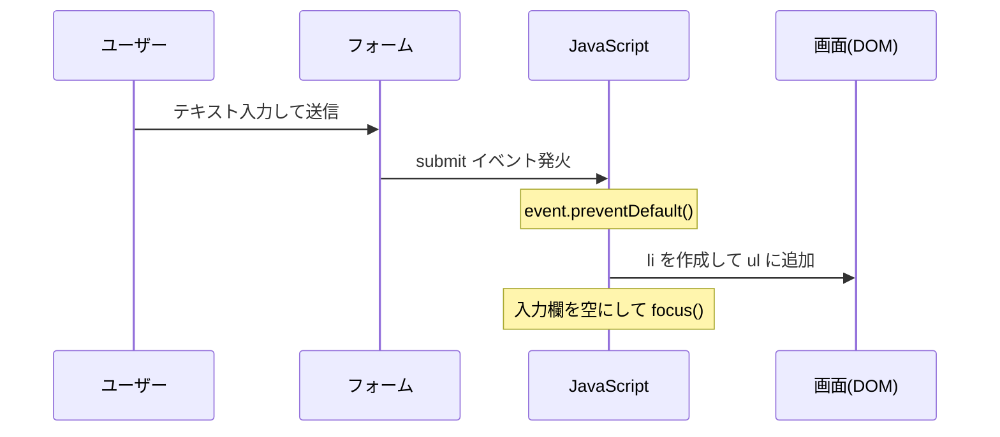
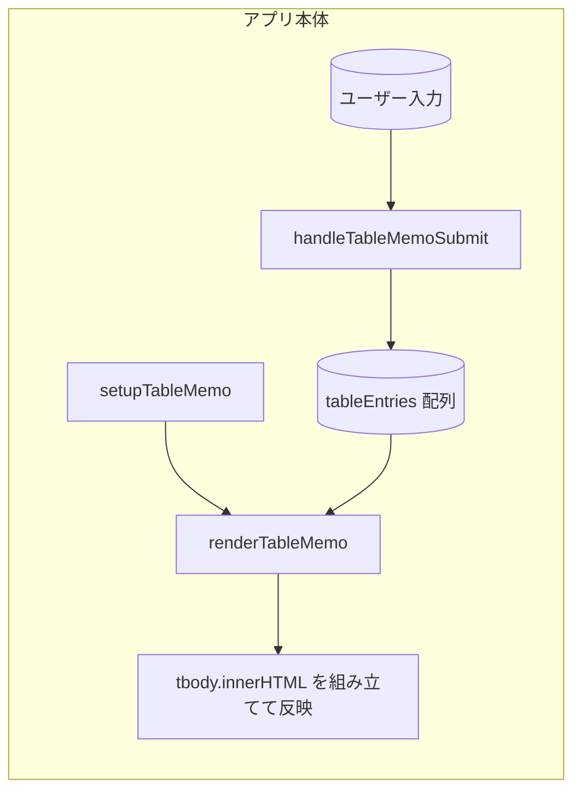

# 🌟 Day 3：入力したら表示！一番シンプルなアプリの原型を作ろう

*   **今日のテーマ**：入力フォームと追加ボタンを使って、入力したデータを画面にどんどん表示していく、一番シンプルな構成を体験します。リスト形式とテーブル形式の2パターンで試してみて、「新しい記録を上に出したいな」っていう気持ちに応えるための工夫もしてみます。
*   **この日のゴール**：まずは「フォームで入力 → 画面に表示」っていう一連の流れを、自分の力で再現できるようになるのが目標です！

---

<br>
<br>
<br>

## あれもこれもはご法度なのよ😭


<b>　 　🍕ピザ姉さん🍕　 　 　 🍣スシサモちゃん🍣　 　</b><br>
</p>


### 💬 「🍕あれもこれも食べたくなる気持ち、わかるわね<br>　 　 🍣でも、あれもこれもじゃ、味がバラバラになっちゃうよ？」

<br>
<br>
<br>

---

## 🔍 3.1 今日のゴールを確認しよう

今回のゴールはとってもシンプルです。

1.  フォームの項目は1つだけ（今回は運動のメモを自由に入力できるようにします）。
2.  「追加」ボタンを押すと、その内容を**表示エリア**に追加します（まずは下に追加していって、あとで並べ替えてみます）。
3.  何度ボタンを押しても、前の履歴が消えずに、画面にどんどん追加されていく状態を目指します。

これができれば、「入力 → 画面表示」の基本サイクルが完成して、これからもっと複雑な機能を追加していくための、しっかりした土台になります。

---

## 🧠 3.2 初心者さんの「？」を解決！

「フォームに入力された値って、どうやって取り出すの？」「ボタンを押したら、裏側で何が起こるの？」きっと、そんな疑問が最初に浮かびますよね。

ここでは、**①ページが読み込まれた最初に準備をする関数**と、**②フォームが送信されたときの処理をする関数**の2つに分けてコードを書いていきます。これは、この後の本番コードでも同じ考え方（`initializePage` → `handleFormSubmit`）が出てくるので、ぴったりの練習になりますよ。


---

## 🧪 3.3 やってみよう！ミニサンプルを動かしてみる

### HTML

```html
<!-- script src="script.js" みたいにどこかで読み込み必要-->
<h2>ミニ運動メモ📝</h2>
<form id="memo-form">
  <label for="memo" class="required">メモ</label>
  <input id="memo" type="text" required placeholder="例: ランニング 10 分">
  <button type="submit">追加</button>
</form>

<h3>きょうのメモ</h3>
<ul id="memo-list"></ul>
```

ポイントは「フォームの項目は1つだけ」「表示エリア（ここでは`<ul>`タグ）の最後にどんどん追加していく」というシンプルな構成です。
`class="required"`は、本番のアプリでも使っている見た目と合わせて、「ここは入力必須だよ」ってことを分かりやすくするための目印です。


ここでも一気にコードを眺めるのではなく、次の3ステップに分けて追いかけてみましょう。「まずはどこで準備するんだろ？」「イベントが来たときに何が必要？」「最後に画面をどう仕上げる？」といった、実装中のつぶやきをそのままトレースしていきます。

#### 1. ページが読み込まれたらフォームを準備する

> 「HTMLより先にJavaScriptが走ったら困るよね…じゃあ読み込み完了を待つおまじないを用意しよう。フォームの場所がわかったら、送信されたときの担当者（関数）を登録すれば、とりあえず入口はできそう！」

最初は「`<script>`を`</body>`直前に置けば大丈夫かな？」と考えたんですが、どこに置くか忘れるたびに挙動がバラつくのはイヤ…。やっぱり確実にDOMの準備を待つ`DOMContentLoaded`を使うのが安心だと気づきました。フォームの要素を毎回探すのも面倒なので、読み込み完了のタイミングでイベントリスナーの登録まで一気に済ませる作戦に決定です。

```javascript
document.addEventListener('DOMContentLoaded', setupMemoForm);

function setupMemoForm() {
  const form = document.getElementById('memo-form');
  form.addEventListener('submit', handleMemoSubmit);
}

function handleMemoSubmit(event) {
  console.log('フォームが送信されたよ！');
}
```

*   **`DOMContentLoaded`**：HTMLの読み込みが終わってからJavaScriptを実行するためのおまじないです。これがないと、まだHTMLの要素が準備できていないのにJavaScriptが動いてしまい、「そんな要素ないよ！」ってエラーを防いでくれます。
*   **`setupMemoForm`**：フォームを見つけて、`submit`が起きたら`handleMemoSubmit`を呼ぶように予約するだけの係。役割を小さく分けておくと、あとで読みやすくなります。

#### 2. 送信イベントで入力値を受け取る

> 「送信イベントが飛んできた！ でもフォームってそのまま送信するとページがリロードされちゃうんだよな…`event.preventDefault()`で止めて、必要な入力欄をまず握ろう。値が入っているかどうか先に確かめないと、空の要素を追加しちゃいそう。」

実際にボタンを押してみたら一瞬で画面が真っ白になって、「あれ？ 追加したメモどこ行った？」状態に。ここで初めて「そうだ、フォームはサーバーに送ろうとするんだった」と思い出し、急いで`preventDefault()`を挟むことにしました。入力欄も`querySelector`にしようか迷いましたが、IDが既にあるので`getElementById`でシンプルに取るのがわかりやすい、という結論に落ち着いています。

`handleMemoSubmit` 関数の中身を実装していきましょう。

```javascript
// いよいよ、handleMemoSubmit関数の中身の実装だよ！
function handleMemoSubmit(event) {
  event.preventDefault(); 

  const memoInput = document.getElementById('memo');
  const memoList = document.getElementById('memo-list');

  const text = memoInput.value.trim();
  if (text === '') {
    return;
  }
```

*   **`event.preventDefault()`**：フォーム本来の挙動（ページリロードやサーバー送信）をストップして、ブラウザ内で完結させるための一行です。
*   **ガード節**：空文字のときに早めに`return`しておけば、以降の処理を安心して書けます。ミニサンプルでも「無効な値はここで止める」という癖をつけておきたいところ。

#### 3. 画面に追加して次の入力に備える

> 「値がちゃんと取れたら、今度は表示エリアに流し込みたい。`<li>`をその場で作ってテキストを入れて…うん、`appendChild`で末尾に足していけば入力順に並ぶはず。入れ終わったら入力欄をリセットして、すぐ次のメモを書けるようにフォーカスも戻しておこう。」

最初は`innerHTML +=`で文字列をガッと足そうとしたんですが、毎回全体を再描画するのはもったいないし、イベントを仕込むときに困りそう…。そこで要素を「その場で生成する」やり方に切り替えました。せっかくフォームが連続入力できる構成なので、最後に`value`を空にして`focus()`を戻すところまで自動化しておけば、小さなストレスを潰せると気づいた流れです。

`handleMemoSubmit`の後半で、いよいよ要素を足していきましょう。

```javascript
  // function handleMemoSubmit(event) の続き
  const item = document.createElement('li');
  item.textContent = text;
  memoList.appendChild(item);

  memoInput.value = '';
  memoInput.focus();
}
```

*   **`document.createElement('li')`**：新しい`<li>`要素をJavaScriptの中で作り出します。こうしておくと、後からイベントを追加したり、属性をつけたりするのも簡単。
*   **`appendChild`**：新しく作った`<li>`要素を表示エリアの末尾に追加します。
*   **後片付け**：入力欄を空にして`focus()`を戻しておくと、連続入力がしやすいという小さなUX向上ポイントになります。

#### 🧭 ミニサンプルのイベントの流れ（シーケンス）



> ❗ **ちょっとメモ**：`event.preventDefault()`は、「フォームが送信されたときの本来の動き（ページの再読み込みや、サーバーへのデータ送信）を止める」ための一行です。`<form>`タグはもともと、入力内容を別のサーバーに送るのがお仕事なので、何もしないとページがリロードされて画面がリセットされちゃいます。今回はアプリの動きを全部ブラウザの中で完結させたいので、この一行で「ちょっと待って！」と止めてから、JavaScriptで画面の更新処理をしています。試しにこの一行をコメントアウトしてボタンを押してみると、一瞬でページが更新されるのが確認できますよ。

これで「入力 → 表示」を繰り返す、一番シンプルなループが完成しました！

---

### テーブル版も試してみよう！

本番のアプリでは、`<table>`を使って記録をきれいに並べます。ここでも、1列だけの最小テーブルを用意して、フォームが送信されるたびに末尾に行を追加してみましょう。まずは「入力した順番に、下に追加されていく」動きを素直に体験してみます。

> 「`<ul>と<li>`版は動いたけど、実際のアプリはテーブル表示なんだよな…。だったらHTMLもテーブル前提にして、`thead`と`tbody`をきちんと用意したい。でも列をいきなり増やすと頭がパンクしそうだから、まずは1列だけの最小構成＋専用フォームという“骨組み”から攻めてみよう。」

```html
<h2>テーブル版メモ</h2>
<form id="table-memo-form">
  <label for="table-memo" class="required">メモ</label>
  <input id="table-memo" type="text" required placeholder="例: ランニング 10 分">
  <button type="submit">追加</button>
</form>

<table>
  <thead>
    <tr>
      <th>メモ内容</th>
    </tr>
  </thead>
<tbody id="table-memo-body"></tbody>
</table>
```

HTMLをこう組み立ててみると、「フォームで入力したものを、すぐ隣のテーブルに並べたい」というゴールが自然に見えてきます。`tbody`にIDを付けておけば、あとでJavaScript側から「ここを書き換える！」というターゲットを指し示しやすくなる、という算段です。

```javascript
// HTMLの読み込みが終わったら、setupTableMemo関数を呼び出す
document.addEventListener('DOMContentLoaded', setupTableMemo);

// 記録を保存しておくための、空っぽの配列を用意
const tableEntries = [];

// テーブル版のフォームの準備をする関数
function setupTableMemo() {
  const tableForm = document.getElementById('table-memo-form');
  // フォームが送信されたら、handleTableMemoSubmit関数を呼ぶように予約
  tableForm.addEventListener('submit', handleTableMemoSubmit);
  // 最初にページが表示されたとき、一度テーブルを空の状態で描画しておく
  renderTableMemo();
}

// テーブル版のフォームが送信されたときに動く関数
function handleTableMemoSubmit(event) {
  event.preventDefault(); // ページのリロードを防ぐ

  const memoInput = document.getElementById('table-memo');
  const text = memoInput.value.trim();
  if (text === '') {
    return;
  }

  // 入力されたテキストを、tableEntries配列の末尾に追加
  tableEntries.push(text);
  // 配列が更新されたので、テーブルを再描画する
  renderTableMemo();

  // 入力ボックスを空にして、フォーカスを当てる
  memoInput.value = '';
  memoInput.focus();
}

// 配列のデータをもとに、テーブルの表示を更新する専門の関数
function renderTableMemo() {
  const tableMemoBody = document.getElementById('table-memo-body');

  let tableHtml = '';
  // tableEntries配列の中身を一つずつ取り出して、HTMLの文字列を作る
  for (const entry of tableEntries) {
    tableHtml += `
      <tr>
        <td>${entry}</td>
      </tr>
    `;
  }

  // 出来上がったHTMLの文字列を、<tbody>の中に一気に流し込む
  tableMemoBody.innerHTML = tableHtml;
}
```

`setup` → `submitハンドラ` → `render` の3つの関数に分けることで、「最初にイベントを登録する」「データを配列にためておく」「画面の表示は専門の関数に任せる」という役割分担がはっきりして、コードが見やすくなりましたね。このバージョンでは、単純に`push`で追加したものをそのまま描画しているので、入力した順に下へ下へと積み上がっていきます。

#### 🧩 テーブル版：責務とデータの流れ



### 補足：`createElement` と `innerHTML`、どっちがいいの？

さっきの`<ul>`の例では`document.createElement('li')`と`appendChild(item)`を使いましたが、今回のテーブルの例では`innerHTML`にHTMLの文字列をまとめて流し込む方法を使いました。それぞれの良いところを知っておくと、本番コードの`renderEntries`関数がもっと読みやすくなります。

*   **DOM API (`createElement`, `appendChild`など)**
    *   一行ずつ要素を作っていくので、最初はちょっと手間がかかるように感じるかも。でも、**後から個別の要素にクリックイベントを追加したり、特別なデータを持たせたりする加工がしやすい** のが大きなメリットです。
    *   `textContent`にテキストをセットする限り、ユーザーが入力した`<script>`タグみたいな危ない文字が、そのままHTMLとして実行されちゃうのを防いでくれるので、**セキュリティ的に安全** です（この現象をXSS：クロスサイトスクリプティングと言います）。
*   **`innerHTML`**
    *   配列のデータから、`map`や`for`ループを使って一気にHTMLの文字列を組み立てられるので、**コードが短く、シンプルに見える** ことが多いです。
    *   テーブル全体を毎回書き換えるようなケースでは、ごっそり中身を入れ替えるだけなので、処理の流れが分かりやすいです。

どっちを使ってもOKですが、「後で削除ボタンみたいに、クリックイベントを追加したいな」「ユーザーが入力した内容を安全に表示したいな」という気持ちが強いときはDOM APIを、「配列のデータから、**ただ見た目を作るだけ**でいいんだ」というときは`innerHTML`を選ぶ、というふうに判断できると、迷うことが少なくなりますよ。

---

<br>
<br>
<br>

## 👟シューズ・トラベル👟スニッキーくんの心の準備

 |

### 💬 「オレにとってはイェイのポーズが決まってからスタート！<br>　 　このポーズは心の準備なのさ👟」

<br>
<br>
<br>

---

### 🔄「新しい記録が下に行っちゃう…」→ 並び順を改善しよう！

リストやテーブルを動かしていると、すぐにこんなことを思うはずです。

> 「さっき追加したばかりのメモが、表の一番下にあって見つけにくいな…。新しいものが一番上に来てほしい！」

その気持ち、すごく分かります！では、記録を保存した瞬間の「時間」も一緒にデータに持たせておいて、表示する前に並び替える、という工夫をしてみましょう。

`createdAt`という名前のプロパティに、`Date.now()`が返してくれる値を入れます。`Date.now()`は、「今この瞬間の時刻」をミリ秒単位のすっごく大きな数字で返してくれる関数です。この数字は絶対に過去には戻らないので、ほぼユニークなID（他の記録と被らない番号）の代わりとしても使えます。

この「時間が進むほど数字が大きくなる」という性質を利用して、`b.createdAt - a.createdAt`のように引き算をすると、新しい記録（`createdAt`が大きい）ほど前に来るように、簡単に並べ替えることができるんです。

まずはHTML（`index.html`）を用意して、`script.js`を外部ファイルとして読み込みます。

```html
<!doctype html>
<html lang="ja">
  <head>
    <meta charset="utf-8">
    <title>Day 3：フォーム最小ループ（テーブル版・改）</title>
    <style>
      /* （見た目を整えるCSS、内容は前と同じなので省略） */
    </style>
  </head>
  <body>
    <h1>Day 3：フォーム最小ループ（テーブル版・改）</h1>

    <form id="table-memo-form">
      <label for="table-memo" class="required">メモ</label>
      <input id="table-memo" type="text" required placeholder="例: ランニング 10 分">
      <button type="submit">追加</button>
    </form>

    <table>
      <thead>
        <tr>
          <th>メモ内容</th>
          <th>記録時刻</th>
        </tr>
      </thead>
      <tbody id="table-memo-body"></tbody>
    </table>

    <script src="./script.js"></script>
  </body>
</html>
```

そしてJavaScriptの処理は、これまで通り`script.js`に切り分けます。

```javascript
// DOMが使える状態になったら、フォーム初期化を実行
document.addEventListener('DOMContentLoaded', setupTableMemo);

// 全ての記録を保持する配列（最新順に並び替えて表示する）
const tableEntries = [];

// テーブル版フォームの初期化。イベント登録と初回描画を担当
function setupTableMemo() {
  const tableForm = document.getElementById('table-memo-form');
  tableForm.addEventListener('submit', handleTableMemoSubmit);
  renderTableMemo();
}

// フォーム送信時に呼ばれ、入力値のバリデーションと登録を行う
function handleTableMemoSubmit(event) {
  event.preventDefault();

  const memoInput = document.getElementById('table-memo');
  const text = memoInput.value.trim();
  if (text === '') {
    return;
  }

  // メモ内容と作成時刻を一つのオブジェクトとして配列に追加
  tableEntries.push({
    text: text,
    createdAt: Date.now(),
  });
  renderTableMemo();

  memoInput.value = '';
  memoInput.focus();
}

// tableEntriesの内容をHTMLに変換し、tbodyへ反映する責務
function renderTableMemo() {
  const tableMemoBody = document.getElementById('table-memo-body');

  // createdAtの大きい順＝最新順でソートしたコピーを使う
  const sortedEntries = tableEntries.toSorted((a, b) => b.createdAt - a.createdAt);

  let tableHtml = '';
  for (const entry of sortedEntries) {
    // createdAtを人が読める日付文字列に変換
    const displayTime = new Date(entry.createdAt).toLocaleString();
    tableHtml += `
      <tr>
        <td>${entry.text}</td>
        <td>${displayTime}</td>
      </tr>
    `;
  }

  // tbodyに一気に流し込む
  tableMemoBody.innerHTML = tableHtml;
}
```

`handleTableMemoSubmit`でデータを保存するときに、ただの文字列じゃなくて`{ text: '入力内容', createdAt: 123456789 }`みたいなオブジェクトの形で配列に入れるように変更しました。

そして`renderTableMemo`関数の中で、`toSorted((a, b) => b.createdAt - a.createdAt)`という一行を追加！これが「新しい順に並び替える」魔法の呪文です。本番コードの`script.js`に出てくる`filteredEntries.sort(...)`も、まったく同じ考え方なんですよ。

---

## 🧭 3.4 ちょっと未来をのぞいてみよう

*   今はブラウザを更新するとメモが消えちゃいます。でも、Day 2で学んだ**`localStorage`**を組み合わせれば、このデータをずっと保存しておけるはず…！って、ピンときますよね？
*   今はまだシンプルな表示だけど、これから削除ボタンをつけたり、もっとたくさんの項目を表示したりと、どんどんリッチにしていきます。まずは「画面にデータをためて、並び替える」っていう基本をしっかり体験しておくことが、とっても大切です。
*   本番の`script.js`では、フォームの項目が増えたり、フィルタリング機能が追加されたりします。でも、今回のミニサンプルで「並び替え」の考え方に触れたことで、本番コードに出てくる`createdAt`と`sort`の組み合わせも、きっとすんなり理解できるはずです。

---

## ✅ 3.5 Day 3 のまとめ

1.  フォームで入力 → 画面に表示、という一番シンプルなアプリの動きを、自分の力で組み立てることができた！
2.  `DOMContentLoaded`や`preventDefault()`といった、JavaScriptの「お作法」を体験できた！
3.  これから必要になる機能（データの保存、削除、並び替えなど）のイメージが、なんとなく掴めるようになった！

このDay 3で手応えをつかめば、「フォームの項目が増えても、データを保存することになっても、きっと大丈夫！」って自信を持って、次のステップに進めますよ！ファイト！💪

---

<h1><a href="D04.md">Day4 へ</a></h1>
