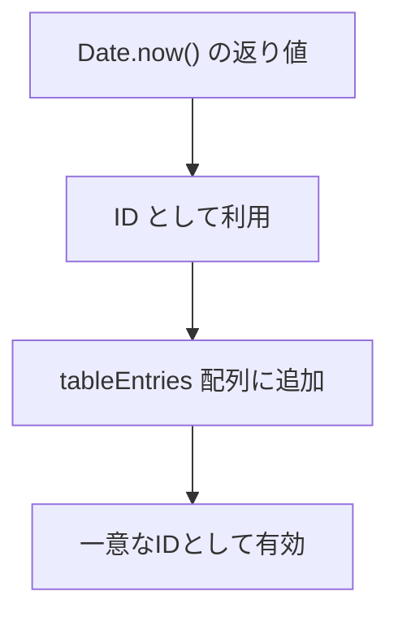
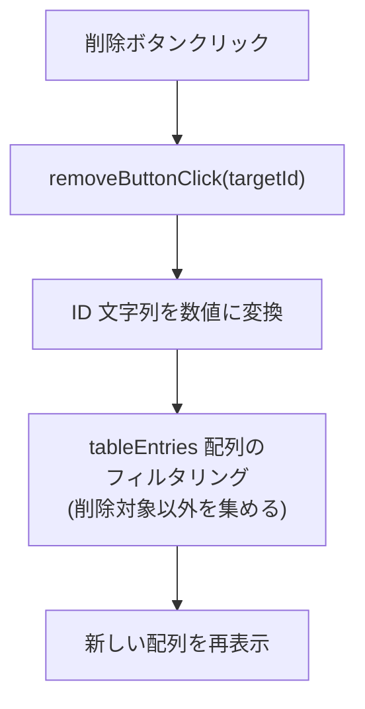
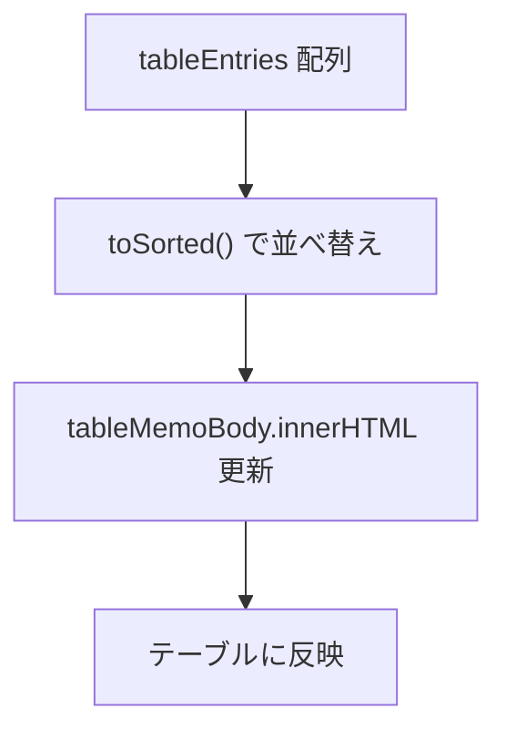

# 🗑️ Day 4：記録にIDをつけて、削除ボタンを作ってみよう

*   **今日のテーマ**：Day 3までで作ったメモのテーブルに、「削除」機能を追加します。

### 注意事項

コード全体は後半にしか掲載されていないので注意  
（以降の章は、「章内全体構成」を把握しながら学習すること）  

### 🗺 `createdAt` と ID の関係



間違えて入力しちゃった記録も、ちゃんと消せるようにしましょう！
*   **この日のゴール**：記録を作った時間（`createdAt`）をIDとして使って、`onclick="removeButtonClick(...)"`っていう仕組みで、行ごとに削除処理を呼び出せるようになります。

---

## 💡 4.1 `createdAt`は、そのままユニークなIDになる！

Day 3で、`Date.now()`っていう関数を使って`createdAt`（作成日時）を記録しましたよね。この`Date.now()`が返してくれるのは、「その瞬間だけの、とっても大きな数字」です。

同じ瞬間に2回クリック！なんてことがない限り、この数字は他の記録と被ることがありません。だから、それぞれの記録を見分けるための**ユニークなID（背番号）**として、そのまま使えちゃうんです！便利ですよね。

`Date.now()` がどんな数字を返すのか、実際に見てみましょう！

開発者ツールのコンソールに、下のコードを貼り付けて実行してみてください。1秒ごとに、どんどん数字が増えていくのが分かりますよ。

```javascript
// 1秒ごとに、現在のタイムスタンプを出力し続ける
setInterval(() => {
  console.log(Date.now());
}, 1000);
```

この数字が、1970年1月1日からの経過時間をミリ秒（1000分の1秒）で表したものです。すごい勢いで増えていくから、IDにしても被る心配がほとんどないんですね！

```javascript
// 今この瞬間の時刻をミリ秒単位の数字で取得
const now = Date.now();

// 配列にデータを追加するときに、idプロパティも一緒に入れてあげる
tableEntries.push({
  id: now, // idとしても使う
  text,
  createdAt: now, // 作成日時としても使う
});
```

こうやって配列に保存するときに`id`プロパティを追加しておけば、後で「この記録を消したい！」って思ったときに、正確に目的の記録を見つけ出すことができます。

---

### 💡 ちなみに：もっと安全なIDについて

「もし、ものすごくたくさんの記録を、すっごく速く追加したらIDが被らない？」と気になった方は、とても良い視点です！

品質が問われる実装では、そういった非常にまれなケースも想定して、`UUID` といた重複しにくい特別なIDを使いつつ、重複チェックも行います。

この場合なら、`crypto.randomUUID()`という関数を使うことで、ほぼ確実に重複しないユニークなIDを生成できます。

```javascript
const now = Date.now();

tableEntries.push({
  id: `${now}-${crypto.randomUUID()}`, // 「他者と無関係な、その人個人用途のID」が「１ミリ秒」以内に「UUID」が重複するなどは、まずありえないと断言できるレベル
  text,
  createdAt: now, // 作成日時として使う
});
```

この方法なら、IDと作成日時を別々に管理できるので、より安全で柔軟な設計になります。

ただ、今回の練習では、まず基本をしっかり押さえるために、シンプルで分かりやすい `Date.now()` をそのまま使っていきましょう！😉

---

## 🧱 4.2 行ごとに削除ボタンを表示しよう

削除ボタンは、記録一行につき一つずつ必要ですよね。

### 🔄 削除ボタンの流れ



> 「よし、削除ボタンを作ろう！ まずは`renderTableMemo`の中でボタンを作って、`addEventListener`でクリックイベントを…あれ？ 待って。この関数は毎回`innerHTML`で中身を全部書き換えてるぞ。せっかく`addEventListener`でイベントを登録しても、次の再描画のときにはボタンごと消えちゃうじゃないか！
>
> うーん、どうしよう…。そうだ！ ボタンを描画するHTMLの中に、直接「クリックされたらこの関数をこのIDで呼んでね」って書いてしまえばいいんだ！ それが`onclick`属性か！ 今の「毎回ぜんぶ描き直す」やり方には、こっちのほうが相性が良さそうだな。」

この`(...)`の中に、さっき決めたID（`createdAt`の数字）を入れてあげることで、「このボタンは、このIDの記録を消すためのボタンだよ」って関連付けることができます。

```javascript
// HTMLの文字列を組み立てるときに、削除ボタンも一緒に追加！
tableHtml += `
  <tr>
    <td>${entry.text}</td>
    <td>その他の項目</td>
    <td>
      <button type="button" class="delete-button" onclick="removeButtonClick('${entry.id}')">削除</button>
    </td>
  </tr>
`;
```

ブラウザの開発者ツールでボタンの部分を見てみると、`onclick="removeButtonClick('168...')"`みたいに、ちゃんとIDが埋め込まれているのが確認できますよ。

---

## 🛠️ 4.3 `removeButtonClick`関数を作ろう！

`removeButtonClick`関数は、ボタンがクリックされたときに呼び出されて、引数としてIDを受け取ります。そのIDを使って、配列（`tableEntries`）の中から「このIDじゃない記録だけを残す」っていう処理をします。

> 「ボタンが押されたら、IDを頼りに配列からデータを消せばいいんだな。配列から要素を削除するのって… `splice` メソッドかな？ でも、`splice` を使うには、まずIDを頼りに『配列の何番目にあるか』っていうインデックス番号を調べないといけない…。ちょっと面倒くさいな。
>
> 他にいい方法はないかな…？ あ、`filter` メソッドっていうのがあるぞ！ これは『条件に合うものだけを集めて、新しい配列を作る』っていう動きなのか。これなら、『渡されたIDと等しくないものだけ残す』って書くだけでいいから、すごくシンプルだ！ 元の配列を直接いじらないから、なんだか安全な気もするし、こっちを使ってみよう！」

JavaScriptの`filter`メソッドを使うと、この処理がとっても読みやすく、安全に書けますよ。

```javascript
// 削除ボタンが押されたときに呼ばれる関数
function removeButtonClick(targetId) {
  // onclickから渡ってくるIDは文字列なので、Number()で数値に戻してあげる
  const numericId = Number(targetId);
  
  // tableEntries配列の中から、クリックされたIDと一致しないものだけを集めて、新しい配列を作る
  tableEntries = tableEntries.filter((entry) => entry.id !== numericId);
  
  // 配列の中身が変わったので、テーブルの表示をもう一度更新する
  renderTableMemo();
}
```

最後に`renderTableMemo()`を呼び出して画面を再描画すれば、削除した行がちゃんと消えた状態になります。`let tableEntries = []`のように`let`で変数を宣言しておけば、配列そのものを新しいものに差し替えても大丈夫です。

> 💡 **ワンポイント**：`onclick`でHTMLに埋め込んだ値は、JavaScriptに渡されるときには文字列になっています。
>
> 「あれ、削除ボタンが効かないぞ…？ `console.log` で `targetId` と `entry.id` を見比べてみよう。…あっ！ `targetId` は `'168...'` ってクォート付きの文字列で、`entry.id` は `168...` っていう数値だ！ 型が違うから `===`（厳密な比較）で `false` になっちゃうんだ！」
>
> こんなふうに、デバッグで気づくことはよくあります。`==`（等価比較）を使えば型変換を自動でやってくれて動く場合もありますが、意図しない動きの元にもなりやすいです。なので、`Number(...)`でちゃんと数値に変換してから比較してあげるのが、安全で確実な方法です。

---

<br>
<br>
<br>

## 🗑️ポイッタ・タイム🗑️ポイッタさんのポイ哲学

 |

### 💬 「人生もコードも、捨てることから始まるの。<br>　 　無駄なものを削ぎ落とし、残すべきものだけを選ぶのよ。<br>　 　それが成長というものよ🗑️」

<br>
<br>
<br>

---

## 🖼️ 4.4 完成したサンプルコード

削除ボタンの実装を含んだ、最小構成のサンプルコードです。

### 🖼️ テーブルの表示フロー



ここまでの手順を一つにまとめたものなので、全体の流れを確認してみてくださいね。

```html
<!-- index.html -->
<!doctype html>
<html lang="ja">
  <head>
    <meta charset="utf-8">
    <title>Day 4：削除ボタンの実装</title>
    <style>
      /* （見た目を整えるCSS、内容は前と同じなので省略） */
    </style>
  </head>
  <body>
    <h1>Day 4：削除ボタンの実装</h1>

    <form id="table-memo-form">
      <label for="table-memo" class="required">内容</label>
      <input
        id="table-memo"
        type="text"
        required
        placeholder="例: プランク 40 秒"
      >
      <button type="submit">追加</button>
    </form>

    <table>
      <thead>
        <tr>
          <th>記録内容</th>
          <th>記録したタイミング</th>
          <th>操作</th>
        </tr>
      </thead>
      <tbody id="table-memo-body"></tbody>
    </table>

    <script src="./script.js"></script>
  </body>
</html>
```

JavaScript は下のように script.js にまとめておきます。D03.md の書き方を踏襲しているので、どこで DOM を触っているかが一目で分かります。

```javascript
document.addEventListener('DOMContentLoaded', setupTableMemo);

let tableEntries = [];

function setupTableMemo() {
  const tableForm = document.getElementById('table-memo-form');
  tableForm.addEventListener('submit', handleTableMemoSubmit);
  renderTableMemo();
}

function handleTableMemoSubmit(event) {
  event.preventDefault();

  const memoInput = document.getElementById('table-memo');
  const text = memoInput.value.trim();
  if (text === '') {
    return;
  }

  const now = Date.now();
  tableEntries.push({
    id: now,
    text,
    createdAt: now,
  });
  renderTableMemo();

  memoInput.value = '';
  memoInput.focus();
}

// 削除ボタンが押されたら、この関数が呼ばれる！
function removeButtonClick(targetId) {
  const numericId = Number(targetId);
  // クリックされたIDと違うものだけを残した、新しい配列を作る
  tableEntries = tableEntries.filter((entry) => entry.id !== numericId);
  // 画面を再描画
  renderTableMemo();
}

function renderTableMemo() {
  const tableMemoBody = document.getElementById('table-memo-body');
  const sortedEntries = tableEntries.toSorted(
    (a, b) => b.createdAt - a.createdAt,
  );

  let tableHtml = '';
  for (const entry of sortedEntries) {
    tableHtml += `
      <tr>
        <td>${entry.text}</td>
        <td>${new Date(entry.createdAt).toLocaleString()}</td>
        <td>
          <button type="button" class="delete-button" onclick="removeButtonClick('${entry.id}')">削除</button>
        </td>
      </tr>
    `;
  }

  tableMemoBody.innerHTML = tableHtml;
}
```

---

## ✅ 4.5 ここで押さえておきたいポイント

1.  `Date.now()`で取得した時刻は、IDとして再利用できる便利なもの！
2.  削除ボタンには`onclick`属性を使って、どの記録を消すかのIDを渡してあげる。
3.  `filter`メソッドで新しい配列を作り直して、`renderTableMemo()`を呼び出せば、画面もすぐに更新される。

ここまでで、「追加した行を、ピンポイントで削除できる」仕組みが完成しました！
次のDay 5では、この仕組みをベースに、アプリ全体の設計を考えていきましょう！

---

<h1><a href="D05.md">Day5 へ</a></h1>