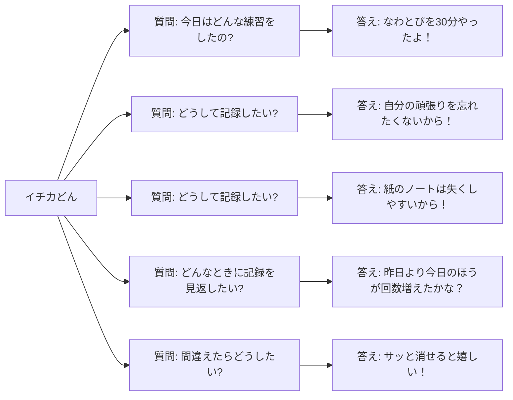
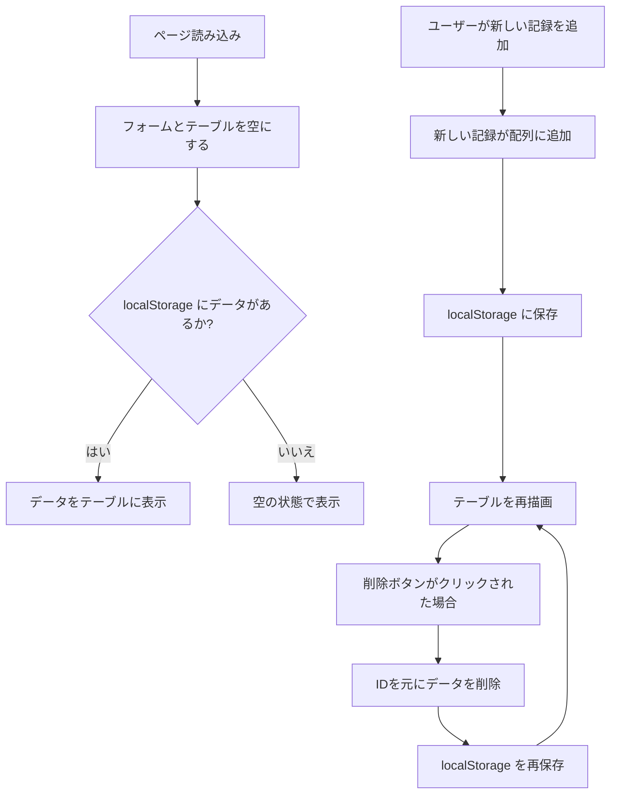

# 📝 Day 5：どんなアプリにする？設計図を書いてみよう！

> **今日の対象**：JavaScriptを学び始めて4ヶ月くらいの、HTMLとCSSも練習中のあなたへ
> **今日のゴール**：難しい言葉は使わずに、「どんなアプリを作りたいか」を自分の言葉で整理できるようになること

ここまでの章では、小さな機能を「まず作ってみる→振り返る」っていうサイクルを繰り返してきました。Day 5は、その経験を活かして、「これがあれば、ちゃんとしたアプリになるよね！」っていう、開発の道しるべ（設計図）を作っていきます。お気に入りのノートにメモを取るような、リラックスした気分で進めていきましょう♪

---

## Step 0：これまでの冒険を振り返る、振り返りノートを作ろう！
> 「いきなりコードを書き始めるんじゃなくて、一度立ち止まって『何を作りたいんだっけ？』って考える時間って、実はプロの開発者もすごく大事にしてるんだ。大きなものを作ろうとするとき、地図もなしに歩き出すと、途中で絶対に迷子になっちゃう。だから、まずは自分だけの地図を作るような、リラックスした気持ちで取り組んでみよう！」

1.  まずは、紙でもテキストファイルでもOK！ページのいちばん上に「Day 5 設計図メモ」ってタイトルを書きましょう。
2.  ページを左右に分けて、「やったこと」と「気づいたこと」の2つのエリアを作ります。
3.  Day 1からDay 4までの冒険を思い出して、表を埋めてみましょう。
    *   例：「Day 3 → フォームが1つでも、ボタンを押したら画面が動くって知った！楽しい！」
    *   例：「Day 4 → 記録を作った時間を、IDの代わりに使えるなんて賢い！」
4.  全部埋まらなくても大丈夫。後で「あ！」って思い出したら、いつでも書き足せばOKです。

> ☕ ここで一度、好きな飲み物で休憩しましょう。頭がスッキリして、次のステップに進みやすくなりますよ。

---

## Step 1：「イチカどん」の理想アプリを想像してみよう！
もしあなたが、このアプリを使う「イチカどん」だったら…？と想像しながら、自分にインタビューしてみましょう。ノートにこんな質問と答えを書いてみてください。

### 🗣 ユーザーインタビューのフロー




| 質問 | イチカどんの答え（例） |
| --- | --- |
| 今日はどんな練習をしたの？ | 「なわとびを30分やったよ！」 |
| どうしてそれを記録しておきたい？ | 「次の試合までに、自分がどれくらい頑張ったか忘れたくないから！」 |
| 記録するときに、ちょっと面倒だなって思うことは？ | 「紙のノートだと失くしちゃうし、いちいち開くのが面倒くさいな…」 |
| どんなときに、記録を見返したくなる？ | 「昨日より今日のほうが回数増えたかな？ってときとか、大会前の追い込み時期とか！」 |
| もし間違えて入力しちゃったら、どうしたい？ | 「うーん、迷わずサッと消せると嬉しいな！」 |

質問がもっと浮かんできたら、どんどん追加してOKです。答えが集まれば集まるほど、作りたいアプリの形がハッキリしてきますよ。

---

## Step 2：イチカどんの「これができたら嬉しいな」を書き出してみよう
Step 1の答えを眺めながら、イチカどんが「こんな体験ができたら嬉しいな」って思うことを、簡単な文章にしてみましょう。

-   例1：フォームに練習内容を書いて「追加」ボタンを押したら、下のテーブルに新しい記録が追加される。
-   例2：日付のところで「2025-01-10」って選んだら、その日の練習記録だけがパッと表示される。
-   例3：間違えて入力しちゃった行の「削除」ボタンを押したら、その記録がスッと消える。
-   例4：一度ページを閉じても、次の日に開いたら、昨日の記録がちゃんと残っている。

> 🔍 ここでは「ユーザーとして、何をしたいか」だけに集中するのがポイントです。技術的な難しい話は、今は考えなくて大丈夫！

---

<br>
<br>
<br>

## 🪢ジャンプ・トウ・ザ・フューチャー🪢なわりんのジャンプはどこまでも


### 💬 「なわとびを飛び越えたその先には、<br>　 　ワクワクするような未来が待っている！<br>　 　跳ぶことで、どんどん自分の可能性が広がって、<br>　 　未来をぐんぐん切り開いていけるんだ🪢」

<br>
<br>
<br>

---

## Step 3：手書きでOK！アプリのラフスケッチを描いてみよう
> 「えっ、絵を描くの？ 絵心ないから苦手だな…」って思うかもしれないけど、全然大丈夫！ ここで大事なのは、綺麗な絵を描くことじゃありません。 **自分だけが分かればOK** なんです。
>
> 丸と四角と線だけで、「ここにボタンがあって、ここに入力欄があって…」っていう部品の配置が自分の中で整理できれば、それで100点満点！ 完璧を目指さずに、気軽に落書きするつもりでやってみましょう。

1.  紙に、スマホみたいな縦長の長方形を描いて、ページを「上」「真ん中」「下」の3つのブロックに分けてみましょう。
2.  それぞれのブロックに、どんな部品を置きたいか書き込んでみます。例えば…
    *   **上ブロック**：入力フォーム（種目 / 日付 / 時間 / 回数・重量 / メモ / 追加ボタン）
    *   **真ん中ブロック**：日付で絞り込むフィルター、フィルター解除ボタン、登録件数の表示、デバッグ用の全削除ボタン
    *   **下ブロック**：記録を表示するテーブル（どんな列が必要か、列名も書いてみよう）
3.  余裕があったら、入力の例（「ランニング」とか）や、ボタンに書きたい文字（「記録する！」とか）も書き添えてみましょう。
4.  「ここ、作るの難しそう…」って思った場所に、✕印や⚠マークをつけておくと、後で自分の苦手なポイントが分かって便利です。

> 📸 もしよかったら、スマホで写真を撮っておきましょう。自分の成長記録にもなりますよ！

---

## Step 4：データの「入れ物」の形を決めよう（コードでメモ）
フォームで入力したデータが、プログラムの中ではどんな形（オブジェクト）で保存されるか、TypeScript風のメモで書き出してみます。実際にTypeScriptを使わなくても大丈夫。「データの箱には、こんな情報が入るんだな」ってイメージをはっきりさせるためのメモです。

```ts
// 運動記録1件分のデータの形
type WorkoutEntry = {
  id: string;        // 削除ボタンが押されたときに使う、記録ごとの背番号
  date: string;      // 例: "2025-02-20"
  type: string;      // 種目名（セレクトボックスで選ぶ予定）
  minutes: number;   // 運動した時間（分）
  value: number;     // 回数 or 重量など（数字ならなんでも）
  note: string;      // ちょっとしたメモ（空っぽでもOK）
  createdAt: number; // 記録が作られた瞬間の時刻（Date.now()で取得する数字）
};
```

-   `id`は、`createdAt`を文字列に変換したもの（`String(createdAt)`）を使うのが、一番シンプルで分かりやすいです。
-   このデータを`localStorage`に保存するときは`JSON.stringify(entries)`、読み出すときは`JSON.parse()`を使うんでしたね。Day 2のおさらいです！

---

## Step 5：アプリの動きを、物語みたいに書いてみよう
> 「フローチャートって、なんだか難しそう…。いきなり図を描く前に、まずは国語の作文みたいに、アプリの動きを文章で書き出してみようかな。
>
> こうやって文章にしておくと、後で『あれ、ボタンを押しても思った通りに動かないぞ？』ってなったときに、この"物語"と実際のコードの動きを見比べることができる。『あ、物語の3番目の処理が、コードから抜け落ちてる！』みたいに、間違いを見つけるための"答え合わせの紙"として使えるんだ。これは、未来の自分を助けるための、最高のデバッグツールになるかもしれない！」

いきなりフローチャートみたいな図を描こうとすると、難しくて固まっちゃう…という人は、日記みたいに文章で書いてみるのがオススメです。

```
1. ページが開かれた瞬間、まずはフォームとテーブルを空っぽの状態で表示する。もしlocalStorageに前のデータが残っていたら、それを使ってテーブルを作る。
2. ユーザーが種目・日付・メモなどを入力して、「追加」ボタンを押す。もし必須項目が空っぽだったら、「入力してください」って優しく教えてあげる。
3. 入力がちゃんとされていたら、新しいデータ（オブジェクト）を作って、配列の末尾に追加（push）する。このとき、Date.now()で`createdAt`と`id`もちゃんと入れる。
4. 配列を丸ごと`localStorage`に保存する。保存が成功したら、テーブルの表示も新しい状態に更新する。
5. テーブルのどこかの行の「削除」ボタンが押されたら、その行のID（data-id）を読み取って、配列からそのIDのデータだけを除外する（filter）。そして、新しい配列をまた`localStorage`に保存して、テーブルも更新する。
6. 日付フィルターで特定の日付が選ばれたら、その日付の記録だけを表示するようにテーブルを更新する。フィルターが空に戻されたら、また全部の記録を表示する。
7. 開発中に便利な「全削除ボタン」が押されたら、「本当に全部消しちゃいますか？」って一度確認してから、`localStorage`の中身を空っぽにして、テーブルもきれいにする。
```

> 💬 声に出して読んでみると、「あれ、ここの動き、ちょっと不安かも…」っていうポイントに気づきやすくなりますよ。

### 📊 アプリの動きのフロー




---

## Step 6：やりたいことのチェックリストを作ろう
| やりたいこと | できた？ | メモ |
| --- | --- | --- |
| 種目と日付は必須項目にする？ | ☐ | 入力欄に `required` 属性をつけよう |
| 時間や回数の欄は、0以上の数字だけ入力できるようにする？ | ☐ | `min="0"` や `type="number"` を使えばできそう |
| もし`localStorage`のデータが壊れてて、読み込みに失敗したらどうする？ | ☐ | `try...catch`っていう構文で、エラーが起きてもアプリが止まらないようにできるみたい |
| テーブルの記録は、新しいものが上に表示されるようにする？ | ☐ | `toSorted((a, b) => b.createdAt - a.createdAt)` を使えばOK！ |
| `localStorage`のデータを、テスト中に簡単に消す方法は？ | ☐ | デバッグ用の「全削除ボタン」を作っておくと便利だね |

### ミニワークショップ
-   一つでも「☐」があったら、その項目を次に取り組む課題にしてみましょう。
-   もし一緒に勉強している友達がいたら、お互いのチェックリストを見せ合って、気づいたことを書き込んであげるのも、すごく良い勉強になりますよ。

---

## Step 7：ちょっとドキドキ…不安なポイントを正直に書き出してみよう
> 「うーん、考えれば考えるほど、分からないことや自信がないことが出てきて、ちょっと不安になってきたな…。でも、ちょっと待って。こうやって『ここが不安だ』って具体的に思えるってことは、それだけ自分が『どうすればもっと良くなるか』を考えられてるってことじゃない？ 何も分からなかった最初の頃と比べて、すごく成長してる証拠なんだ。
>
> よし、この不安な気持ちも大切にしよう。この不安リストが、次のレベルへ進むための経験値クエストになるんだから！」
>
> 次の章に進む前に、「ここ、ちょっと自信ないな…」って思っている場所に、心の中で付箋を貼るような気持ちで書き出してみましょう。

-   フォームの値を全部`trim()`（空白削除）するのを、忘れちゃいそう。
-   もし`localStorage`の中身が、何かの拍子で壊れちゃったらどうしよう？
-   ボタンがたくさんあると、イベントの付け方で混乱しちゃいそうだな…。
-   CSSはまだちょっと苦手だから、レイアウトで困ったらBootstrapの力を借りようかな。

不安なことを正直に書いておくと、後の章でその答えが見つかったときに、「あ、これだ！分かった！」っていう達成感が、もっと大きくなりますよ。

---

## Step 8：次にやることを3つだけ決めよう！
1.  **フォーム部分のHTMLだけ、まず作ってみる**（JavaScriptはまだ書かなくてOK）。
2.  **テーブルの`<tbody>`の中に、ダミーのデータを手で書き込んでみて**、どんな列が必要か、見た目を確認してみる。
3.  **Day 3とDay 4のサンプルコードを、もう一度動かしてみる**。特に、削除ボタンがどうやって動いているのかに慣れておこう。

> ✅ この3つができたら、Day 6に進む準備はバッチリです！

---


<br>
<br>
<br>

## 🖨️ペーパー・ジャム🖨️プリンタスは天然プリンセス
 

### 💬 「あなたの設計、今からフルカラーでプリントアウトします！<br>　 　……あっ、インク切れてました。<br>　 　じゃあ今日のところは、<br>　 　紙に手書きでラフスケッチしちゃいましょう🖨」

<br>
<br>
<br>

---


---

### おまけ：困ったときのQ&Aメモ
-   **Q. `localStorage`の中身を、こっそり覗いてみたいときは？**
    → 開発者ツール（F12）のコンソールで、`JSON.parse(localStorage.getItem('ichikaWorkoutLogEntries'))`って打ち込んでEnter！

-   **Q. IDが、もし万が一、被っちゃったらどうする？**
    → もし心配なら、`id: crypto.randomUUID()`っていう、もっと強力なID生成方法に挑戦してみるのもアリです。最近のブラウザなら、使えます。

-   **Q. フィルターをかけたとき、1件も表示されないのが正しいのか不安…**
    → `console.log(filteredEntries)`みたいに、画面に表示する直前の配列の中身をコンソールに出力してみて、自分の思った通りのデータになっているか確認するクセをつけると、すごくデバッグが楽になります。

---

## まとめメモ（声に出して読んでみよう！）
1.  「追加 → 保存  → 表示 → 削除 → 絞り込み」っていう順番で考えれば、迷子になりにくい！
2.  画面の配置（見た目）と、データの形（中身）を先にメモしておくと、HTMLとJavaScriptを書くときに、すごく安心できる。
3.  不安なポイントを事前に書き出しておくと、後の章で答えが見つかった瞬間に、「できた！」って心から実感できる！

これで、“自分の言葉で説明できる、あなただけの設計図”が手元にできましたね。
次はDay 6で、この設計図に書いたアイデアを、一つずつ形にしていきましょう！

---

<h1><a href="D06.md">Day6 へ</a></h1>
