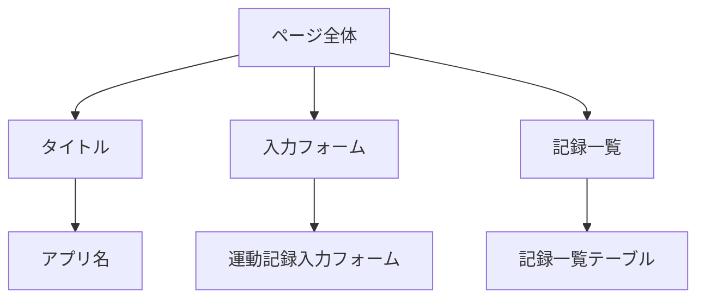
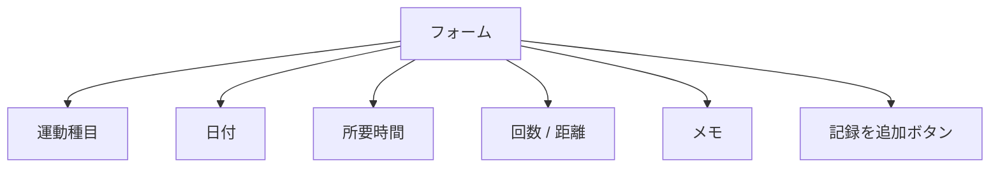

# 🎨 Day 6：見た目を作ろう！HTMLとCSSで骨組み作り（心の声と一緒に編）

## 🌟 6.1 今日のゴールを、言葉にしてみよう

今回作りたいのは、「運動記録アプリ」の土台になるページです。
でも、いきなり完成形のコードを書き始めるんじゃなくて、**「どんな見た目で、どんな操作ができたら嬉しいかな？」**っていうのを、まず言葉にしてから手を動かしてみましょう。

#### 🧠 心の中のメモ
-   毎日の運動を入力できるフォームが欲しいな。
-   これまでの記録を、一覧でずらっと確認したい。
-   デザインはまだ気にしなくてOK。まずは「ちゃんと動く骨組み」を作ることが大事！

> ゴールをこうやって文章にしておくと、「今、自分はどこまで進んだのかな？」って、いつでも現在地を確認しやすくなりますよ。

---

## 🗺️ 6.2 手を動かす前に、ページの構造をスケッチしよう

HTMLを書き始める前に、ページ全体をざっくりとしたブロックに分けてみましょう。

### 🗺 ページの構造フロー



紙に四角を描いてみるのもいいし、箇条書きでメモするだけでもOKです。

```
ページ全体
├─ タイトル（このページが何のためのものか、パッと見てわかるように）
├─ 入力フォーム（運動の記録を追加するための場所）
└─ 記録一覧（追加した内容を、後から眺めるための場所）
```

#### 🧠 心の中のメモ
-   ブロックの順番は、やっぱり「入力する → 確認する」っていう流れが自然だよね。
-   後でJavaScriptから操作したい場所には、`id`っていう名前をつけておく予定。
-   `<body>`の中で、大きなかたまりごとに`<section>`タグで囲んであげると、後から整理しやすそう。

---

## 🧱 6.3 HTMLの、最小スケルトン（骨格）を用意しよう

ページの構造が見えてきたら、まずはHTMLの最小構成（骨組み）を作ります。
この時点では、`<body>`の中は空っぽのままで大丈夫です。

```html
<!DOCTYPE html>
<html lang="ja">
<head>
  <meta charset="UTF-8">
  <meta name="viewport" content="width=device-width, initial-scale=1.0">
  <title>運動記録アプリ</title>
</head>
<body>
  <!-- ここに、これから色々な部品が入っていくよ -->
</body>
</html>
```

#### 🧠 心の中のメモ
-   `<!DOCTYPE html>`を書き忘れると、ブラウザが古いモードで動いちゃうことがあるから、忘れずに書こう。
-   `lang="ja"`をつけておくと、音声読み上げソフトを使っている人や、検索エンジンが「これは日本語のページなんだな」って理解するのを助けてあげられるんだって。優しいね。
-   ここまで書いたら、一度ブラウザで表示を確認してみよう（真っ白な画面でも、エラーが出てなければOK！）。

---

## 🏷️ 6.4 ページのタイトルと、簡単な説明文を整えよう

ブラウザのタブや、Google検索の結果に表示されるタイトルも、早めに決めておくと気分が上がります。
「このアプリは、こんなアプリです」っていう一言メモのような説明文（description）も書いておくと、後から自分で見返したときに、何を作りたかったのか思い出せて便利ですよ。

```html
<head>
  <meta charset="UTF-8">
  <meta name="viewport" content="width=device-width, initial-scale=1.0">
  <title>運動記録アプリ</title>
  <meta name="description" content="日々の運動量を記録して、一覧表示できるシンプルなアプリの土台です。">
</head>
```

#### 🧠 心の中のメモ
-   `description`は絶対に必要ってわけじゃないけど、自分が作りたいアプリの目的を言葉にする、良い練習になるな。
-   後でこのアプリをSNSでシェアすることも想像してみると、モチベーションが上がるかも！

---

## ✍️ 6.5 フォームに、どんな項目を入れたいか決めよう

いきなり`<form>`タグを書き始めるんじゃなくて、まず「何を入力したいか」を、普通の言葉でリストアップしてみましょう。

### 🧱 フォームのフィールド構造




| 入力したいもの | その目的 | HTMLでの入力タイプ候補 |
|---|---|---|
| 運動種目 | どんな運動をしたか記録するため | `text`（文字入力） |
| 日付 | いつ運動したかを記録するため | `date`（日付ピッカー） |
| 所要時間 | どれくらいの時間頑張ったか記録するため | `number`（数字） + 「分」っていう単位 |
| 回数 / 距離 | 種目によって、数字の意味を変えられるように | `number`（数字） |
| メモ | 感想や、その日の調子など、自由に書き残すため | `text`（文字入力） |

#### 🧠 心の中のメモ
-   「時間と回数」を両方入力できる、もっと複雑な画面も考えたけど、まずは一つずつ分けてシンプルに作ってみよう。
-   後で入力チェック（バリデーション）をしやすくするために、それぞれの入力欄に`id`を振っておく予定。
-   どの項目を必須入力にするか、今のうちに仮でもいいから決めておくと、`required`属性をつけるときに迷わないな。

---

## 🧩 6.6 フォームを、最小構成で組み立てていこう

フォームは、大きなかたまりごとに少しずつ追加して、その都度ブラウザで表示を確認しながら進めるのが、迷子にならないコツです。

```html
<section id="entry-form-section">
  <h2>運動記録を追加</h2>
  <form id="entry-form">
    <!-- 運動種目の入力エリア -->
    <div class="form-field">
      <label for="type" class="required">運動種目</label>
      <input id="type" name="type" type="text" placeholder="例: ランニング" required>
    </div>

    <!-- 日付の入力エリア -->
    <div class="form-field">
      <label for="date" class="required">日付</label>
      <input id="date" name="date" type="date" required>
    </div>

    <!-- 所要時間の入力エリア -->
    <div class="form-field">
      <label for="minutes">所要時間 (分)</label>
      <input id="minutes" name="minutes" type="number" min="0" placeholder="例: 30">
    </div>

    <!-- 回数や距離の入力エリア -->
    <div class="form-field">
      <label for="value">回数 / 距離</label>
      <input id="value" name="value" type="number" min="0" placeholder="例: 20回 / 5km">
    </div>

    <!-- メモの入力エリア -->
    <div class="form-field">
      <label for="note">メモ</label>
      <input id="note" name="note" type="text" placeholder="ひとことメモ">
    </div>

    <button type="submit">記録を追加</button>
  </form>
</section>
```

#### 🧠 心の中のメモ
-   `<div>`でそれぞれの入力欄を囲っておくと、後でCSSでレイアウトを調整するときに便利そう。
-   全部の入力欄に`name`属性をつけておくと、後でフォームのデータをまとめてJavaScriptで取得できるんだって。
-   `required`をつけるかつけないかで、ユーザーの使い心地が結構変わるから、仮のルールでもいいから決めておこう。
-   必須項目のラベルには、`class="required"`を揃えてつけておけば、後からCSSで「＊」みたいな印をまとめてつけられて、デザインの統一感が出るな。

---

## 🔁 6.7 記録を表示するための、テーブルを用意しよう

入力した内容をすぐ確認できるように、記録を表示するためのテーブルも早めに置いておきましょう。
この段階では、テーブルの中身はまだ空っぽですが、後でJavaScriptから行を追加しやすいように、`<thead>`と`<tbody>`をちゃんと分けて作っておくのがポイントです。

```html
<section id="entry-table-section">
  <h2>運動記録一覧</h2>
  <table id="entry-table">
    <thead>
      <tr>
        <th>日付</th>
        <th>種目</th>
        <th>時間 (分)</th>
        <th>回数 / 距離</th>
        <th>メモ</th>
      </tr>
    </thead>
    <tbody id="entry-list">
      <!-- ここに、これからJavaScriptで記録の行がどんどん追加されていく予定！ -->
    </tbody>
  </table>
</section>
```

#### 🧠 心の中のメモ
-   `<thead>`（ヘッダー部分）と`<tbody>`（ボディ部分）を分けておくと、CSSでデザインを整えたり、ボディ部分だけスクロールさせたりするのが楽になるんだ。
-   `<tbody>`に`id="entry-list"`っていう名前をつけておけば、JavaScriptから`document.getElementById`で、この場所を簡単に見つけられる！
-   テーブルの列の順番は後からでも変えられるから、まずはフォームの入力項目の順番に合わせておこう。

---

## 🪄 6.8 最低限のCSSで、見た目をちょっとだけ整えよう

この段階でのCSSは、凝ったデザインよりも、「フォームとテーブルの読みやすさ」と「必須項目の印付け」だけに集中します。
実際に本番の`index.html`で使っているのと同じスタイルをあてておくと、全体の方向性が揃って安心です。

```html
<style>
  body {
    font-family: sans-serif; /* どのPCでも綺麗に見える、ゴシック体のフォント */
    margin: 16px; /* 画面の端っこに、少しだけ余白を作る */
  }

  /* class="required"がついてるラベルの、後ろに「 *」を追加する */
  .required::after {
    content: " *";
    color: #c00; /* ちょっと目立つように、赤色で */
  }

  table {
    border-collapse: collapse; /* テーブルの線を、二重線じゃなく一本線にする */
  }

  th,
  td {
    border: 1px solid #000; /* テーブルのマスに、黒い枠線をつける */
    text-align: left; /* マスの中の文字を、左揃えにする */
  }
</style>
```

#### 🧠 心の中のメモ
-   `body`の余白は、動作確認がしやすい最小限の`16px`に。フォントは、どの環境でも無難に見える`sans-serif`にしておこう。
-   `.required::after`っていうCSSの疑似要素を使えば、HTMLのコードを汚さずに、赤い「＊」マークを後から追加できて、すごくスマート！
-   テーブルは、境界線と文字の左寄せだけ設定して、まずはシンプルに見やすくすることを一番に考えよう。
-   この章では、角を丸くしたり、影をつけたりする装飾はまだ我慢。「必要な情報が、ちゃんと読めること」だけに集中！

---

<br>
<br>
<br>

## 🎂どっしり・ストロベリー🎂ストロベリーヌさんの土台

 |

### 💬 「ちょっと待ちなさい！ <br>　 　土台がグラグラじゃ、<br>　 　上にどんな素敵ないちごを飾っても<br>　 　崩れちゃうわよ🎂」

<br>
<br>
<br>

---

## 🎯 6.9 ここまでの完成形を、一度に確認しよう

最後に、ここまで作ってきたそれぞれの部品を、一つにまとめたコードを載せておきます。
実際には、ステップごとに少しずつ確認しながら進めるのが理想ですが、「どこに何を配置したんだっけ？」って分からなくなったときに、この完成形を見て再確認するのに使ってください。

```html
<!DOCTYPE html>
<html lang="ja">
<head>
  <meta charset="UTF-8">
  <meta name="viewport" content="width=device-width, initial-scale=1.0">
  <title>運動記録アプリ</title>
  <meta name="description" content="日々の運動量を記録して、一覧表示できるシンプルなアプリの土台です。">
  <style>
      body {
        font-family: sans-serif;
        margin: 16px;
      }
      .required::after {
        content: " *";
        color: #c00;
      }
      table {
        border-collapse: collapse;
      }
      th,
      td {
        border: 1px solid #000;
        text-align: left;
      }
  </style>
</head>
<body>
  <header>
    <h1>運動記録アプリ</h1>
    <p>毎日の運動を入力して、自分の頑張りを一覧で振り返りましょう。</p>
  </header>

  <section id="entry-form-section">
    <h2>運動記録を追加</h2>
    <form id="entry-form">
      <div class="form-field">
        <label for="type" class="required">運動種目</label>
        <input id="type" name="type" type="text" placeholder="例: ランニング" required>
      </div>
      <div class="form-field">
        <label for="date" class="required">日付</label>
        <input id="date" name="date" type="date" required>
      </div>
      <div class="form-field">
        <label for="minutes">所要時間 (分)</label>
        <input id="minutes" name="minutes" type="number" min="0" placeholder="例: 30">
      </div>
      <div class="form-field">
        <label for="value">回数 / 距離</label>
        <input id="value" name="value" type="number" min="0" placeholder="例: 20回 / 5km">
      </div>
      <div class="form-field">
        <label for="note">メモ</label>
        <input id="note" name="note" type="text" placeholder="ひとことメモ">
      </div>
      <button type="submit">記録を追加</button>
    </form>
  </section>

  <section id="entry-table-section">
    <h2>運動記録一覧</h2>
    <table id="entry-table">
      <thead>
        <tr>
          <th>日付</th>
          <th>種目</th>
          <th>時間 (分)</th>
          <th>回数 / 距離</th>
          <th>メモ</th>
        </tr>
      </thead>
      <tbody id="entry-list">
        <!-- ここに JavaScript から行が追加される予定 -->
      </tbody>
    </table>
  </section>
</body>
</html>
```

---

## ✅ 6.10 この章でできるようになったか、チェックリスト！

-   [ ] HTMLの基本の骨格（`<html>` / `<head>` / `<body>`）を書き始める理由を、自分の言葉で説明できる。
-   [ ] フォームに必要な入力欄を、なぜそれが必要なのか理由もつけてリストアップできる。
-   [ ] テーブルで`<thead>`と`<tbody>`を分けるメリットを、友達に説明できる。
-   [ ] 「まずは機能、デザインは後から！」っていう考え方で、手を止めずに前に進められる。

---

## 📝 まとめと、次の一歩

この章では、完成形のコードをただ暗記するんじゃなくて、**「どうして、この順番で組み立てるんだろう？」**っていう、考え方の順番を確認しながらページを作ってみました。
次は、いよいよこのフォームからデータを受け取って、`localStorage`に保存したり、テーブルに表示したりする処理を、JavaScriptで実装していきます！

> 「なぜ、この順番で組み立てたのか？」を声に出して説明できるようになると、初めて見るWebページでも、自分で構造を分解して、再構築できるようになります。焦らず、一歩ずつ進んでいきましょうね。

---

<h1><a href="D07.md">Day7 へ</a></h1>