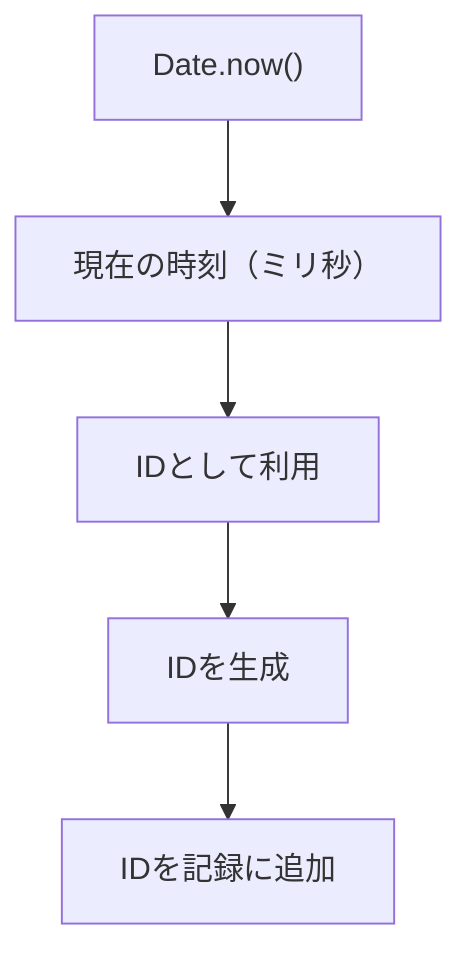

# 📦 Day 7：データの形と`localStorage`を、もっと深く知ろう！ 🐾

## 🌟 7.1 心の旅：データをどうやって保存しようかな？

まず最初に考えるべきことは、 **「入力されたデータを、どうやって保存しておくか」** です。Day 2で出会った`localStorage`は、ブラウザにデータを保存するための、とっても便利な魔法でしたね。これを使えば、データを **永続的に（ずーっと）保存** することができます。

今回は、運動の記録を **`localStorage`に保存** して、ページを更新（リロード）してもデータが消えないようにする、本格的な実装に挑戦します！

---

## 🌼 7.2 `localStorage`の基本を、もう一度おさらい

まずは、 **`localStorage`の基本的な使い方** を復習しましょう。`localStorage`は、ブラウザに **「キー」と「値」のペア** としてデータを保存します。保存したデータは、ページをリロードしてもちゃんと残っていて、次にアクセスしたときにも使うことができます。

### **基本的な使い方**

```javascript
// 'key'という名前で、'value'というデータを保存する
localStorage.setItem('key', 'value');

// 'key'という名前のデータを取り出す
const value = localStorage.getItem('key');

// 'key'という名前のデータを削除する
localStorage.removeItem('key');
```

### **心の旅**：

「そうだった！`localStorage`にデータを保存するには、 **一度ぜんぶ文字列に変換しないといけない** んだった。だから、複数の情報がまとまった **オブジェクトは、一度文字列に変換** して保存して、後で取り出すときには、また **文字列からオブジェクトに戻す** 必要があるんだよね。」

---

## 🌸 7.3 データの形（データ構造）をデザインしよう！

運動の記録を保存するために、 **どんな情報のセット（データ構造）が必要か** を考えます。運動の記録には、運動の種類、日付、時間、回数、メモなどが含まれるので、これらの情報を一つのオブジェクトに、ひとまとめにして保存する必要があります。

### **心の旅**：

「運動の記録をちゃんと保存するためには、最低でも **運動の種類、日付、時間、回数、メモ** が必要だよね。これらの情報を一つのオブジェクトにまとめて、`localStorage`に保存するようにしよう！」

#### **データ構造の例**：

```javascript
{
    id: '1678535800000', // Date.now()の結果を文字列にしたもの（削除や編集のときに使う背番号）
    date: '2023-04-01',  // 運動した日付
    type: 'ランニング',    // 運動の種類
    minutes: 30,         // 運動した時間（分）
    value: 5,            // 回数や距離（km）
    note: '今日は調子が良かったな', // ちょっとしたメモ
    createdAt: 1678535800000 // idと同じ時刻の数字（並び替えのときに使う）
}
```

### **心の旅**：

「うん、この形を使えば、データを分かりやすく保存できそう！後で取り出して、画面に表示することもイメージできるぞ。」

---

## 🔢 7.4 記録ごとの背番号（ユニークID）の決め方を考えよう

データの形が決まったら、次は **「それぞれの記録を、どうやって見分けるか」** を考えます。後で記録を削除したり、編集したりするときに、「どの記録を操作しますか？」っていうのを、正確に指定できる仕組みが必要です。

### **心の旅**：

-   「配列のインデックス（0番目、1番目…）をそのまま使うと、後で記録を並び替えたときに、番号がズレて大変なことになりそう…。」
-   「ランダムな文字列を作る方法もあるけど、初心者の私には、仕組みを追いかけるのがちょっと難しそうだな。」
-   「あ、そうだ！時間は絶対に過去には戻らないんだから、記録を作った瞬間の時刻をそのままIDにすれば、ほとんど重複することはないはず！」

#### **どの方法がいいか、比べてみよう**

| IDの作り方 | 良いところ | ちょっと気になるところ |
|---|---|---|
| 配列のインデックス | 何も考えなくても、すぐ使える | 並び替えや削除で、番号が変わっちゃう！ |
| ランダムな文字列 | 重複しにくい、プロっぽい！ | どうやって作ってるのか、仕組みの理解が少し必要 |
| `Date.now()`の結果 | 仕組みが直感的で、自分で再現しやすい | 数字がすごく長くなるから、扱うときはちょっと注意が必要 |

`Date.now()`は、 **「今の時刻を、ミリ秒っていうすごく細かい単位で返してくれる関数」** でしたね。同じ瞬間に2回ボタンを押さない限り、まず重複することはありません。しかも、時間の情報としても使い回せます。

そこで、IDを作る専門の関数`generateEntryId()`を作って、いつでも同じ手順でIDを作れるようにしておきましょう。

```javascript
// 記録ごとにユニークなID（=作られた瞬間の時刻のミリ秒）を返す関数
function generateEntryId() {
    return Date.now();
}
```

> 後で「新しい順」に並び替えるときにも、この時刻の数字（`createdAt`）を使いたいので、 **IDは一度、数値のまま受け取って、必要に応じて文字列に変換する** という方針にしておくと、一石二鳥で便利ですよ。

---

<br>
<br>
<br>

## ⏰️アウェイク・タイム⏰️りんりんの時のスティック⭐️


### 💬 「目を覚まして！<br>　 　 時が進むたびに、新しいチャンスが生まれるんだよ！<br>　 　 リンリン⏰️<br>　 　 時を刻むたびに成長するんだから！」

<br>
<br>
<br>

--


## 🌼 7.5 フォームから入力値を取り出す準備をしよう

フォームに入力された値を、JavaScriptで確実に受け取るために、まずはそれぞれの入力欄への参照（ショートカット）を、変数にまとめておきましょう。
変数が準備できたら、開発者ツールのコンソールから、本当に思った通りのデータが取れているか、一つずつ確認してみましょう。

### **心の旅**：

-   「`document.getElementById`を毎回書くのは、ちょっと面倒だし、タイプミスしそう。最初に全部まとめて変数に入れておけば、後が楽ちんだし、コードも読みやすいな。」
-   「あれ、変数の宣言って、いつもは`const`を使ってるけど、ここでは`let`を使ってるな。どうしてだっけ…？ あ、そうか！ `const`は宣言したときに値を入れないといけないけど、今回は`initializePage`関数の中で初めて値が代入されるから、宣言の時点ではまだ中身が決まってない。だから、後から値を入れられる`let`を使うのが正しいんだ！」
-   「変数にちゃんとHTMLの要素が入ったかどうかは、コンソールで確認しておくと、不安が減って安心できる。」

#### **ステップ1: HTML要素への参照を変数にまとめる**

```javascript
// これから、ここにHTMLの要素を入れていくよ、という宣言
let entryFormElement;
let dateInputElement;
let typeInputElement;
let minutesInputElement;
let valueInputElement;
let noteInputElement;

// HTMLの要素を探して、それぞれの変数に代入する関数
function assignElementReferences() {
    entryFormElement = document.getElementById('entry-form');
    dateInputElement = document.getElementById('date');
    typeInputElement = document.getElementById('type');
    minutesInputElement = document.getElementById('minutes');
    valueInputElement = document.getElementById('value');
    noteInputElement = document.getElementById('note');
}
```

**コンソールでチェック！**
`assignElementReferences()`を実行してから、コンソールで`typeInputElement`と打ち込んでみましょう。`<input id="type" ...>`というHTML要素の情報が表示されれば成功です。フォームに何か文字を入力した後、`typeInputElement.value`でその文字が取得できるかも確認してみましょう。

#### **ステップ2: フォームの値を、きれいなオブジェクトにまとめる**

```javascript
// フォームに入力された値を取得して、一つのオブジェクトにまとめて返す関数
function getFormData() {
    // まず、記録のIDと作成時刻を取得
    const timestamp = generateEntryId();

    // 取得した値を、私たちが決めたデータ構造のオブジェクトに詰めていく
    return {
        id: String(timestamp), // IDは文字列として保存。製品相当にするなら、`${timestamp}-${crypto.randomUUID()}`　などが◎
        date: dateInputElement.value,
        type: typeInputElement.value,
        // 数値の入力欄は、空っぽの時にエラーにならないように、|| 0 をつけておく
        minutes: parseInt(minutesInputElement.value, 10) || 0,
        value: parseInt(valueInputElement.value, 10) || 0,
        note: noteInputElement.value.trim(), // メモは前後の空白を削除
        createdAt: timestamp // 並び替え用に、元の数値も保存
    };
}
```

> 💡 **ちょっとメモ**：`parseInt(value, 10) || 0`は、「もし`parseInt(value, 10)`が`NaN`（数字じゃないよ、っていう意味）だったら、代わりに`0`を使ってね」という、賢いショートカット記法です。
>
> 「あれ、文字列を数値に変換するなら`Number()`でもいいんじゃないかな？…と思って試してみたら、`Number('30分')`は`NaN`になっちゃうけど、`parseInt('30分', 10)`は`30`っていう数値だけをうまく取り出してくれる！すごい！ユーザーが間違えて『30分』みたいに単位まで入力しちゃう可能性を考えると、`parseInt`の方がより親切で、エラーに強いコードになるな。」
>
> 入力欄が空っぽのとき、`parseInt`は`NaN`を返します。`NaN`はJavaScriptの世界では「偽物（falsy）」として扱われるので、`||`の右側にある`0`が採用される、という仕組みです。もしこの書き方がまだ難しく感じたら、まずは下のコードを動かしてみて、同じ結果になることを確認すると、イメージが掴みやすいですよ。
> 
> ```javascript
> let minutes = parseInt(minutesInputElement.value, 10);
> if (Number.isNaN(minutes)) {
>   minutes = 0;
> }
> ```

**コンソールでチェック！**
フォームに一通り値を入力した後、コンソールで`getFormData()`を実行してみましょう。入力した通りの値が入ったオブジェクトが表示されればOKです。数値の欄を空にした場合に、ちゃんと`0`が入るかも確認しておくと、さらに安心です。

---

## 🪄 7.6 `localStorage`と、データのやり取りをする土台を作ろう

配列全体を`localStorage`から読み込んだり、書き戻したりする専門の関数を用意して、これもコンソールからテストできるようにしておきましょう。

```javascript
// localStorageに保存するときのキー（合言葉）を決めておく
const WORKOUT_STORAGE_KEY = 'ichikaWorkoutLogEntries';

// localStorageから、保存されている記録の配列を読み込む関数
function loadEntriesFromStorage() {
    const rawData = localStorage.getItem(WORKOUT_STORAGE_KEY);

    // --- 心の旅 ---
    // 「最初は if (rawData) { return JSON.parse(rawData); } else { return []; } って書いてたけど、
    //   こういう『もしAならB、そうでなければC』みたいな単純な分岐は、三項演算子を使うと一行でスッキリ書けるんだな。プロっぽい！」
    // 「それと、一番最初にアプリを開いたときは localStorage は空っぽだから rawData は null になる。
    //   そのときに JSON.parse(null) を実行するとエラーで止まっちゃうから、『データがなかったら空の配列 [] を返す』っていう初期化処理は、すごく大事なんだ！」
    //
    return rawData ? JSON.parse(rawData) : [];
}

// 記録の配列を、丸ごとlocalStorageに保存する関数
function saveEntriesToStorage(entries) {
    localStorage.setItem(WORKOUT_STORAGE_KEY, JSON.stringify(entries));
}
```

> ⚠️ **注意！**：もし`localStorage`に保存されているデータが、何かの拍子で壊れてしまっていると、`JSON.parse`がエラーを起こして、アプリが止まってしまうことがあります。例えば、別のプログラムが同じキーで、変なデータを上書きしちゃった…なんてケースです。この章では「そういう事故も、起こる可能性があるんだな」と知っておくだけで大丈夫。Day 13で、`try...catch`という構文を使って、こういう事故が起きてもアプリが止まらないように、しっかりガードする方法に触れます。

**コンソールでチェック！**
`loadEntriesFromStorage()`を実行して、期待通りの配列が返ってくるか確認しましょう。
次に、`saveEntriesToStorage([{ id: 'draft', createdAt: Date.now() }])`のようにダミーのデータを保存してみて、もう一度`loadEntriesFromStorage()`でデータが取れるか確認します。テストが終わったら、`localStorage.removeItem(WORKOUT_STORAGE_KEY)`で、お掃除も忘れずに。

---

## 🌸 7.7 フォームの送信イベントと、作った関数を結びつけよう

HTMLに直接`onsubmit`と書く代わりに、JavaScriptからイベントを登録することで、処理の流れを一つのファイルに集中させて、管理しやすくします。

```javascript
// イベントリスナー（イベントを待ち受ける仕組み）を登録する関数
function attachEventListeners() {
    entryFormElement.addEventListener('submit', handleFormSubmit);
}

// フォームが送信（submit）されたときに呼ばれる関数
function handleFormSubmit(event) {
    // フォーム送信時のデフォルトの動き（ページのリロード）を止める
    event.preventDefault();

    // --- 心の旅 ---
    // 「新しいデータを1件追加するだけなのに、毎回localStorageから全部のデータを読み込んで、また全部を保存し直すのって、ちょっと効率悪くないかな？」
    // 「でも、今の段階ではデータの件数も少ないし、処理も一瞬で終わる。それに、この『常に最新の配列を元に処理する』っていうやり方の方が、データの不整合が起きにくくて、コードがシンプルで安全なんだ。まずはこの確実な方法をマスターしよう。もっとすごいアプリを作る時になったら、効率のことも考えればいいや！」

    // ここで、今まで作ってきた関数を順番に呼び出していく！
    const entry = getFormData(); // 1. フォームからデータを取得
    const entries = loadEntriesFromStorage(); // 2. 今までの記録を読み込む
    entries.push(entry); // 3. 新しい記録を追加
    saveEntriesToStorage(entries); // 4. 全体を保存し直す

    // 次の入力がしやすいように、フォームをリセット
    entryFormElement.reset();
    console.log('[handleFormSubmit] 保存が完了しました！現在の件数:', entries.length);
}
```

**コンソールでチェック！**
フォームを送信した後に、コンソールの件数がちゃんと増えていくか、そして`loadEntriesFromStorage()`で取得できる配列の中身も、ちゃんと増えているかを確認しましょう。

---

## 🧪 7.8 ここまでの流れを、手動でテストしてみよう

1.  ブラウザを開いて、コンソールで`initializePage()`を呼び出すか、ページをリロードして、プログラムを初期状態にします。
2.  フォームに値を入力して、送信ボタンを押します。
3.  コンソールで`loadEntriesFromStorage()`を実行して、配列に新しいデータが追加されたか確認します。
4.  もしテストをやり直したくなったら、`localStorage.removeItem(WORKOUT_STORAGE_KEY)`でデータをリセットして、何度でも挑戦してみましょう。



---

## 🧩 7.9 ここまでのコードを、まとめて確認しよう

バラバラに作ってきた関数を、一つのファイルに並べてみると、フォームの入力から`localStorage`への保存まで、一連の流れがはっきりと見えてきます。
ここまでで組み立てた部品を順番に貼り合わせて、全部が一本の線でつながることを確かめましょう。

```javascript
// localStorageに保存する際のキー
const WORKOUT_STORAGE_KEY = 'ichikaWorkoutLogEntries';

// HTMLのUI要素を格納する変数
let entryFormElement;
let dateInputElement;
let typeInputElement;
let minutesInputElement;
let valueInputElement;
let noteInputElement;

// IDを元にHTML要素を取得し、変数に割り当てる
function assignElementReferences() {
    entryFormElement = document.getElementById('entry-form');
    dateInputElement = document.getElementById('date');
    typeInputElement = document.getElementById('type');
    minutesInputElement = document.getElementById('minutes');
    valueInputElement = document.getElementById('value');
    noteInputElement = document.getElementById('note');
}

// フォームのsubmitイベントに、処理用の関数を紐付ける
function attachEventListeners() {
    entryFormElement.addEventListener('submit', handleFormSubmit);
}

// 現在時刻のタイムスタンプを元に、ユニークなIDを生成する
function generateEntryId() {
    return Date.now();
}

// フォームの入力値を取得し、1つのオブジェクトに整形して返す
function getFormData() {
    const timestamp = generateEntryId();
    return {
        id: String(timestamp),
        date: dateInputElement.value,
        type: typeInputElement.value,
        minutes: parseInt(minutesInputElement.value, 10) || 0,
        value: parseInt(valueInputElement.value, 10) || 0,
        note: noteInputElement.value.trim(),
        createdAt: timestamp
    };
}

// localStorageから運動記録の配列を読み込む
function loadEntriesFromStorage() {
    const rawData = localStorage.getItem(WORKOUT_STORAGE_KEY);
    // データがあればJSONとして解析し、なければ空の配列を返す
    return rawData ? JSON.parse(rawData) : [];
}

// 運動記録の配列をlocalStorageに保存する
function saveEntriesToStorage(entries) {
    // 配列をJSON文字列に変換して保存
    localStorage.setItem(WORKOUT_STORAGE_KEY, JSON.stringify(entries));
}

// フォーム送信時の処理
function handleFormSubmit(event) {
    // デフォルトの再読み込みを防止
    event.preventDefault();
    
    // 1. フォーム入力値を取得
    const entry = getFormData();
    // 2. ストレージから既存の記録を読み込み
    const entries = loadEntriesFromStorage();
    // 3. 新しい記録を追加
    entries.push(entry);
    // 4. 全ての記録をストレージに保存
    saveEntriesToStorage(entries);
    
    // フォームをリセット
    entryFormElement.reset();
}

// ページの初期化処理
function initializePage() {
    assignElementReferences();
    attachEventListeners();
    // この時点では、まだ保存処理だけ。画面の表示更新は、Day 8で追加します！
}

// DOMの読み込み完了時に、ページの初期化処理を実行
document.addEventListener('DOMContentLoaded', initializePage);
```

---

### **コードの詳しい説明**：

1.  **`assignElementReferences` / `attachEventListeners`**：フォームのHTML要素をまとめて管理し、送信イベントを`handleFormSubmit`関数に結びつける、大事な初期化処理です。

2.  **`getFormData`**：フォームから入力されたデータを取得する専門の関数です。それぞれの入力欄から値を取り出して、一つのきれいなオブジェクトにまとめて返してくれます。

3.  **`generateEntryId`**：記録データに、世界で一つの背番号（ID）を割り振るための関数です。`Date.now()`で現在の時刻を取得し、それをIDと`createdAt`の両方に使っています。

4.  **`loadEntriesFromStorage` / `saveEntriesToStorage`**：`localStorage`とのデータのやり取りを専門に担当する、頼れる関数ペアです。

5.  **`handleFormSubmit`**：フォームが送信されたときに、これまで作ってきた関数たちを順番に呼び出して、データの保存処理を実行する、いわば司令塔のような関数です。

---

### **これまでの実装の流れ**：

*   Day 7では、まずデータの保存方法を学び、**`localStorage`にデータを保存する**ための、しっかりした土台を実装しました。
*   次に、フォームから入力されたデータを、その土台に乗せて**`localStorage`に保存**し、次のステップで**データを表示するための準備**を整えました。

このコードを使えば、運動の記録をフォームで入力して、ブラウザをリロードしても、データがちゃんと**`localStorage`に保存**されるため、**大切な記録をずっと保持**できます。

次回は、この保存されたデータを、いよいよ**画面のテーブルに表示する**処理を追加していきます！楽しみですね！

---

<br>
<br>
<br>

## 🧊データ・サーチ🧊デタサチーナの「型と人生」


### 💬 「データは型にハマるほど扱いやすくなるけど、<br>　 　 人生は型をハミ出すほど物語が増えるのよ🔍」

<br>
<br>
<br>

---

## 🌼 7.10 次のステップに進むための準備

ここまでで、 **`localStorage`にデータを保存する仕組み** が、ばっちり完成しました。
次回は、保存されたデータを **テーブルに表示** して、ユーザーが自分の頑張りをいつでも確認できるようにします。

### **まとめ**：

*   **`localStorage`を使って、データを安全に保存する方法** を理解した！
*   フォームから取得したデータを、決まった形のオブジェクトにして **`localStorage`に保存** し、それを **表示するための準備** ができた！
*   次回は、いよいよ **保存されたデータを、画面にきれいに表示する** 処理に進みます！

---

## 🌼 **優しい補足：実際の`script.js`では、どうなってるの？**

ここまでのコードは、「処理の流れを理解する」ための、一番シンプルな最短ルートです。最終的に完成する`script.js`では、もう少しだけステップアップした、大人な書き方がいくつか加わっています。

*   `loadEntriesFromStorage`関数では、`try...catch`という構文を使って、もしデータの読み込みに失敗しても、アプリ全体が止まってしまわないように、優しくガードしています。
*   `handleFormSubmit`関数の最後で、日付の入力欄を今日の日付に戻したり、`renderEntryTable()`を呼び出して、保存と同時に画面も更新したりしています（これはDay 8で詳しく扱います）。
*   この後の章で登場する、フィルター機能や削除ボタンも、ここで紹介した変数や関数に少しずつ機能を追加していくだけで、うまく連携できるように設計されています。

まずはこの章のシンプルなコードで「仕組み」をしっかり理解して、慣れてきたら、本番のソースコードと見比べながら、「なるほど、こんな工夫があるんだ！」って、少しずつ真似していきましょうね。

> 📝 `JSON.stringify`や`JSON.parse`をうっかり忘れてしまうと、`localStorage`に保存したデータが、ただの文字列のままになっちゃいます。「あれ、ちゃんとオブジェクトの配列に戻ってるかな？」って心配になったら、`console.log`で途中のデータの中身を覗いてみるクセをつけると、すごく安心ですよ。

---

<h1><a href="D08.md">Day8 へ</a></h1>
