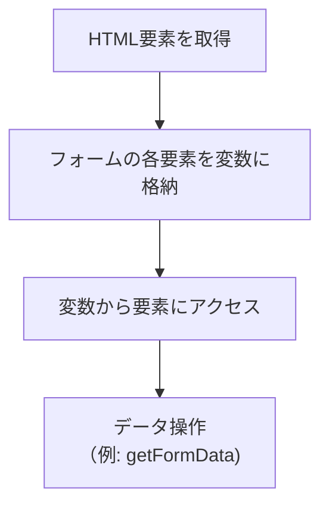
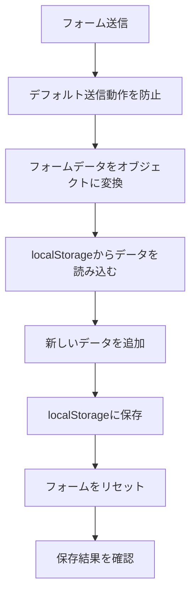

# 📥 Day 8：フォームの操作とデータの保存（心の声と一緒に編）

---

## 🌟 8.1 保存したい情報を、もう一度整理しよう

Day 7までで、1件分の運動の記録を、きれいな形のオブジェクトにまとめることができるようになりました。
ここからは、いよいよ「フォームで入力 → JavaScriptで受け取る → `localStorage`に保存する」という一連の流れを完成させます！

### 初心者さんの、心の声

-   「フォームに入力した値を、どうやってJavaScriptの世界に渡せばいいんだろう？」
-   「ちゃんと保存できたかどうか、どうやって確かめたらいいのかな？」

### アプリ制作者の、心の旅

1.  まずは、フォームのそれぞれの入力欄にアクセスしやすいように、HTML要素への参照（ショートカット）をまとめておこう。
2.  フォームが送信されたイベントをJavaScript側でキャッチして、ページがリロードされちゃう、っていうデフォルトの動きを止めてあげよう。
3.  1件分のデータをオブジェクトの形にして、今までの記録が入った配列に追加して、その新しい配列を丸ごと`localStorage`に書き戻そう。
4.  ちゃんと保存できたかどうかは、まずは`console.log`を使って、自分の目で確認できるようにしよう。

---

## 🧰 8.2 既存のデータを読み出す処理の、おさらい

データを保存するときの土台になる`loadEntriesFromStorage()`関数は、Day 7でも登場しましたね。
`localStorage`から保存済みの配列を取得して、もしデータが見つからなければ、代わりに空っぽの配列を返す、という形にしておくと、後々の処理がとっても楽になります。

```javascript
// localStorageから、保存されている記録の配列を読み込む関数
function loadEntriesFromStorage() {
    // WORKOUT_STORAGE_KEYっていう合言葉で、データを取得してみる
    const rawData = localStorage.getItem(WORKOUT_STORAGE_KEY);
    // もしデータがあったら、JSON.parseでオブジェクトに戻す。なかったら、空の配列を返す
    return rawData ? JSON.parse(rawData) : [];
}
```

> `WORKOUT_STORAGE_KEY`は、`'ichikaWorkoutLogEntries'`という文字列を、定数（名前が変わらない変数）にまとめたものです。こうしておくと、後からキーの名前を変えたくなったときも、たった1ヶ所を修正するだけで済むので、とっても便利なんですよ。

---

## 🌸 8.3 フォームが送信されたら、データを保存しよう！

### ステップ1: よく使うHTML要素を、変数にまとめておこう

### 🧰 フォーム要素参照のフロー




```javascript
// これから、ここにHTMLの要素を入れていくよ、という宣言
let entryFormElement;
let dateInputElement;
let typeInputElement;
let minutesInputElement;
let valueInputElement;
let noteInputElement;

// HTMLの要素を探して、それぞれの変数に代入する関数
function assignElementReferences() {
    entryFormElement = document.getElementById('entry-form');
    dateInputElement = document.getElementById('date');
    typeInputElement = document.getElementById('type');
    minutesInputElement = document.getElementById('minutes');
    valueInputElement = document.getElementById('value');
    noteInputElement = document.getElementById('note');
}
```

> これで、どの関数からでも、同じ入力欄の要素を簡単に参照できるようになりました！

### ステップ2: 送信イベントを、JavaScript側で受け取ろう

```javascript
// イベントリスナー（イベントを待ち受ける仕組み）を登録する関数
function attachEventListeners() {
    // entryFormElement（フォーム）が送信（submit）されたら、handleFormSubmit関数を呼び出すように予約する
    entryFormElement.addEventListener('submit', handleFormSubmit);
}
```

`handleFormSubmit`関数は、この後すぐに作ります。HTMLに`onsubmit="..."`と直接書くよりも、JavaScript側からイベントを登録するほうが、処理の流れを一つのファイルでまとめて管理できるので、コードが読みやすくなります。


### ステップ3: 1件分のデータを取得して、保存しよう


```javascript
// フォームが送信されたときに呼ばれる、メインの処理関数


function handleFormSubmit(event) {
    // まずは、ブラウザのデフォルトの送信動作（ページのリロード）をストップ！
    event.preventDefault(); 

    // Day 7で作った関数たちを、順番に呼び出していくよ
    const entry = getFormData(); // 1. フォームから、入力された値を取得してオブジェクトにする
    const entries = loadEntriesFromStorage(); // 2. 今までの記録をlocalStorageから読み込む
    entries.push(entry); // 3. 新しい記録を、配列の末尾に追加する
    saveEntriesToStorage(entries); // 4. 新しくなった配列を、丸ごとlocalStorageに保存し直す

    // 次の入力がしやすいように、フォームの中身をリセットする
    entryFormElement.reset();
    // ちゃんと保存できたか、コンソールにメッセージと配列の中身を表示して確認！
    console.log('保存済みの記録一覧:', entries);
}
```

ここでのポイントは、次の通りです。

-   `event.preventDefault()`で、ページが勝手にリロードされちゃうのを防ぎます。
-   `getFormData()`（Day 7で実装済み）で、フォームの入力値をきれいなオブジェクトにまとめます。
-   `loadEntriesFromStorage()`で既存の記録の配列を取り出して、新しい記録を`push`で追加します。
-   `saveEntriesToStorage(entries)`で、新しい配列を丸ごとJSON文字列に変換して保存します。
-   最後にフォームを`reset()`して次の入力に備えつつ、配列全体を`console.log`で確認します。

> `console.log`は、後で完成したら消しても大丈夫ですが、開発中は、あなたのコードがちゃんと動いているか教えてくれる、とっても頼もしい相棒ですよ。

---

<br>
<br>
<br>

## 🗒️キープ・メモリー🗒️メモリナ姉さんが残す、消えぬ日々のしるし

 |

### 💬 「忘れたの？<br>　 　それはそれで、まあいいのかもしれないね。<br>　 　だって、私がメモしてるから、<br>　 　あなたの過去は『私の中で生き続ける』わ🗒️」

<br>
<br>
<br>


---

## 🧪 8.4 ちゃんと保存できたか、確認してみよう

1.  フォームに好きな値を入力して、送信ボタンを押してみましょう。
2.  ブラウザの開発者ツールを開いて、コンソールで`loadEntriesFromStorage()`と打ち込んで、Enterキーを押してみましょう。
3.  さっき入力したデータが、配列の末尾に追加されていれば、大成功です！🎉
4.  さらに、開発者ツールの「Application」（または「ストレージ」）タブで、`localStorage`の中にある`ichikaWorkoutLogEntries`というキーの中身を見てみると、保存されている内容を直接確認することもできますよ。

> もし、うまくいかないな？と感じたら、`handleFormSubmit`関数の途中に`console.log(entry)`や`console.log(entries)`を挟んでみて、「どの段階で、自分の思った動きとズレちゃったんだろう？」と探してみましょう。

---

### 📝 フォーム送信処理のフロー



---

## 🌸 8.5 次の章に向けて

ここまでは、「データがちゃんと保存できているか」を、`console.log`で確認するところまでを仕上げました。
Day 9では、いよいよ`renderEntryTable()`関数を実装して、保存されているデータを、画面のテーブルにきれいに描画していきます。

> 今はまだ、ボタンを押しても画面に変化がなくて、ちょっと寂しいかもしれません。でも大丈夫。裏側では、あなたの入力したデータが、ちゃんと積み重なっています。それが確認できれば、次のステップに進む準備は万端です！

---

## 🌼 8.6 この章の、重要なポイント

-   フォームのHTML要素を、JavaScriptの変数にまとめて取得して、どこからでも参照できるようにした。
-   `handleFormSubmit`関数の中で、`localStorage`への保存処理と、フォームのリセット処理を行った。
-   画面の表示は次の章に任せることにして、まずは`console.log`で、保存結果を自分の目で確認するところまでをクリアした。

---

## 全体のJavaScriptコード（Day 8時点）

```javascript
const WORKOUT_STORAGE_KEY = 'ichikaWorkoutLogEntries';

let entryFormElement;
let dateInputElement;
let typeInputElement;
let minutesInputElement;
let valueInputElement;
let noteInputElement;

function assignElementReferences() {
    entryFormElement = document.getElementById('entry-form');
    dateInputElement = document.getElementById('date');
    typeInputElement = document.getElementById('type');
    minutesInputElement = document.getElementById('minutes');
    valueInputElement = document.getElementById('value');
    noteInputElement = document.getElementById('note');
}

function attachEventListeners() {
    entryFormElement.addEventListener('submit', handleFormSubmit);
}

function generateEntryId() {
    return Date.now();
}

function getFormData() {
    const timestamp = generateEntryId();

    return {
        id: String(timestamp),
        date: dateInputElement.value,
        type: typeInputElement.value,
        minutes: parseInt(minutesInputElement.value, 10) || 0,
        value: parseInt(valueInputElement.value, 10) || 0,
        note: noteInputElement.value.trim(),
        createdAt: timestamp
    };
}

function loadEntriesFromStorage() {
    const rawData = localStorage.getItem(WORKOUT_STORAGE_KEY);
    return rawData ? JSON.parse(rawData) : [];
}

function saveEntriesToStorage(entries) {
    localStorage.setItem(WORKOUT_STORAGE_KEY, JSON.stringify(entries));
}

function handleFormSubmit(event) {
    event.preventDefault();

    const entry = getFormData();
    const entries = loadEntriesFromStorage();
    entries.push(entry);
    saveEntriesToStorage(entries);

    entryFormElement.reset();
    // Day 9で、このconsole.logを、画面表示の処理に置き換える予定です！
    console.log('保存済みの記録一覧:', entries); 
}

function initializePage() {
    assignElementReferences();
    attachEventListeners();
}

document.addEventListener('DOMContentLoaded', initializePage);
```

---

ここまでのコードを動かしながら、「ちゃんと保存できているかな？」というのを、コンソールで確かめる練習をしてみてください。
次の章では、この保存済みのデータを、テーブルに描画する`renderEntryTable()`関数を、一歩ずつ組み立てていきます。

---

<h1><a href="D09.md">Day9 へ</a></h1>