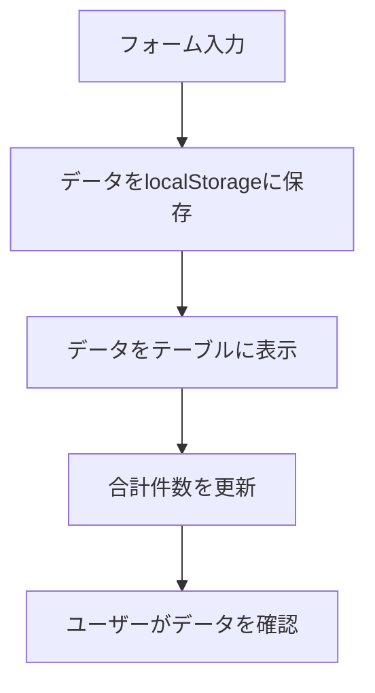
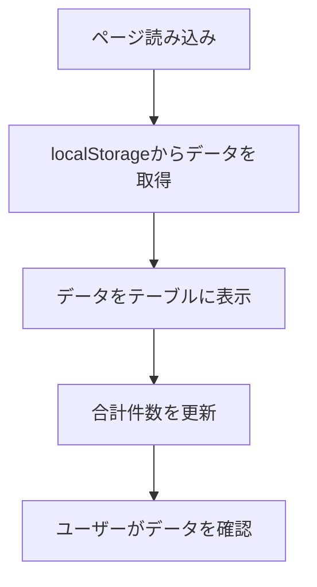
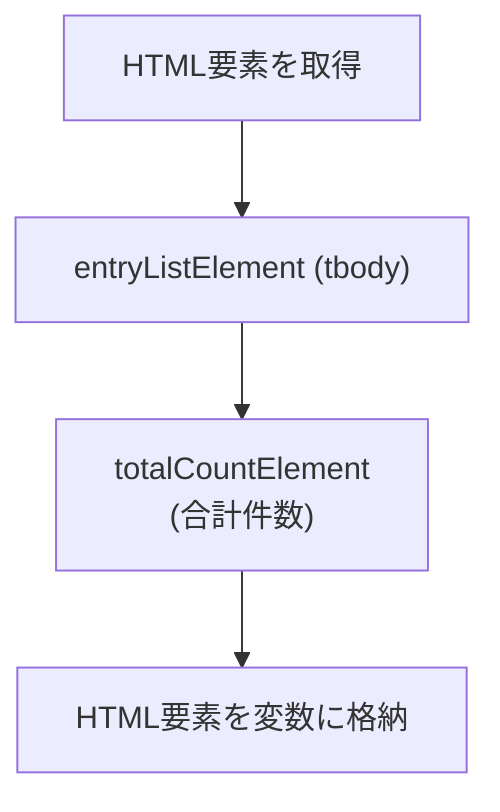

# 📜：データを画面に表示しよう！（心の声と一緒に編）

---

## 🌟 9.1 保存したデータを、目に見える形にしよう！

### 📜 データ表示フロー

#### 新規保存



#### 読み込み




Day 8までで、フォームで送信したデータを、`localStorage`にどんどん蓄積できるようになりました。
ここでは、その蓄積したデータを、いよいよ画面のテーブルにきれいに描画して、ユーザーが自分の頑張りを目で見て確認できるようにします！

### 初心者さんの、心の声

-   「データは`localStorage`に溜まっているはずなのに、画面は空っぽのままで、本当にできてるか不安…」
-   「どのタイミングで、どうやってHTMLを組み立てて、画面に表示すればいいのか分からない…」

### アプリ制作者の、心の旅

1.  まずは、表示に必要なHTML要素（テーブルの`<tbody>`とか、件数を表示する場所とか）への参照も、`assignElementReferences()`関数に追加しておこう。
2.  `renderEntryTable()`っていう、テーブルを描画する専門の関数を作って、配列のデータから`<tr>`（テーブルの行）のHTMLを組み立てて、`innerHTML`に一気に流し込む、っていう処理を作ろう。
3.  フォームが送信された後と、ページが読み込まれた一番最初のタイミングで、この`renderEntryTable()`関数を呼び出してあげれば、いつでも画面が最新の状態に保たれるはず！

---

## 🧰 9.2 表示に使うHTML要素への参照も、追加しよう

### 🧰 HTML要素参照フロー




Day 8でまとめたフォームの要素に加えて、テーブルの本体（`<tbody>`）や、記録の合計件数を表示するための要素も、変数に保持しておきましょう。

```javascript
// テーブルの本体（tbody）と、合計件数を表示する場所の変数を追加
let entryListElement;
let totalCountElement;

function assignElementReferences() {
    // ...（今までのフォーム要素の参照は、ここにあります）...
    entryFormElement = document.getElementById('entry-form');
    dateInputElement = document.getElementById('date');
    typeInputElement = document.getElementById('type');
    minutesInputElement = document.getElementById('minutes');
    valueInputElement = document.getElementById('value');
    noteInputElement = document.getElementById('note');

    // 新しく追加する、表示用の要素
    entryListElement = document.getElementById('list'); // HTMLでは<tbody id="list">のこと
    totalCountElement = document.getElementById('total-count'); // 合計件数を表示する<span>のこと
}
```

> この後の章（Day 10以降）で、削除ボタンやフィルター機能を扱うときも、ここに対象となるHTML要素を追加して、使い回していくことになります。

---

## 🌸 9.3 `renderEntryTable()`関数を、作ってみよう！

`loadEntriesFromStorage()`で取得した記録の配列から、`for`ループを使って一件ずつデータを取り出して、`<tr>`（テーブルの行）のHTML文字列を組み立てていきます。そして、出来上がったHTML文字列を、`innerHTML`プロパティを使って、テーブルの`<tbody>`に一気に流し込みます。

```javascript
// 保存されているデータを、画面のテーブルに描画するための専門の関数
function renderEntryTable() {
    // --- 心の旅 ---
    // 「Day 3でcreateElementとinnerHTMLの両方を試したけど、今回はどっちがいいんだろう？
    //   このrender関数は、呼ばれるたびにテーブルの中身を一度空にして、全部のデータを描き直す、っていう作りだ。
    //   それなら、一行ずつappendChildしていくよりも、HTML文字列をforループで全部作ってから、最後にinnerHTMLで一気にドン！と入れ替える方が、コードがシンプルで分かりやすいな。
    //   よし、今回もinnerHTML作戦で行こう！」

    // まずは、localStorageから全データを読み込む
    const entries = loadEntriesFromStorage();

    // これから組み立てるHTMLの文字列を、一旦空っぽで準備
    let tableHtml = '';
    // 配列のデータを、forループで一件ずつ取り出して処理する
    for (const entry of entries) {
        // ``(バッククォート)で囲んだテンプレートリテラルを使うと、HTMLの中に変数を埋め込めて便利！
        tableHtml += `
            <tr>
                <td>${entry.date}</td>
                <td>${entry.type}</td>
                <td class="text-end">${entry.minutes || ''}</td>
                <td class="text-end">${entry.value || ''}</td>
                <td>${entry.note || ''}</td>
            </tr>
        `;
    }

    // もし、記録が1件もなかったら、「データがありません」という特別な行を表示する
    if (entries.length === 0) {
        // --- 心の旅 ---
        // 「最初はデータがあることしか考えてなかったけど、初めてアプリを使うユーザーの画面には、テーブルが空っぽで何も表示されない…。
        //   それだと『壊れてるのかな？』って不安にさせちゃうかも。
        //   『まだ記録がありません』って一言メッセージがあるだけで、『ここに入力すればいいんだな』ってユーザーを優しく導いてあげられる。
        //   こういう『データが一件もない状態（Empty State）』をちゃんとデザインしてあげるのって、すごく大事なんだな。」
        tableHtml = '<tr><td colspan="5">まだ記録がありません。最初の記録を追加してみましょう！</td></tr>';
    }

    // 出来上がったHTMLの文字列を、テーブルの<tbody>に一気に流し込む！
    entryListElement.innerHTML = tableHtml;
    // 合計件数も、ちゃんと更新する
    totalCountElement.textContent = String(entries.length);
}
```

### ✨ `map`と`join`で整える例（参考程度）

`for (const entry of entries) {...}` で十分ですが、テンプレート的に書きたいときは`entries.map(...).join('')`を使っても問題ありません。`map`で各行のHTML文字列を配列にし、最後に`join('')`でひとつの大きな文字列にまとめる方法です。  

```javascript
const tableHtml = entries
    .map(entry => `
        <tr>
            <td>${entry.date}</td>
            <td>${entry.type}</td>
            <td class="text-end">${entry.minutes || ''}</td>
            <td class="text-end">${entry.value || ''}</td>
            <td>${entry.note || ''}</td>
        </tr>
    `)
    .join('');
```

> 「mapとjoinに書き換えたら速くなるんじゃ？」
> 
> そんな期待を抱きつつ書き換えてみたものの、いざ心の片隅で「これ、本当に速いのかな……？」と疑念が芽生える

──これはあるあるの思考の流れです。  

実際には、`map().join()` にしたからといって高速化されるわけではありません。むしろこのシーンでは `map + join` の方が「ほぼ確実に遅く」なります。JavaScript エンジンは `tableHtml += ...` のような連結パターンを想定して内部で最適化しており、このような文字列連結を何度繰り返しても、速度・メモリの両面で大きく不利にはなりにくい設計になっています。

「本当に`+=`の方が速いの？」と気になったら、ぜひ console.log などで簡単なベンチマークを書いてみてください。データ件数が少ないうちは差はほとんど出ず、数十万件規模になって初めて差が出たかな？ ──というのが実際のところです。

よほどデータ件数が多くない限りは、自分にとって読みやすい記述、自然な思考に寄り添う記述を優先しましょう。もしデータが膨大になってきたら、その時点で「どちらの書き方が実行速度が速いか」を実際に計測し、適切なものを選べば十分です。

### 🛡️ 完成版ではもう一歩

完成版の`script.js`では、ユーザーが入力した文字に悪意のあるコードが含まれていた場合も安全に表示するための`escapeHtml()`という処理を挟んだり、削除ボタンを追加したりしています。でも、まずは「データを表示する」っていう、この基本的な仕組みを理解することを優先しましょうね。

---

<br>
<br>
<br>

## 🦐エビ・フライ🦐エビーナは世渡り上手


### 💬 「褒め言葉が思いつかない？ <br>　 　とりあえず『きょうもサクサクですね』<br>　 　 って言っとけばテンプレ的に正解よ🦐」

<br>
<br>
<br>


---
---

## 🔄 9.4 保存処理と、表示処理を、つなげよう！

フォームが送信された後と、ページが読み込まれた一番最初のタイミングで、さっき作った`renderEntryTable()`関数を呼び出すようにします。

```javascript
// フォームが送信されたときの処理
function handleFormSubmit(event) {
    event.preventDefault();

    const entry = getFormData();
    const entries = loadEntriesFromStorage();
    entries.push(entry);
    saveEntriesToStorage(entries);

    entryFormElement.reset();
    
    // 保存が終わったら、すぐに画面を更新！
    renderEntryTable();
}

// ページが読み込まれたときに、一番最初に実行される処理
function initializePage() {
    assignElementReferences();
    attachEventListeners();
    
    // --- 心の旅 ---
    // 「`handleFormSubmit`の中で`render`するのは分かる。新しいデータを追加したんだから、画面も更新しないとね。
    //   じゃあ、`initializePage`の中で`render`するのはなんでだっけ？
    //   …あ、そうか！ページを開いた瞬間に、`localStorage`に残っている前回のデータを画面に復元するためだ！
    //   この2つのタイミングで`render`を呼ぶことで、『追加したとき』と『ページを開いたとき』の両方で、画面が必ず最新の状態になる。
    //   なるほど、これでアプリがいつでも正しい見た目になるんだな。」
    renderEntryTable(); 
}

// HTMLの読み込みが終わったら、initializePage関数を呼び出す
document.addEventListener('DOMContentLoaded', initializePage);
```

これで、「入力 → 保存 → すぐに表示！」という一連の流れが、一本の線でキレイにつながりました！

---

## 👀 9.5 ちゃんと動くか、チェックしてみよう！

1.  フォームに好きな値を入力して、送信ボタンを押してみましょう。
2.  テーブルに、今入力した内容の新しい行が追加されて、合計件数の表示も1つ増えているか、確認してみましょう。
3.  ブラウザをリロード（F5キー）しても、さっき保存したデータが、最初からちゃんと表示されることを確かめてみましょう。
4.  もし思った通りに動かない場合は、`renderEntryTable`関数の最初の行あたりで`console.log(entries)`を実行してみて、「配列の中身は、ちゃんと期待通りになっているかな？」「テーブルが空っぽのままじゃないかな？」と、順番に確認してみましょう。

> 🧾 **補足：`${entry.minutes || ''}` って、どういう意味？**
> 
> `minutes`や`value`は、数値として保存されています。もしユーザーが何も入力しなかった場合、Day 7の実装で`0`が入るようになっています。
> `||`という記号は、「もし左側がfalsy（偽物っぽい値、`0`もその一つ）だったら、右側の値を使う」という、JavaScriptの便利な短縮記法です。
> 
> ここで`|| ''`としているのは、もし`minutes`が`0`だった場合に、テーブルのセルに「0」と表示するのではなく、**見た目をスッキリさせるために、あえて空欄にしたい**、というデザイン上の判断です。
> もし「0でもちゃんと表示したい！」という場合は、この`|| ''`を消しても大丈夫ですよ。状況に応じて、「未入力のデータを、どう見せるのが一番親切かな？」と考えられるようになると、もっと素敵なアプリが作れるようになります。

---

<br>
<br>
<br>

## 💻️クラッシュ・スクリーン💻️ブルーモニカは清々しい


### 💬 「ブルー・スクリーン💻は清々しいわ！<br>　 　 再起動すると、きっとキラキラした楽しい未来が映るから💻」

<br>
<br>
<br>


---

## 全体のJavaScriptコード（Day 9時点）

```javascript
const WORKOUT_STORAGE_KEY = 'ichikaWorkoutLogEntries';

let entryFormElement;
let dateInputElement;
let typeInputElement;
let minutesInputElement;
let valueInputElement;
let noteInputElement;
let entryListElement;
let totalCountElement;

function assignElementReferences() {
    entryFormElement = document.getElementById('entry-form');
    dateInputElement = document.getElementById('date');
    typeInputElement = document.getElementById('type');
    minutesInputElement = document.getElementById('minutes');
    valueInputElement = document.getElementById('value');
    noteInputElement = document.getElementById('note');
    entryListElement = document.getElementById('list');
    totalCountElement = document.getElementById('total-count');
}

function attachEventListeners() {
    entryFormElement.addEventListener('submit', handleFormSubmit);
}

function generateEntryId() {
    return Date.now();
}

function getFormData() {
    const timestamp = generateEntryId();
    return {
        id: String(timestamp),
        date: dateInputElement.value,
        type: typeInputElement.value,
        minutes: parseInt(minutesInputElement.value, 10) || 0,
        value: parseInt(valueInputElement.value, 10) || 0,
        note: noteInputElement.value.trim(),
        createdAt: timestamp
    };
}

function loadEntriesFromStorage() {
    const rawData = localStorage.getItem(WORKOUT_STORAGE_KEY);
    return rawData ? JSON.parse(rawData) : [];
}

function saveEntriesToStorage(entries) {
    localStorage.setItem(WORKOUT_STORAGE_KEY, JSON.stringify(entries));
}

function handleFormSubmit(event) {
    event.preventDefault();
    const entry = getFormData();
    const entries = loadEntriesFromStorage();
    entries.push(entry);
    saveEntriesToStorage(entries);
    entryFormElement.reset();
    renderEntryTable();
}

function renderEntryTable() {
    const entries = loadEntriesFromStorage();
    let tableHtml = '';
    for (const entry of entries) {
        tableHtml += `
            <tr>
                <td>${entry.date}</td>
                <td>${entry.type}</td>
                <td class="text-end">${entry.minutes || ''}</td>
                <td class="text-end">${entry.value || ''}</td>
                <td>${entry.note || ''}</td>
            </tr>
        `;
    }
    if (entries.length === 0) {
        tableHtml = '<tr><td colspan="5">まだ記録がありません。最初の記録を追加してみましょう！</td></tr>';
    }
    entryListElement.innerHTML = tableHtml;
    totalCountElement.textContent = String(entries.length);
}

function initializePage() {
    assignElementReferences();
    attachEventListeners();
    renderEntryTable();
}

document.addEventListener('DOMContentLoaded', initializePage);
```

---

これで、保存されたデータを、ちゃんと画面に表示できるようになりましたね！
次の章では、削除ボタンなどの操作を追加して、見た目だけじゃなく、「ちゃんと操作できるテーブル」へと、さらに育てていきます。

---

<h1><a href="D10.md">Day10 へ</a></h1>