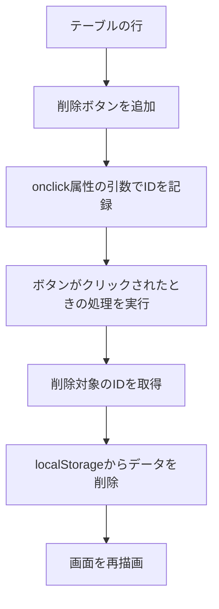
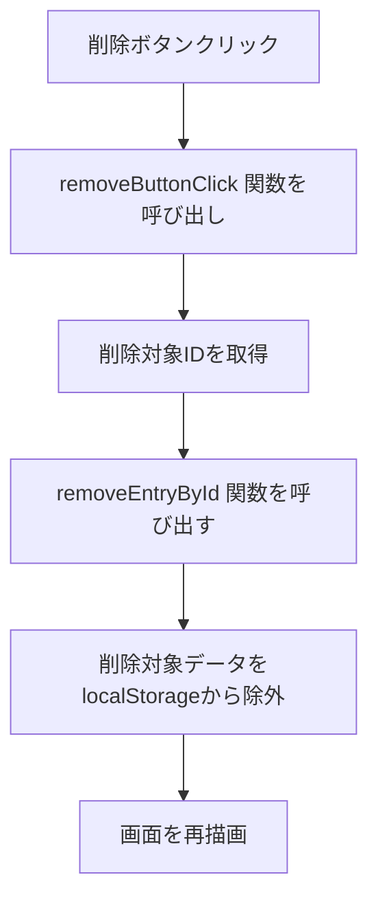

# 🗑️ Day 10：いらない記録はさよなら！削除機能を作ろう 🐾

## 🌟 10.1 心の旅：どうして削除機能が必要なんだろう？

これまで、フォームに入力したデータを **`localStorage`に保存** して、それを **画面に表示** してきました。でも、もしユーザーが「あ、これ間違えて入力しちゃった！」とか「この記録はもういらないな」って思ったとき、そのデータを **削除** する機能がなかったら、とっても困っちゃいますよね。

### 初心者さんの、心の声：

「テーブルの行に **削除ボタンを作る** っていうのは、なんとなく分かる。でも、 **クリックしたボタンが、どの行のデータを消せばいいのか** を、どうやってJavaScriptに伝えればいいんだろう？」

### アプリ制作者の、心の旅：

「削除ボタンを作る前に、まず **『どのデータを削除するのか』を特定する方法** を考えよう。そうだ！それぞれの削除ボタンの **`onclick`** で呼び出す関数に、引数として削除すべきデータのID（背番号）を渡しておこう。そうすれば、ボタンがクリックされたときに、そのIDをヒントにして、 **`localStorage`から目的のデータを削除** できるはずだ！」

---

<br>
<br>
<br>

## 🍾ボトル・スタンド🍾ボトルちゃんはジッと立つ


### 💬 「止まってる自分を責めないの。<br>　 　 ボトルだって、じっと立ってる時間で<br>　 　 中身がまろやかになるんだから🍾」

<br>
<br>
<br>

---

## 🌼 10.2 テーブルに、削除ボタンを作ろう

### 🧰 削除ボタンの追加フロー




まずは、テーブルのそれぞれの行に、 **削除ボタン** を追加することから始めます。これで、ユーザーが「この記録を消したいな」って思ったときに、クリックできるボタンが用意できます。

### 心の旅：

「テーブルの行を描画するときに、一緒に **削除ボタンも追加** しよう。そして、そのボタンが **どの記録に対応しているのか** を、後からJavaScriptが分かるようにしてあげたい。そのためには、ボタンの **`onclick`** 属性で呼び出す関数に、引数としてその記録のIDを渡しておけば、完璧だ！」

#### **削除ボタンを追加するコード**（`renderEntryTable`関数の中）

```javascript
function renderEntryTable() {
    const entries = loadEntriesFromStorage(); // `localStorage`から全データを取得
    const entryListElement = document.getElementById('list'); // データを表示する場所（tbody）

    // もしデータが1件もなかったら、「データがありません」と表示する
    if (entries.length === 0) {
        entryListElement.innerHTML = '<tr><td colspan="6">まだ記録がありません。</td></tr>';
        return;
    }

    // データがある場合は、テーブルの行を一件ずつ作っていく
    let tableHtml = '';  // これから組み立てるHTMLを、一旦空っぽで準備
    for (const entry of entries) {
        tableHtml += `
            <tr>
                <td>${entry.date}</td>
                <td>${entry.type}</td>
                <td class="text-end">${entry.minutes || ''}</td>
                <td class="text-end">${entry.value || ''}</td>
                <td>${entry.note || ''}</td>
                <td>
                    <button class="delete-button" onclick="removeButtonClick('${entry.id}')">
                        削除
                    </button>
                </td>
            </tr>
        `;
    }

    entryListElement.innerHTML = tableHtml; // 出来上がったHTMLを、テーブルに一気に流し込む
}
```

-   **`<button class="delete-button" onclick="removeButtonClick('${entry.id}')" ...>`** の部分が、テーブルの各行に削除ボタンを追加しているコードです。
-   それぞれのボタンの`onclick`属性で`removeButtonClick`関数を呼び出す際に、引数としてその記録のIDを渡すことで、 **「このボタンは、このIDのデータを削除するためのボタンですよ」** ということを記録しています。

> 📝 **ちょっとメモ**：この削除ボタンは、テーブルを描き直すたびに、毎回新しく作り直されています。
>
> 「`<tbody>`全体に`addEventListener`を一つだけ登録して、クリックされたのがどのボタンかを`event.target`で調べる『イベント委任』っていう高度なテクニックもあるらしい。その方がパフォーマンスが良いって書いてある記事も見たな。でも、今の段階ではコードがちょっと複雑になって、何が起きているか追いかけるのが大変そう…。
>
> 今回は`render`のたびにボタンも全部作り直してるし、`onclick`で一つ一つのボタンに役割を直接書いてあげる方が、直感的で間違いが少ないな。まずはこのシンプルな方法を確実にマスターしよう！」
>
> そこで今回は、一番シンプルで分かりやすい`<button ... onclick="removeButtonClick(...)">`という書き方で、ボタンが作られた瞬間に、クリックされたときの処理を直接結びつけています。

### 初心者さんの、心の声：

「ボタンの **`onclick`** でIDを渡す理由が、まだちょっとピンとこないな…」

### アプリ制作者の、心の旅：

「削除ボタンの **`onclick`** で`removeButtonClick`関数にIDを渡すことで、JavaScriptが『どのIDのデータを削除すればいいか』を直接受け取ることができるんだ。そのIDと **`localStorage`に保存されているデータのID** が一致するものを探して削除すればいいから、明確に分かるようになるんだよ。」

> 🧪 もし、削除ボタンを押しても「あれ？なんだかうまく消えないな？」と感じたら、`removeEntryById`関数の最初と最後で、`console.log(entries)`や`console.log(filteredEntries)`を実行してみましょう。配列から、本当に目的のデータが消えているかを目で確かめると、原因が見つかりやすくなりますよ。

---

## 🌸 10.3 ボタンがクリックされたときの、イベント処理

### 🌸 削除ボタンクリックイベントフロー




次に、 **削除ボタン** がクリックされたときに、どのデータを削除するのかを **特定する処理** を作ります。ここでは、クリックされた **削除ボタン** に埋め込まれている`onclick`属性から、削除対象となるデータのIDを受け取ります。

### 心の旅：

「削除ボタンがクリックされたら、`onclick`属性からIDを受け取って、そのIDを使って、削除対象のデータを特定しよう。この方法なら、処理の流れが、一目で追いやすいな。」

#### **クリックイベントのコード**（削除ボタンがクリックされた時に呼ばれる関数）

```javascript
// 削除ボタンのonclickから呼び出される関数
function removeButtonClick(entryId) {
    // もし、何らかの理由でentryIdが空っぽだったら、何もしないで処理を終了
    if (!entryId) {
        return;
    }

    // 受け取ったIDを使って、実際にデータを削除する専門の関数を呼び出す
    removeEntryById(entryId);
}
```

-   削除ボタンのHTMLに`onclick="removeButtonClick('ここにIDが入る')"`と書いておくことで、ボタンが押された瞬間に、その記録のIDが、この関数に引数として渡されます。
-   `removeButtonClick`関数は、受け取ったIDを、そのまま次の削除専門関数（`removeEntryById`）に渡す、橋渡し役をしています。

    -   **心の旅**：「最初は`removeButtonClick`の中に`filter`の処理も全部書いちゃおうかな、って思った。でも、そうすると『クリックイベントの処理』と『`localStorage`のデータを操作する処理』っていう、性質の違う仕事が一つの関数に混ざっちゃうな…。
    -   `removeEntryById`っていう名前にして、『IDを渡せば、データを消してくれる専門家』として独立させておけば、後から別の場所（例えば、一括削除機能とか）からも呼び出せるかもしれない。関数は『一つの仕事だけをする』ように小さく分けておくと、再利用しやすくて、コードが綺麗になるんだな。」

-   データの削除と、画面の再描画は、`removeEntryById`関数の中でまとめて行います。

---

## 🌸 10.4 `localStorage`から、データを削除しよう

削除ボタンがクリックされたら、いよいよ **`localStorage`からデータを削除する処理** を実行します。`localStorage`に保存されている記録の配列の中から、指定されたIDのデータだけを除外して、残りのデータで新しい配列を作り直し、それをもう一度保存する、という流れになります。

### 心の旅：

「削除すべきデータのIDが分かったら、`localStorage`から全データを一度読み込んで、その中からIDが一致するデータだけを除外しよう。そして、残ったデータで出来た新しい配列を、もう一度`localStorage`に保存し直せば、削除が完了するはずだ。最後に、画面もちゃんと更新してあげないとね。」

#### **データを削除するコード**

```javascript
// 指定されたIDの記録を、localStorageから削除する専門の関数
function removeEntryById(entryId) {
    // まずは、localStorageから全データを読み込む
    const entries = loadEntriesFromStorage(); 
    
    // filterメソッドを使って、削除したいIDと「違う」IDを持つデータだけを残した、新しい配列を作る
    const filteredEntries = entries.filter(entry => entry.id !== entryId); 

    // 新しく出来上がった配列を、localStorageに保存し直す
    saveEntriesToStorage(filteredEntries);
    
    // 最後に、テーブルの表示を更新して、画面に削除を反映させる
    renderEntryTable();
}
```

-   **`filter()`** メソッドは、配列の中の要素を一つずつチェックして、 **条件に合ったデータだけを集めて、新しい配列を作ってくれる** 、とっても便利なメソッドです。
-   ここでは、「削除したいIDと、IDが違うもの」という条件でフィルタリングすることで、結果的に、削除したいデータだけが除外された、新しい配列が出来上がります。

### 初心者さんの、心の声：

「 **`filter()`** メソッドが、どうやって動いているのか、まだちょっとイメージが湧かないな…」

### アプリ制作者の、心の旅：

「 **`filter()`** は、配列の中から、 **『この条件に合う子だけ、残って！』** ってお願いするイメージだよ。今回は、 **『削除したいIDと違うIDを持ってる子だけ、残って！』** ってお願いすることで、結果的に、削除したいIDの子だけがいなくなる、っていう仕組みなんだ。」

「『削除』って聞くと、配列からその要素を直接『引っこ抜く』みたいなイメージ（`splice`とか）があったけど、`filter`は発想が逆なんだな。『この条件に合うものだけを集めて、 **新しいリストを作る** 』っていう考え方。結果的に、条件に合わなかったものが『削除された』のと同じことになる。元の配列を直接変更しないから、副作用がなくて安全っていうメリットもあるらしい。なるほど、こういう『不変性（Immutability）』を意識した書き方が、モダンなJavaScriptの考え方なんだな。」

---

<br>
<br>
<br>

## 🗑️ポイッタタイム🗑️ポイッタさんのポイ哲学


### 💬 「記憶は紙飛行機みたいなものよ。<br>　 　 ちゃんと手放してこそ、前進するんだから🗑️」

<br>
<br>
<br>

---

### 🔍 **実際の`script.js`では、どうなってるの？**

完成版の`script.js`では、削除ボタンに`delete-button btn btn-sm btn-outline-danger`のように、役割を示すクラス名と、Bootstrapで見栄えを良くするためのクラス名が、セットでついています。

そして、ボタンの要素には、この章で学んだように、
```html
onclick="removeButtonClick('${currentEntry.id}')"
```
が直接書き込まれていて、`script.js`側では、`removeButtonClick`関数がそのIDを受け取って、`removeEntryById`関数を呼び出すだけで、削除が完了するようになっています。

まずはこの章のシンプルな実装で動きをしっかり理解して、慣れてきたら、クラス名の付け方や、`onclick`の活用方法などを、少しずつ自分のものにしていきましょうね。

---

## 🌼 10.5 まとめ

この章では、削除ボタンをクリックしてデータを削除するために、次の処理を実装しました。

1.  **削除ボタンに`onclick`を設定** し、引数でIDを渡すことで、削除するデータを特定できるようにした。
2.  クリックされた削除ボタンから **ID** を読み取って、どの記録を削除するかを特定した。
3.  **`filter()`** メソッドを使って、削除対象のデータを **`localStorage`から削除** （正確には、除外して再保存）した。
4.  最後に、 **テーブルを再描画** して、削除が画面に反映されるようにした。

### **この章の、重要なポイント**：

-   削除ボタンの`onclick`で渡された **ID** を手がかりに、クリックされた行のデータを特定した。
-   **`filter()`** メソッドを使って、削除したいデータを除外し、残ったデータを **`localStorage`に再保存** した。
-   `removeEntryById`関数の最後で`renderEntryTable()`を呼び出すことで、削除後の記録一覧が、自動で更新される仕組みになっている。もし動きが不安なときは、関数の最初と最後に`console.log`を仕込んで、データの流れを目で追ってみてくださいね。

次回は、 **データの編集機能** や、 **絞り込み（フィルタリング）機能** を追加して、このアプリをさらに便利で素敵なものにしていきます！

---

これでDay 10：削除機能の実装は終了です！お疲れ様でした！

---

<h1><a href="D11.md">Day11 へ</a></h1>
