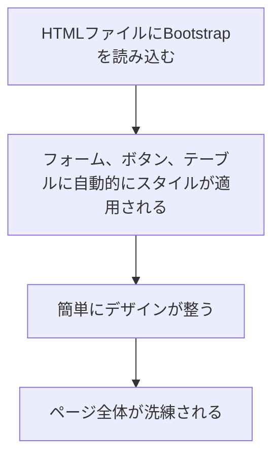
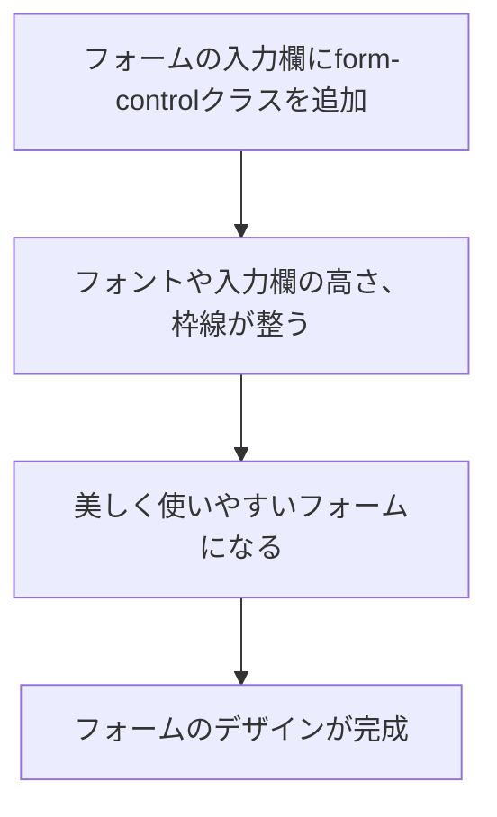
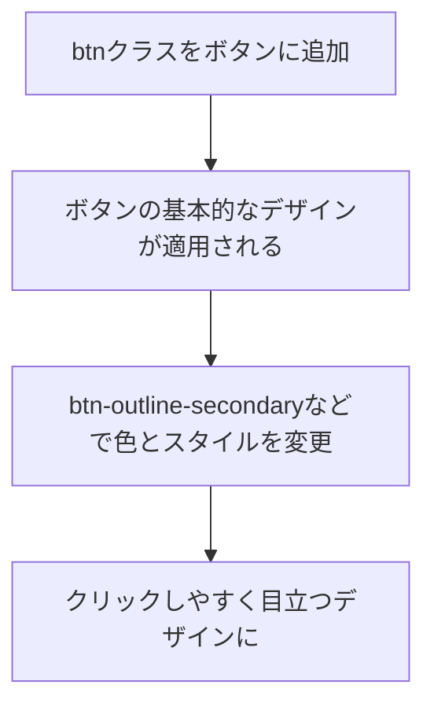
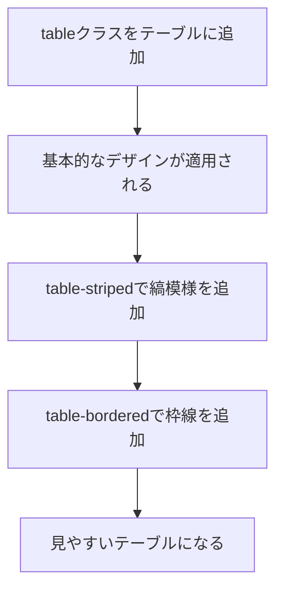
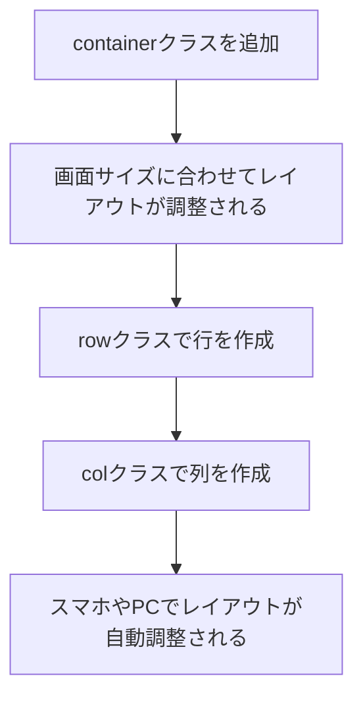
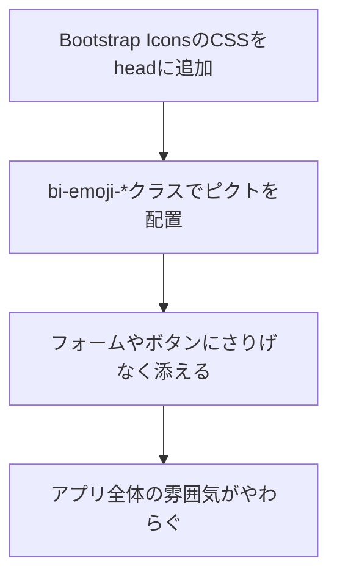
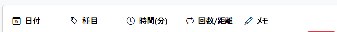
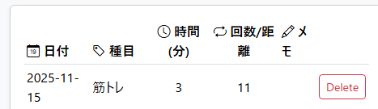
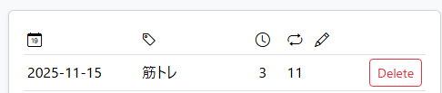

# ✨ Day 12：もっと華麗に！BootstrapでUIを整えよう 🐾

## 👀 index.boostrap.html を参考に
この章では、CSSフレームワークの **Bootstrap** を使って、アプリの見た目を一気におしゃれで使いやすくします。`index.bootstrap.html`ファイルを参考にしながら、フォームやボタン、テーブルのデザインを整えていきましょう。

## 🌟 12.1 Bootstrapっていう、魔法の道具を使ってみよう

### 🌟 Bootstrap導入フロー




Bootstrapは、ページの見た目を、とっても簡単に、そして一気におしゃれにしてくれる **CSSフレームワーク** です。これを使うと、自分で複雑なCSSを書かなくても、プロが作ったみたいにきれいで使いやすいデザインを実現できます。

> 💡 クラス名を全部、丸暗記する必要はまったくありません！「このクラス名を書くと、こんな見た目になるんだな」って、感覚で掴んでおけば十分です。後からGoogleで検索したり、AIに聞きながら使ったりすればOKですよ。

### 初心者さんの、心の声：

「Bootstrapを使うのは初めてで、何から始めたら良いか分からないな…。どうやったら、CSSを簡単に適用できるんだろう？」

### アプリ制作者の、心の旅：

「CSSをゼロから書くのって、すごく大変…。ボタン一つ作るにも、`padding`や`border-radius`、`hover`したときの色とか、考えることがいっぱい。それに、ブラウザごとに微妙に表示が違ったりする『クロスブラウザ問題』も考えないといけない。
Bootstrapは、そういう面倒なことを全部引き受けてくれて、プロがデザインした『良い感じの部品』をクラス名だけで使えるようにしてくれる。これを使えば、僕は『どうやって動かすか』っていうJavaScriptのロジックに集中できる！デザインと機能開発を分業できるなんて、すごく効率的だ。」

「まずは、 **BootstrapをHTMLファイルに読み込む** ところから始めよう。これだけで、ページに適用されるスタイルが一気に整うから、フォームやボタンが、あっという間にきれいな見た目になるよ。」

#### **Bootstrapの導入方法**

まず、Bootstrapを使うためには、**CDN（Content Delivery Network）**という仕組みを使って、外部のサーバーからスタイルシートを読み込みます。

```html
<!-- BootstrapのCSSを、CDN経由で読み込む -->
<link href="https://cdn.jsdelivr.net/npm/bootstrap@5.3.7/dist/css/bootstrap.min.css" rel="stylesheet">
```

-   この **`<link>`タグ** を、HTMLの`<head>`セクションに追加するだけ。たったこれだけで、Bootstrapのスタイルが、あなたのページ全体に適用されます。

> 💡 モーダルやドロップダウンみたいに、 **ちょっと動きのあるコンポーネント** を使いたいときは、`</body>`の直前あたりに次の1行も足して、BootstrapのJavaScriptバンドルを読ませておこう。
>
> ```html
> <script src="https://cdn.jsdelivr.net/npm/bootstrap@5.3.7/dist/js/bootstrap.bundle.min.js"></script>
> ```
>
> フォームやボタン、テーブルみたいに「見た目だけ借りたいよ」という場面なら、この`script`はムリに入れなくても大丈夫。Bootstrap公式ドキュメントのコンポーネントページには「Requires JavaScript」「JavaScript behavior」と書いてある場所があるので、そこをチラッと見て「今回は`.min.js`が必要かどうか」を確かめながら進めていこう。

この一行を追加しただけで、ページのフォームやボタンの見た目が、一気におしゃれに整うのを、ぜひ自分の目で確かめてみてください！

---

## 🌼 12.2 フォームの見た目を、もっと使いやすく

### 🌼 フォームのスタイリングフロー




フォームは、このアプリの **一番大事な顔** です。ユーザーが情報を入力するために、何度も使う場所だから、 **使いやすくて、見やすいデザイン** にしてあげることが、とっても大切です。

### 初心者さんの、心の声：

「フォームの見た目をきれいにしたいけど、CSSをどう書けばいいか分からない…。Bootstrapを使えば、本当にきれいになるのかな？」

> 🔖 クラス名を覚えきれなくても、全然大丈夫！「`form-control`っていうクラスをつけると、入力欄がシュッと整うんだな」くらいの感覚で十分です。分からなくなったら、その都度調べればOKですよ。

### アプリ制作者の、心の旅：

「フォームの入力欄に、 **`form-control`** っていうクラスをつけるだけで、入力フィールドのデザインがすごくきれいになるから、これを使おう！」

#### **フォームのスタイリング**

Bootstrapには、フォームを簡単にきれいにするための **`form-control`クラス** が用意されています。このクラスを、フォームのそれぞれの入力欄（`<input>`タグ）に適用するだけで、フォントや、入力欄の大きさ、枠線のデザインなどが、自動的に整います。

```html
<div class="mb-3">
    <label for="filter-date" class="form-label">日付で絞り込み</label>
    <input type="date" class="form-control" id="filter-date" name="filter-date">
</div>
```

-   **`form-label`**：`<label>`タグにつけると、ラベルのスタイルを整えてくれます。
-   **`form-control`**：`<input>`タグにつけるクラスで、フォームの **高さや幅** 、 **枠線のスタイル** などを、いい感じに整えてくれます。
-   **`mb-3`**：`<div>`タグにつけると、フォームの項目と項目の間に、ちょうど良い **マージン（下の余白）** を設定してくれて、要素がきれいに並ぶようになります。

    -   **心の旅**：「`mb-3`っていうクラス名、最初は『`margin-bottom: 1rem`』って自分で書くのと何が違うの？って思った。でも、アプリのいろんな場所で余白を設定するときに、ある場所では`15px`、別の場所では`1.2rem`みたいにバラバラだと、全体で見たときに統一感がなくてガタガタに見えちゃう。Bootstrapの`mb-3`みたいに決められた単位を使うことで、アプリ全体のデザインに『一貫性』が生まれて、プロっぽい仕上がりになるんだな。」

これで、 **日付の入力フォーム** が、ぐっと見やすく、きれいになりましたね！

---

## 🌸 12.3 ボタンのデザインと、操作感を良くしよう

### 🌸 ボタンのスタイリングフロー




ボタンは、ユーザーが **「これをやるぞ！」とアクションを起こすための、とっても重要な要素** です。だから、ちゃんと目立たせて、クリックしやすいデザインにしてあげることが大切です。

### 初心者さんの、心の声：

「ボタンをもっと可愛くしたいけど、どのクラスを使えばいいのか分からないな…。クラスをつけるだけで、本当に見た目が良くなるの？」

> 💬 「`btn`っていうクラスをつけると、“Bootstrap仕様のボタン”に変身する」くらいを覚えておけば大丈夫です。色やサイズのクラスは、必要になったときに調べればOKですよ。

---

<br>
<br>
<br>

## 🎨ペイント・ダンス🎨パレティーナの『飾りじゃないのよデザインは、ハッハ〰』


### 💬 「見た目を整えるのは飾りじゃないわ。<br>　 　『安心して触ってね』の合図よ🎨<br><br>　 　♬　飾りじゃないのよデザインは、ハッハ〰　♬<br>　 　♬　飾りじゃないのよ絵文字ぃは、ホッホ〰🎨　♬」

---

<br>
<br>
<br>


### アプリ制作者の、心の旅：

「ボタンに **`btn`クラス** を追加して、さらに色を変えるためのクラスもつけてみよう。これだけで、 **クリックしやすそうなデザイン** になるし、 **色も簡単に変更できる** から、すごく便利だ！」

#### **ボタンのスタイリング**

Bootstrapでは、 **`btn`** クラスを使うと、ボタンの基本的なスタイルが適用されます。さらに、 **色やサイズ** を調整するためのクラスを追加することで、ボタンの見た目を自由自在に変えることができます。

```html
<button id="clear-filter" class="btn btn-outline-secondary">フィルタ解除</button>
```

-   **`btn`** クラスで、ボタンの基本的なデザインが適用されます。
-   **`btn-outline-secondary`** クラスで、ボタンが **アウトラインスタイル** （背景色が透明で、枠線だけが表示される、おしゃれなスタイル）になります。
-   他にも`btn-primary`（青色）や`btn-danger`（赤色）など、たくさんの色が用意されています。

これにより、ボタンが見た目にも分かりやすく、 **クリックしたくなる** ようなデザインになります。

#### **JavaScriptで追加する、削除ボタンのスタイリング**

「フィルタ解除」ボタンだけではなく、 **JavaScriptで動的に生成される「削除」ボタン** にも、同じようにBootstrapのクラスを適用してあげましょう。

`script.js`の`renderEntryTable`関数の中で、削除ボタンを生成しているHTML文字列の部分を、次のように変更します。

```html
<button class="delete-button btn btn-sm btn-outline-danger" onclick="removeButtonClick('${id}')">Delete</button>
```

-   **`btn`**：ボタンの基本的なスタイルを適用します。
-   **`btn-sm`**：ボタンを少し **小さいサイズ** にして、テーブル内にすっきりと収めます。
-   **`btn-outline-danger`**： **赤色のアウトラインスタイル** になり、「削除」という操作の注意を促します。

こうすることで、後から追加されるボタンも、ページ全体のデザインに統一感が出ますね。

---

## 🌸 12.4 テーブルの見た目を、もっと見やすく

### 🌸 テーブルのスタイリングフロー




テーブルは、たくさんのデータを **一覧で表示** するために使います。特に、記録が増えてくると、テーブルのデザインが **シンプルで見やすい** ことが、とっても重要になります。

### 初心者さんの、心の声：

「データが多くなってくると、テーブルのどこを見ているのか、分からなくなっちゃう…。Bootstrapを使えば、テーブルもきれいに表示できるのかな？」

> 📎 テーブル用のクラス名も、忘れてしまって大丈夫です。「`table`っていうクラスをつければ、きれいなテーブルになるんだな」くらいでOK。縞模様や枠線が欲しくなったら、その都度調べれば十分ですよ。

### アプリ制作者の、心の旅：

「テーブルに **`table`** クラスをつけるだけで、 **基本的なデザイン** が適用されるんだ。さらに、 **`table-striped`** （縞模様）や **`table-bordered`** （枠線）を追加して、テーブルをもっと見やすくしてあげよう。」

#### **テーブルのスタイリング**

```html
<table id="list" class="table table-striped table-bordered">
    <thead>
        <tr>
            <th>日付</th>
            <th>種類</th>
            <th>時間</th>
            <th>回数</th>
            <th>メモ</th>
        </tr>
    </thead>
    <tbody>
        <!-- ここに、データが入るよ -->
    </tbody>
</table>
```

-   **`table`** クラスを使うと、テーブルの **基本的なスタイル** が適用されます。
-   **`table-striped`** クラスを使うと、テーブルの行が **交互に色が変わる** （縞模様になる）ので、横に長い行でも、目がチカチカしにくくなります。
-   **`table-bordered`** クラスを追加すると、テーブルの **枠線** が表示されて、データがさらに見やすくなります。

これで、たくさんのデータが並んでいても、 **きれいで見やすい** テーブルになりましたね！

---

## 🌸 12.5 スマホでも見やすく！レスポンシブ対応とレイアウト調整

### 🌼 レスポンシブ対応フロー




スマートフォンやタブレットなど、画面の大きさが違うデバイスでも、ページがちゃんと綺麗に表示されるように、 **レスポンシブ対応** を行います。これにより、ユーザーがどんなデバイスを使っていても、快適にアプリを使えるようになります。


### 初心者さんの、心の声：

「スマートフォンでもきれいに表示させたいけど、どうやってレスポンシブ対応をすればいいのか、よく分からないな…。」

> 🗒️ `container`や`col`も、「ページの幅を、いい感じに調整してくれる魔法の道具」くらいの捉え方でOKです。細かい動きは、必要になったときに確認すれば大丈夫ですよ。

### アプリ制作者の、心の旅：

「`col-md-6`の`md`って何だろう？って思ったら、'medium'の略で、画面幅がある一定のサイズ（ブレークポイント）より大きいときだけ、このスタイルが適用されるっていう意味なんだ。だから、PCみたいな広い画面では横に2列に並んで、スマホみたいな狭い画面では`md`の条件から外れるから、Bootstrapのデフォルトの動き（ブロック要素として縦に並ぶ）になる。なるほど、画面幅に応じてクラスの効き方が変わるから、自動的にレイアウトが変わる『レスポンシブデザイン』が実現できるんだな！」

「Bootstrapの **`container`** と **`col`クラス** を使えば、デバイスの画面の幅に応じて、 **レイアウトを自動で調整** してくれるんだ。これを使ってみよう。」

#### **レスポンシブ対応**

```html
<div class="container">
    <div class="row">
        <div class="col-md-6">
            <!-- 画面の左半分のコンテンツ -->
        </div>
        <div class="col-md-6">
            <!-- 画面の右半分のコンテンツ -->
        </div>
    </div>
</div>
```

-   **`container`** クラスは、ページ全体の **幅をいい感じに調整** して、レスポンシブデザインの土台を作ってくれます。
-   **`row`** クラスで **行** を作り、その中に **`col`クラス** を使って、列を作成します。
-   **`col-md-6`** は、画面の幅が中くらい（`md` = medium）以上のデバイスでは、 **列が画面の半分の幅（50%）** を取るように設定します。スマホのような小さい画面では、自動的に縦に並んでくれます。

これにより、PCでもスマホでも、コンテンツが適切に配置されるようになります。

実際に、[index.bootstrap.html](https://komiyamma.github.io/site_ichika_exercise_tracker/index.bootstrap.html)にアクセスして、ブラウザの横幅を狭くしたり、広くしたりしてみてください。  
レスポンシブデザインが、どんな風に働くのかを、実際に感じ取ることができますよ！

---

## 🌈 12.6 絵文字＆Bootstrap Iconsで雰囲気ブースト

### 🎨 絵文字デコレーションの流れ



Bootstrap Iconsには`bi-emoji-smile`のようなEmojiカテゴリのアイコンがそろっています。テキストと数字だけの画面に、ほんの少しの絵文字を添えるだけで、トラッカーの印象がぐっと柔らかくなります。

### 受講者さんの、よくある声

「入力画面がまじめすぎて、毎日の記録がちょっと面倒に感じる……。」

> 💡 Emojiを **一つ添えるだけでも「歓迎されている」ムード** になります。`bi-emoji-heart-eyes`などのわかりやすい表情を使うと、機能説明のアイキャッチにもなります。

### アプリ制作担当の、納得ポイント

「最初は絵文字なんてただの飾りで、機能には関係ないと思ってた。でも、『削除』ボタンの隣にゴミ箱のアイコンがあったり、『時間』の入力欄の隣に時計のアイコンがあったりすると、文字を読む前に『このボタンは何をするものか』が直感的に分かる。アイコンは、言語の壁を超えて意味を伝えることができる、強力なコミュニケーションツールなんだな。パレティーナの言う『飾りじゃないのよデザインは』って、こういうことか！」

「Bootstrap IconsのCDNを読み込んでおけば、HTMLのどこにでもアイコンを差し込める。フォームラベルの左に🕒や📝を置くだけでも、ユーザーの目線がすっと移動してくれる。」

#### **Bootstrap絵文字を読み込む**

```html
<link rel="stylesheet" href="https://cdn.jsdelivr.net/npm/bootstrap-icons@1.13.1/font/bootstrap-icons.min.css">
```

-   CDNの`<link>`を`<head>`に追加すると、ページ全体で`bi-`クラスが使えるようになります。
-   既にBootstrap本体をCDNで読み込んでいても、そのまま並べて記述して問題ありません。

#### **フォームやボタンに添える**

```html
<button class="btn btn-outline-primary">
    <span class="bi bi-emoji-smile text-warning" aria-hidden="true"></span>
    今日の記録を追加
</button>

<label for="memo" class="form-label">
    <span role="img" aria-label="メモ">📝</span>
    メモ
</label>
```

-   `bi bi-emoji-smile`でBootstrap Icons版の絵文字を表示。`text-warning`などのユーティリティで色味も調整できます。
-   直接Unicode絵文字（📝など）を入れる場合は、`role="img"`と`aria-label`を合わせて記述しておくとスクリーンリーダーにも伝わります。
-   使いすぎず、節目のボタンやセクション見出しだけに添えると、全体のトーンが崩れずにワクワク感を足せます。

テーブル見出しや統計カードにEmojiをワンポイントで置くと、どの数値が嬉しい記録なのかがひと目で判断でき、アプリ全体のストーリーテリングが進みます。

---

### 📱 画面サイズに応じてアイコンだけを表示するテクニック

Bootstrapの強力な機能の一つに、**レスポンシブ表示ユーティリティ**があります。これを使うと、「PCのような広い画面ではテキストも表示するけど、スマホのような狭い画面ではアイコンだけにしてスッキリ見せる」といった調整が、クラス名を追加するだけで簡単に実現できます。

### 初心者さんの、心の声：

「スマホで見たとき、ボタンの文字が長くて変なところで改行されちゃう…。でも、文字を消しちゃうとPCで見たときに分かりにくいし、どうしたらいいんだろう？ `d-none`とか`d-md-inline`とか、なんだか難しそう…。」

**パレティーナ**</b>  


💬「大丈夫よ！これは『画面が小さいときは隠して、大きくなったら見せる』っていう、  
　　 Bootstrapの便利な記述よ。CSSを書かなくても、クラス名だけで見た目を操れるのよ。  
　　 やってみたら、意外と簡単だから驚くわよ！」

#### **心の旅：**
「テーブルの列名に『時間(分)』とか全部書くと、スマホ幅では窮屈で文字列が２段になっちゃう。でもPCで見るときにはちゃんと文字で説明したい。こういうとき、Bootstrapならどうやって出し分ければいいんだろう？」




「なるほど、`d-none`でまずテキストを隠しておいて、`d-md-inline`で『中くらいの画面サイズ（`md`）以上なら表示する』って指定すればいいのか！これなら、HTMLの構造は一つなのに、CSSを書かずに表示を切り替えられる。すごくスマートだ！」


#### **実装例：レスポンシブ対応ヘッダー**

`index.bootstrap.html` のテーブルでは、列ヘッダーが実際に **「狭い画面＝アイコンだけ」「広い画面＝アイコン＋文字」** になるように作り込んであります。該当箇所のコードは次のとおりです。

```html
<th class="text-center">
    <i class="bi bi-clock"></i>
    <span class="d-none d-md-inline ms-1">時間(分)</span>
</th>
<th class="text-center">
    <i class="bi bi-repeat"></i>
    <span class="d-none d-md-inline ms-1">回数/距離</span>
</th>
```

-   `text-center`: ヘッダー内のコンテンツを中央揃えにして、アイコンだけのときでも見栄えを整えます。
-   `bi bi-*`: Bootstrap Iconsで列の意味（時間、回数/距離）をシンプルに伝えます。
-   `d-none`: 最小幅ではテキストを完全に非表示にします。
-   `d-md-inline`: 画面幅が `md` (768px) 以上になると、テキストをインラインで表示し直します。
-   `ms-1`: アイコンとテキストの間に 0.25rem の余白を追加して、読みやすさを確保します。

このように Bootstrapのクラスを仕込むだけで、スマホではアイコン中心のコンパクト表示、タブレットやPCではテキスト付きの丁寧な表示へ自動で切り替わります。実際の `index.bootstrap.html` で同じものが動いているので、ブラウザで幅を変えながら挙動を確認してみましょう。

---

## 🌼 12.7 まとめ：Bootstrapで、アプリを素敵に変身させよう！

この章では、 **Bootstrapを使って、アプリのUI（見た目）を整え** 、ぐっと使いやすく、おしゃれに改善しました。

1.  **Bootstrapの導入**：BootstrapをHTMLに読み込んで、一瞬で基本的なスタイリングを適用しました。
2.  **フォームのスタイリング**：`form-control`を使って、フォームの入力欄を美しく整えました。
3.  **ボタンの改善**：`btn`クラスを使って、ボタンのスタイルを整え、視覚的に分かりやすくしました。
4.  **Emoji / Bootstrap Icons**：`bi-emoji-*`クラスやUnicode絵文字を活用して、雰囲気を柔らかく保ちながら視線誘導を助けました。
5.  **テーブルの改善**：`table`クラスや`table-bordered`、`table-striped`を使って、データ表示の見た目を改善しました。
6.  **レスポンシブ対応**：`container`や`col`クラスを使って、画面サイズに合わせた、柔軟なレイアウトに対応しました。

---

次回は、いよいよ最後の **最終調整と動作確認** を行い、アプリを完成させる準備をします。あともう少しです！

---

これでDay 12：BootstrapによるUIの整備は終了です！次回は、 **最終調整と改善** に進んでいきます。

---

<h1><a href="D13.md">Day13 へ</a></h1>
