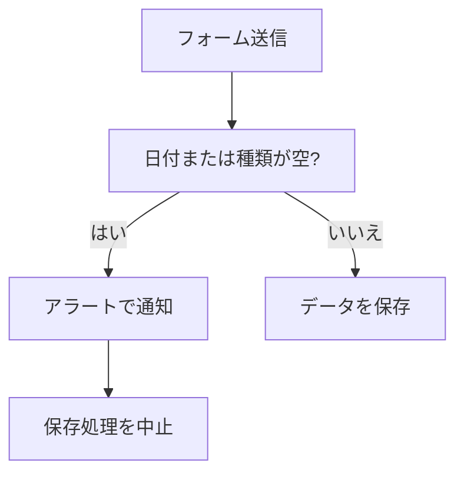
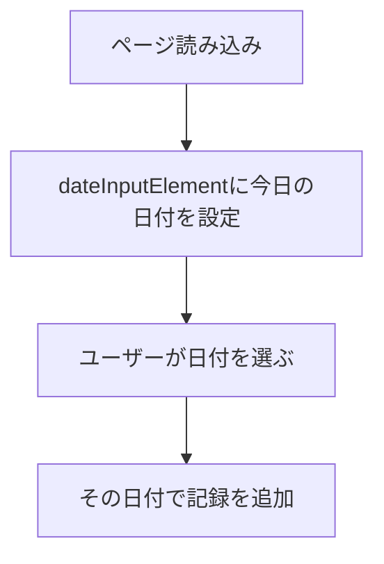
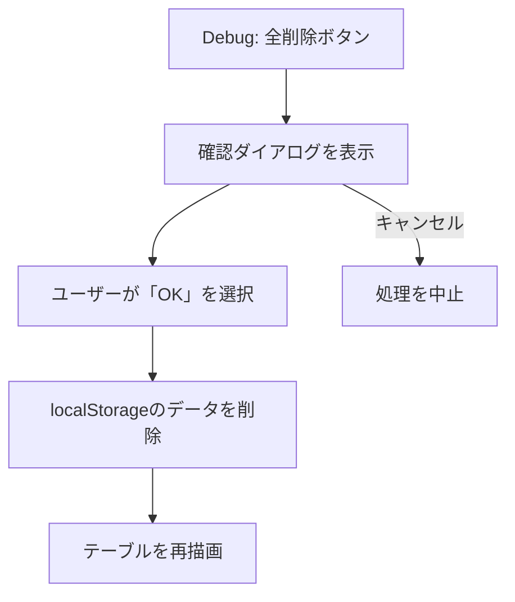
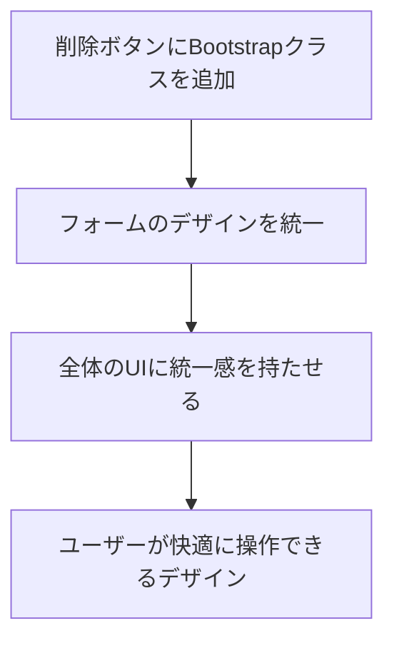

# 👀 Day 13：最後のひと手間！細かな調整で仕上げよう

ここまで、本当にお疲れ様でした！

Day 12までで、アプリのコア機能と見た目は一通りそろいましたね。

この章では、「Day 12までで作ってきたコード」と「完成版の`script.js`」をじっくり見比べながら、「最後の仕上げとして、どんな『優しい工夫』が追加されたのか」を一緒にゆっくり確認していきます。

ただ動くだけでなく、ユーザーにとってより親切で、開発者にとってより安全なコードを目指すための、プロのひと手間を学びましょう。

---

<br>
<br>
<br>

## 🔬マイクロ・スコープ🔬ミクルスは見逃さない


### 💬 「もう完璧？<br>　 　 よし、じゃあ10倍ズームで確認しようかしら？🔬」

<br>
<br>
<br>

---
## 🔄 Step 1 ─ フォーム送信時の、ちょっとした気配り

### 🔄 フォーム送信時の気配りフロー




### Step 1での変化ポイント
- `handleFormSubmit`関数の中で、`type`（種類）と`date`（日付）が空っぽのまま送られたら`alert`で「入力してね」と止める分岐が入っています（最終版`script.js`もこの保険を残しています）。
- さらに`index.html`側では`<select id="type" required>`や`<input id="date" type="date" required>`のように`required`を付けて、ブラウザ標準のバリデーションにも頼るダブルガード構成です。慣れてきたらJSの分岐を外して`required`一本でもOKですが、初心者のうちは両方効かせておくと安心です。


```javascript
// もし、運動の種類か日付が入力されていなかったら…
if (!entry.type || !entry.date) {
  // アラートで優しく教えてあげる
  alert('種類と日付は、入力必須の項目です。');
  // そして、ここで処理をストップ！
  return;
}
```

### どうして、この工夫が必要なの？
- もし空っぽのまま保存できちゃうと、「これ、何の記録だっけ？」って、後から見たときにユーザーさんが困ってしまいますよね。そうなる前に、入力の段階で「ここ、忘れてるよ！」って、優しく気づかせてあげるための仕組みです。

    -   **心の旅** ：「最初はJavaScriptで`if`文を書いて、`alert`でエラーを出すのがプロっぽい！って思ってた。でも、HTMLの入力欄に`required`って一言書くだけで、ブラウザが『ここを入力してください』って、標準のキレイなメッセージを出してくれるんだ！ こっちの方がずっとスマートだし、JavaScriptのコードもシンプルになる。『HTMLでできることはHTMLに任せる（関心の分離）』っていうのは、こういうことなんだな。ブラウザの標準機能をうまく使うのが、賢いやり方なんだ。」

### 確認してみよう！
1.  `種類`と`日付`を入力しないで、登録ボタンを押してみましょう。
2.  ちゃんとアラートが表示されるか、そして`localStorage`に変なデータが増えていないか、確認してみましょう。
    -   開発者ツールのコンソールで`loadEntriesFromStorage()`と入力すると、保存されている記録の配列の中身が見えますよ。

------

## 🔄 Step 2 ─ `localStorage`が使えなかった場合に、備えよう

### Step 2での変化ポイント
- `loadEntriesFromStorage`関数と`saveEntriesToStorage`関数に、`try...catch`という構文が追加されて、もし`localStorage`の読み書きに失敗しても、アプリがクラッシュしないように、安全な道に誘導する処理が加わりました。

```javascript
function loadEntriesFromStorage() {
  try {
    // まずは、いつも通りlocalStorageからデータを読み込もうと試みる
    const entriesJson = localStorage.getItem(WORKOUT_STORAGE_KEY);
    return entriesJson ? JSON.parse(entriesJson) : [];
  } catch (e) {
    // もし、tryの中でエラーが起きたら、こっちの処理が動く！
    console.error('ストレージからのデータ読み込みに失敗しました:', e);
    // エラーが起きても、空の配列を返してあげることで、アプリは動き続ける
    return [];
  }
}
```

### どうして、この工夫が必要なの？
- 例えば、ブラウザのプライベートモード（シークレットモード）を使っていたり、スマホの容量がパンパンだったりすると、`localStorage`が使えないことがあります。そんな予期せぬ状況でも、アプリ全体が止まってしまわないようにするための、大切なお守りのようなものです。

    -   **心の旅** ：「今、自分のPCでは問題なく動いているから、エラーなんて起きないって思っちゃう。でも、世の中には色々なブラウザや設定でアプリを使う人がいるんだよな…。『もし〇〇だったらどうなる？』って、自分以外のユーザーの環境を想像して、失敗する可能性を先に考えておくのが、プロの仕事なんだ。`try...catch`は、その『転ばぬ先の杖』をコードで実現する方法なんだな。完璧に動くコードを書くことと同じくらい、うまく失敗するコードを書くことも大事なんだ。」

> ⚠️ **ちょっとメモ** ：`try...catch`がないと、もし`localStorage`への書き込みが禁止されているブラウザ（例えば、プライベートモードのSafariなど）で`JSON.parse`を実行しようとしたときに、エラーが発生して処理がそこで止まってしまいます。そうなると、画面が真っ白になったり、ボタンが効かなくなったりします。`catch`の中で、代わりに空の配列を返してあげて、コンソールにエラーの記録を残しておけば、「保存はできなかったけど、アプリは動き続ける」という、安全な状態を保つことができるんです。

### 確認してみよう！
- このエラーは、普段使っている状態ではなかなか起きないので、直接再現するのは難しいです。でも、コードを読んで、「なるほど、もしもの時でも、空の配列を返してくれるから、アプリは止まらないんだな」と、仕組みを理解しておくだけで十分です。

------

## 🔄 Step 3 ─ 日付の入力欄に、今日の日付を自動でセット！

### 🔄 今日の日付を自動設定するフロー



---

### Step 3での変化ポイント
- `initializePage`関数の中で、`dateInputElement.value = formatDateForInput(getTodayString());`という処理が呼ばれるようになりました。
- そのために、`getTodayString`や`formatDateForInput`といった、日付のフォーマットを整えるための、お助け関数が増えています。

### どうして、この工夫が必要なの？
- アプリを開くたびに、毎回カレンダーから今日の日付を選ぶのは、ちょっとだけ手間ですよね。最初から今日の日付が入っていると、ユーザーさんはもっとスムーズに記録を始められます。そんな、ちょっとした優しさです。

### 確認してみよう！
1.  ページをリロード（再読み込み）して、日付の入力欄に、自動的に今日の日付が入っているか、見てみましょう。
2.  コンソールで`getTodayString()`や`formatDateForInput('20240101')`を呼び出してみて、どんな形式の文字列が返ってくるか、試してみるのも面白いですよ。

------

<br>
<br>
<br>

## 📆ラスト・カレンダー📆カレダ姉さんとスベリこみ


### 💬 「“仕様です”は最後の切り札。<br>　 　 &nbsp;まずは直せるか、カレンダーに相談ね📆」

<br>
<br>
<br>

---


## 🔄 Step 4 ─ 開発中に便利！「全部消す」ボタンの追加

### 🔄 デバッグ用「全削除」ボタンのフロー




### Step 4での変化ポイント
- 開発中に、テストデータを一気に消したいとき、とっても便利な「Debug: 全削除」ボタン（`debug-clear-storage`）が追加されました。
- `handleDebugClearStorageClick`関数で、「本当に消す？」っていう確認ダイアログを出してから、削除処理 → テーブルの再描画までを、一括で行うようになっています。

```javascript
function handleDebugClearStorageClick() {
  const message = 'localStorageに保存されている、このアプリの記録データを、本当に全部削除しますか？';
  // window.confirmで、ユーザーに「OK」か「キャンセル」かを選んでもらう
  if (!window.confirm(message)) {
    return; // もし「キャンセル」が押されたら、ここで処理をストップ
  }

  // 「OK」が押されたら、削除処理を実行
  localStorage.removeItem(WORKOUT_STORAGE_KEY);
  filterDateInputElement.value = ''; // フィルターもリセット
  renderEntryTable(); // テーブルを再描画
  window.alert('データを全て削除しました。');
}
```

### どうして、この工夫が必要なの？
- アプリを作っている途中（学習中）に、「一度、全部のデータをリセットして、まっさらな状態からテストしたい！」って思う場面が、よくあります。そのたびに手動で消すのは大変なので、そのための便利ボタンです。
  - ※実際にリリースするアプリでは、こういうボタンは開発者だけが見える場所に置くことが多いです。

### 確認してみよう！
1.  「Debug: 全削除」ボタンを押して、確認のダイアログが表示されるか、確認してみましょう。
2.  「OK」を押したら、テーブルの記録一覧が空っぽになって、件数も0になっているか、見てみましょう。
3.  開発者ツールの「Application」タブにある`localStorage`のビューで、`ichikaWorkoutLogEntries`というキーごと、データが削除されているかも、チェックしてみましょう。

------

## 🔄 Step 5 ─ `renderEntryTable`関数を、さらにパワーアップ！

Day 11時点から最終版までに、表示をより安全・直感的にするための差分は次の2点です（D06〜D12では未登場だった部分）。

| 追加した改善点 | その目的 | 確認のコツ |
| --- | --- | --- |
| `escapeHtml()`で、入力内容をエスケープ処理 | HTMLの特殊文字を安全に表示し、XSSを防ぐため | メモ欄に`<script>alert('こんにちは！')</script>`と入れてもテキスト表示にとどまるか確認 |
| 削除ボタンに、Bootstrap Iconsのゴミ箱アイコン＋`d-none`テキスト | スマホでも直感的に見える削除ボタンにするため（Bootstrap未適用時はテキストが表示されるフォールバック） | アイコン表示を確認し、Bootstrap無効時に"Delete"が出ることも確認 |

> 🔐 **メモ：どうして`escapeHtml()`が必要なの？**
> 
> もし`escapeHtml()`を通さずに、ユーザーがメモ欄に`<script>alert('こんにちは！')</script>`のような悪意のあるコードを入力して保存すると、次にそのデータを表示したときに、ブラウザがそのコードを実行してしまい、勝手にポップアップが表示されるなどの、予期せぬトラブルに繋がります（これを **クロスサイトスクリプティング(XSS)** と言います）。
>
> **心の旅** ：「このアプリは自分しか使わないし、変なコードを入力するなんてありえない、って最初は思ってた。でも、もし将来このアプリを友達にも使ってもらうことになったら？もし、このコードを元に別のアプリを作ることになったら？『ユーザーの入力は、常に信頼しない』っていうのが、セキュリティの鉄則なんだって。`escapeHtml()`は、その鉄則を守るための、一番基本的で、一番大事な習慣なんだな。どんな小さなアプリでも、この習慣だけは絶対に身につけておこう。」
>
> `escapeHtml()`は、`<`や`>`のような特別な意味を持つ文字を、ただの安全な文字（`&lt;`や`&gt;`）に変換してくれる、大切なお守りのような関数です。完成版のアプリでは、ユーザーが入力した内容を表示する前に、必ずこの処理を通すことで、どんな入力が来ても、アプリが安全に動き続けるように守っています。

### Step 5の補足コード（抜粋）

```javascript
// ...（filter/sortのあとで）...
tableHtml +=
  `<tr>
      <td>${escapeHtml(date)}</td>
      <td>${escapeHtml(type)}</td>
      <td class="text-center">${escapeHtml(minutes || '')}</td>
      <td class="text-center">${escapeHtml(value || '')}</td>
      <td>${escapeHtml(note || '')}</td>
      <td class="text-end">
          <button class="delete-button btn btn-sm btn-outline-danger" onclick="removeButtonClick('${id}')">
              <i class="bi bi-trash"></i><span class="d-none">Delete</span>
          </button>
      </td>
  </tr>`;
// ...（略）...
```

### 確認してみよう！
1.  メモ欄に`<script>alert('こんにちは！')</script>`と入力し、テキストとして表示されること（XSSが起きないこと）を確認しましょう。
2.  削除ボタンにゴミ箱アイコンが表示されること、Bootstrapを無効にした場合でも"Delete"テキストが見えることを確認しましょう。

------

## 🔄 Step 6 ─ アプリ全体のUIを、きれいに整える（Bootstrapなど）

### 🔄 UI整備フロー（Bootstrap利用）




### Step 6のポイント
- 「ボタンの色やサイズ、入力欄の余白などを整えて、もっと使いやすく、もっと可愛くしたい！」という、最後の仕上げです。
- Bootstrapのクラス（`btn btn-sm btn-outline-danger`など）を使って、アプリ全体のデザインに統一感を出しています。

### Step 6での変化ポイント
- HTMLとCSSにも、たくさんの手が加わっていますが、`script.js`の中では、削除ボタンにBootstrap用のクラスとアイコンを追加している点が、主な差分です。具体的には、`renderEntryTable`関数内でテーブルの行を生成している部分が、以下のように変更されています。

```javascript
// ...（略）...
tableHtml +=
    `<tr>
        <td>${escapeHtml(date)}</td>
        <td>${escapeHtml(type)}</td>
        <td class="text-center">${escapeHtml(minutes || '')}</td>
        <td class="text-center">${escapeHtml(value || '')}</td>
        <td>${escapeHtml(note || '')}</td>
        <td class="text-end">
            <button class="delete-button btn btn-sm btn-outline-danger" onclick="removeButtonClick('${id}')">
                <i class="bi bi-trash"></i><span class="d-none">Delete</span>
            </button>
        </td>
    </tr>`;
// ...（略）...
```
- 削除ボタンには、Bootstrap Iconsのゴミ箱アイコン（`<i class="bi bi-trash"></i>`）が表示され、"Delete"というテキストは`d-none`クラスで非表示になっています。これにより、スマホなどの小さな画面でも見やすく、直感的に操作できるデザインになっています。また、script.js がBootstrapを適用していないindex.htmlから呼ばれた場合には、ゴミ箱アイコンではなく、"Delete"が表示されるようになっています。
- また、数値を表示する列（時間・回数/距離）には`text-center`クラスが適用され、中央揃えで見やすくなっています。
- Day 12の内容と合わせて見直すと、最終的な見た目がどうやって作られているのかが、よく分かります。

### どうして、この工夫が必要なの？
- アプリ全体のUI（見た目）に統一感を持たせることで、ユーザーが「このボタンは、こういう役割だな」と、直感的に操作しやすくなるからです。
- 小さな画面では、テキストよりもアイコンの方がスペースを節約できて、見やすくなります。

### 確認してみよう！
- テーブルの中の削除ボタンに、ゴミ箱のアイコンが表示されているか、確認してみましょう。
- ブラウザの幅を狭くして、スマホサイズにしてみて、アイコンがちゃんと見えるか、試してみましょう。
- フォームの入力欄や他のボタンの見た目が、きれいに統一されているかを、ブラウザでじっくり眺めてみましょう。

---

<br>
<br>
<br>

## 🧽スポンジ・フィニッシュ🧽スポンジー姉さんの仕上げ


### 💬 「とりあえず動く、は下地。<br>　 　“気持ちよく使えるか” で合否よ🧽<br>　 　 ラスト 5％ の仕上げが、<br>　 　 プロっぽさの 95％ を作るの。これ鉄則ね🧽」

<br>
<br>
<br>

------

## まとめ

これらの工夫を一つずつ取り入れていくことで、自信を持って完成させることができます。

1.  **入力チェック** で、変なデータが保存されない、しっかり者のアプリに。
2.  **エラー対策** で、予期しない状況でも壊れにくい、たくましいアプリに。
3.  **日付の初期値設定** で、ユーザーの入力を助ける、親切なアプリに。
4.  **デバッグ補助機能** で、学習中のリセットが簡単な、開発者に優しいアプリに。
5.  **表示ロジックの充実** （フィルター・並び替え・件数・XSS対策）で、多機能で安全なアプリに。
6.  **UIの統一感** で、誰にとっても操作がしやすい、美しいアプリに。

ぜひ、ご自身の手で、ただ動く”だけでなく、“使いやすい”アプリにしてくださいね。

<br>
<br>

---

<br>
<br>
<br>

## 🏐アミアミ・モコモコ🏐アミモコの「毛糸玉式ほぐし論」


### 💬 「リファクタリングって、編み目を増やすことじゃないの。<br>　 　 ほどいて、編み直して、かわいくすること🏐」

<br>
<br>
<br>

------

<br>
<br>

## ブラッシュアップ版の例

以下は、Antigravity / Gemini-3.0-pro を使って、  
自動で「index.bootstrap.theme.html」をブラッシュアップした例となります。

[index.bootstrap.antigravity.html](https://komiyamma.github.io/site_ichika_exercise_tracker/index.bootstrap.antigravity.html)

<br>
<br>

---

<h1><a href="D14.md">Day14 へ</a></h1>
