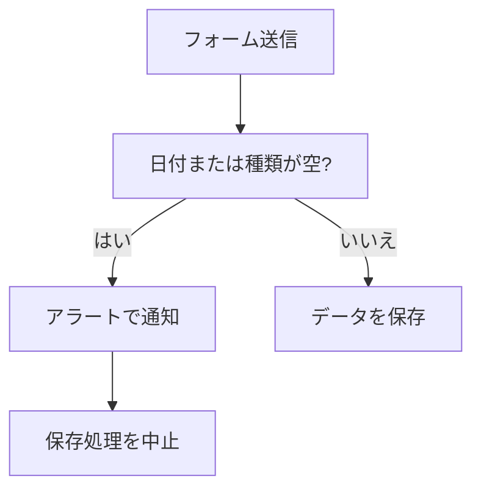
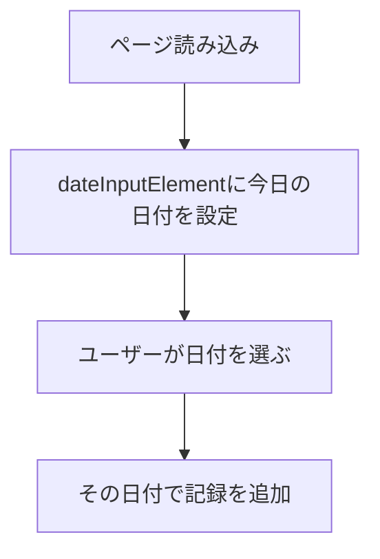
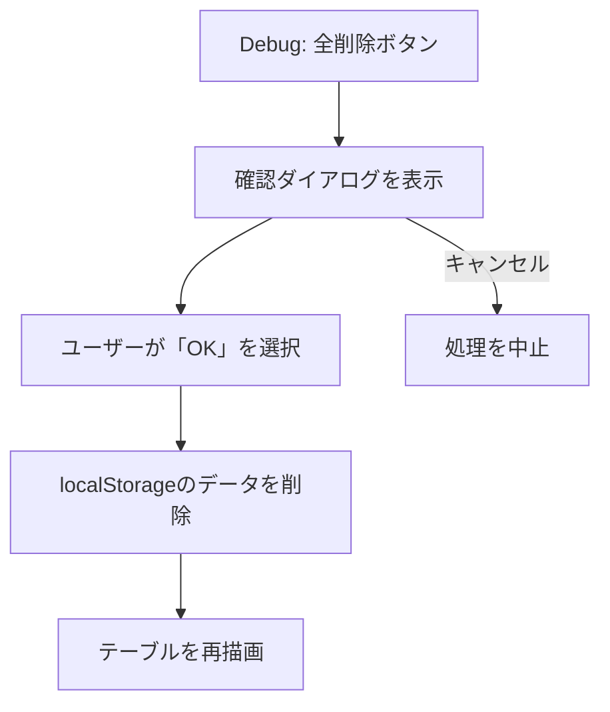
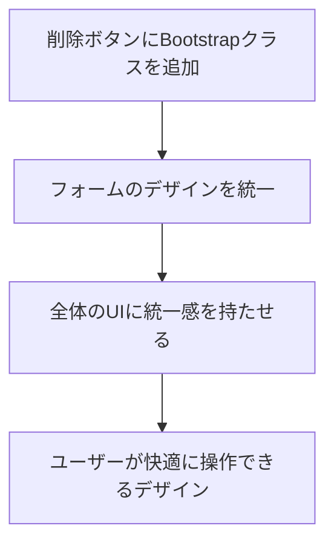

# 👀 Day 13：ついに完成！ 細かな調整とチェックで仕上げよう

ここまで、本当にお疲れ様でした！

Day 11までで、フォームでの保存、一覧表示、削除、そして日付での絞り込み（フィルター）機能が、一通りそろいましたね。

この最後の章では、 **「Day 11までで作ってきたコード」** と、 **「完成版の`script.js`」** をじっくり見比べながら、「最後の仕上げとして、どんな『優しい工夫』が追加されたのか」、そして「完成前にどんな観点でチェックしておくと安心なのか」を、一緒にゆっくり確認していきます。

本当は「細かな調整の章」と「テストの章」に分けることもできますが、初めての Web アプリづくりなら、調整と最終確認をセットで捉えた方が流れが掴みやすいはず。そこで Day 13 では、仕上げの工夫と手動テストのチェックリストを 1 つの章にまとめて、一気にゴールまで駆け抜けます。

> **この章の対象読者さん**：プログラミング学習を始めて3ヶ月くらい。JavaScriptとHTML・CSSにも、少しずつ慣れてきたかな？というあなたへ。
> ステップごとに、コンソールで試せる確認ポイントも書いてあるので、安心して進めてくださいね。

------

## 🔄 Step 1 ─ フォーム送信時の、ちょっとした気配り

### 🔄 フォーム送信時の気配りフロー




### Step 1での変化ポイント
- `handleFormSubmit`関数の中で、`type`（種類）と`date`（日付）が空っぽのまま送信されたときに、`alert`でお知らせして、保存しないようにする処理が追加されました。
- ただし最終版では、この分岐は`script.js`から取り除き、`index.html`側で`<select id="type" required>`や`<input id="date" type="date" required>`のように`required`属性を付ける設計へ寄せるのが良いでしょう。ブラウザ標準のバリデーションとエラーメッセージに任せた方が自然で、JS側の責務もシンプルに保てます。必要に応じて他の必須項目にも同様の`required`を付けて揃えておきましょう。


```javascript
// もし、運動の種類か日付が入力されていなかったら…
if (!entry.type || !entry.date) {
  // アラートで優しく教えてあげる
  alert('種類と日付は、入力必須の項目です。');
  // そして、ここで処理をストップ！
  return;
}
```

### どうして、この工夫が必要なの？
- もし空っぽのまま保存できちゃうと、「これ、何の記録だっけ？」って、後から見たときにユーザーさんが困ってしまいますよね。そうなる前に、入力の段階で「ここ、忘れてるよ！」って、優しく気づかせてあげるための仕組みです。

### 確認してみよう！
1.  `種類`と`日付`を入力しないで、登録ボタンを押してみましょう。
2.  ちゃんとアラートが表示されるか、そして`localStorage`に変なデータが増えていないか、確認してみましょう。
    -   開発者ツールのコンソールで`loadEntriesFromStorage()`と入力すると、保存されている記録の配列の中身が見えますよ。

------

## 🔄 Step 2 ─ `localStorage`が使えなかった場合に、備えよう

### Step 2での変化ポイント
- `loadEntriesFromStorage`関数と`saveEntriesToStorage`関数に、`try...catch`という構文が追加されて、もし`localStorage`の読み書きに失敗しても、アプリがクラッシュしないように、安全な道に誘導する処理が加わりました。

```javascript
function loadEntriesFromStorage() {
  try {
    // まずは、いつも通りlocalStorageからデータを読み込もうと試みる
    const entriesJson = localStorage.getItem(WORKOUT_STORAGE_KEY);
    return entriesJson ? JSON.parse(entriesJson) : [];
  } catch (e) {
    // もし、tryの中でエラーが起きたら、こっちの処理が動く！
    console.error('ストレージからのデータ読み込みに失敗しました:', e);
    // エラーが起きても、空の配列を返してあげることで、アプリは動き続ける
    return [];
  }
}
```

### どうして、この工夫が必要なの？
- 例えば、ブラウザのプライベートモード（シークレットモード）を使っていたり、スマホの容量がパンパンだったりすると、`localStorage`が使えないことがあります。そんな予期せぬ状況でも、アプリ全体が止まってしまわないようにするための、大切なお守りのようなものです。

> ⚠️ **ちょっとメモ**：`try...catch`がないと、もし`localStorage`への書き込みが禁止されているブラウザ（例えば、プライベートモードのSafariなど）で`JSON.parse`を実行しようとしたときに、エラーが発生して処理がそこで止まってしまいます。そうなると、画面が真っ白になったり、ボタンが効かなくなったりします。`catch`の中で、代わりに空の配列を返してあげて、コンソールにエラーの記録を残しておけば、「保存はできなかったけど、アプリは動き続ける」という、安全な状態を保つことができるんです。

### 確認してみよう！
- このエラーは、普段使っている状態ではなかなか起きないので、直接再現するのは難しいです。でも、コードを読んで、「なるほど、もしもの時でも、空の配列を返してくれるから、アプリは止まらないんだな」と、仕組みを理解しておくだけで十分です。

------

## 🔄 Step 3 ─ 日付の入力欄に、今日の日付を自動でセット！

### 🔄 今日の日付を自動設定するフロー



---

<br>
<br>
<br>

## 📆ラスト・カレンダー📆カレダ姉さんの締切指南

 |

### 💬 「“仕様です”は最後の切り札。<br>　 　 &nbsp;まずは直せるか、カレンダーに相談ね📆』

<br>
<br>
<br>

---


### Step 3での変化ポイント
- `initializePage`関数の中で、`dateInputElement.value = formatDateForInput(getTodayString());`という処理が呼ばれるようになりました。
- そのために、`getTodayString`や`formatDateForInput`といった、日付のフォーマットを整えるための、お助け関数が増えています。

### どうして、この工夫が必要なの？
- アプリを開くたびに、毎回カレンダーから今日の日付を選ぶのは、ちょっとだけ手間ですよね。最初から今日の日付が入っていると、ユーザーさんはもっとスムーズに記録を始められます。そんな、ちょっとした優しさです。

### 確認してみよう！
1.  ページをリロード（再読み込み）して、日付の入力欄に、自動的に今日の日付が入っているか、見てみましょう。
2.  コンソールで`getTodayString()`や`formatDateForInput('20240101')`を呼び出してみて、どんな形式の文字列が返ってくるか、試してみるのも面白いですよ。

------

## 🔄 Step 4 ─ 開発中に便利！「全部消す」ボタンの追加

### 🔄 デバッグ用「全削除」ボタンのフロー




### Step 4での変化ポイント
- 開発中に、テストデータを一気に消したいとき、とっても便利な「Debug: 全削除」ボタン（`debug-clear-storage`）が追加されました。
- `handleDebugClearStorageClick`関数で、「本当に消す？」っていう確認ダイアログを出してから、削除処理 → テーブルの再描画までを、一括で行うようになっています。

```javascript
function handleDebugClearStorageClick() {
  const message = 'localStorageに保存されている、このアプリの記録データを、本当に全部削除しますか？';
  // window.confirmで、ユーザーに「OK」か「キャンセル」かを選んでもらう
  if (!window.confirm(message)) {
    return; // もし「キャンセル」が押されたら、ここで処理をストップ
  }

  // 「OK」が押されたら、削除処理を実行
  localStorage.removeItem(WORKOUT_STORAGE_KEY);
  filterDateInputElement.value = ''; // フィルターもリセット
  renderEntryTable(); // テーブルを再描画
  window.alert('データを全て削除しました。');
}
```

### どうして、この工夫が必要なの？
- アプリを作っている途中（学習中）に、「一度、全部のデータをリセットして、まっさらな状態からテストしたい！」って思う場面が、よくあります。そのたびに手動で消すのは大変なので、そのための便利ボタンです。
  - ※実際にリリースするアプリでは、こういうボタンは開発者だけが見える場所に置くことが多いです。

### 確認してみよう！
1.  「Debug: 全削除」ボタンを押して、確認のダイアログが表示されるか、確認してみましょう。
2.  「OK」を押したら、テーブルの記録一覧が空っぽになって、件数も0になっているか、見てみましょう。
3.  開発者ツールの「Application」タブにある`localStorage`のビューで、`ichikaWorkoutLogEntries`というキーごと、データが削除されているかも、チェックしてみましょう。

------

## 🔄 Step 5 ─ `renderEntryTable`関数を、さらにパワーアップ！

Day 11の時点でも、テーブルの表示はできていましたが、最終版では、さらに使いやすく、安全にするための、以下のような改善が加わっています。

| 改善点 | その目的 | 確認のコツ |
| --- | --- | --- |
| `filter-date`の値を使って、`entries.filter(...)`で絞り込み | 日付フィルターの機能を、ちゃんと反映させるため | フィルターの日付を変えたときに、`console.log('[renderEntryTable] filteredEntries:', ...)`の出力がどう変わるか見てみよう |
| `filteredEntries.sort((a, b) => b.createdAt - a.createdAt)` | 新しい記録が、いつも一番上に表示されるようにするため | 新しく記録を登録したときに、その記録がテーブルの一番上に来るか、チェックしよう |
| `totalCountElement.textContent`を更新 | 表示されている件数を、ラベルで分かりやすく表示するため | フィルターを変更したり、記録を削除したときに、件数の数字もちゃんと変わるか確認しよう |
| `escapeHtml()`で、入力内容をエスケープ処理 | HTMLの特殊文字を、安全な文字に変換して表示するため | メモ欄に`<script>alert('こんにちは！')</script>`と入力しても、アラートが出ずに、ただの文字として表示されるか確認しよう |
| 削除ボタンに、Bootstrapのクラスを追加 | ボタンの見た目を、他のボタンと揃えて、統一感を出すため | テーブルの中の削除ボタンのサイズや色が、他のボタンと統一されているか、目で見て確認しよう |

> 🔐 **メモ：どうして`escapeHtml()`が必要なの？**
> 
> もし`escapeHtml()`を通さずに、ユーザーがメモ欄に`<script>alert('こんにちは！')</script>`のような悪意のあるコードを入力して保存すると、次にそのデータを表示したときに、ブラウザがそのコードを実行してしまい、勝手にポップアップが表示されるなどの、予期せぬトラブルに繋がります（これを **クロスサイトスクリプティング(XSS)** と言います）。
> `escapeHtml()`は、`<`や`>`のような特別な意味を持つ文字を、ただの安全な文字（`&lt;`や`&gt;`）に変換してくれる、大切なお守りのような関数です。完成版のアプリでは、ユーザーが入力した内容を表示する前に、必ずこの処理を通すことで、どんな入力が来ても、アプリが安全に動き続けるように守っています。

### Step 5の補足コード（抜粋）

```javascript
// 選択されている日付を取得
const selectedDate = filterDateInputElement.value;
let filteredEntries = entries;

// もし日付が選択されていたら、絞り込みを実行
if (selectedDate) {
  filteredEntries = entries.filter((entry) => entry.date === selectedDate);
}

// 新しい順に並び替え
filteredEntries.sort((a, b) => b.createdAt - a.createdAt);
// 件数を更新
totalCountElement.textContent = String(filteredEntries.length);

// ...この後、escapeHtml()を通しながら、テーブルのHTMLを組み立てて描画...
```

### 確認してみよう！
1.  `console.log('[renderEntryTable] filteredEntries:', filteredEntries);`の出力を見て、フィルター機能がちゃんと効いているか、確認してみましょう。
2.  新しい記録を追加してみて、件数と並び順が、思った通りに変わるかを見てみましょう。
3.  メモ欄に、`<`や`>`などの特殊文字を入力してみて、それがコードとして実行されずに、ただのテキストとして表示されるか、確認してみましょう。

------

## 🔄 Step 6 ─ アプリ全体のUIを、きれいに整える（Bootstrapなど）

### 🔄 UI整備フロー（Bootstrap利用）




### Step 6のポイント
- 「ボタンの色やサイズ、入力欄の余白などを整えて、もっと使いやすく、もっと可愛くしたい！」という、最後の仕上げです。
- Bootstrapのクラス（`btn btn-sm btn-outline-danger`など）を使って、アプリ全体のデザインに統一感を出しています。

### Step 6での変化ポイント
- HTMLとCSSにも、たくさんの手が加わっていますが、`script.js`の中では、削除ボタンにBootstrap用のクラスを追加している点が、主な差分です。具体的には、`renderEntryTable`関数内でテーブルの行を生成している部分が、以下のように変更されています。

```javascript
// ...（略）...
tableHtml +=
    `<tr>
        <td>${escapeHtml(date)}</td>
        <td>${escapeHtml(type)}</td>
        <td class="text-end">${escapeHtml(minutes || '')}</td>
        <td class="text-end">${escapeHtml(value || '')}</td>
        <td>${escapeHtml(note || '')}</td>
        <td class="text-end">
            <button class="delete-button btn btn-sm btn-outline-danger" data-id="${id}" onclick="removeButtonClick('${id}')">Delete</button>
        </td>
    </tr>`;
// ...（略）...
```
- Day 12の内容と合わせて見直すと、最終的な見た目がどうやって作られているのかが、よく分かります。

### どうして、この工夫が必要なの？
- アプリ全体のUI（見た目）に統一感を持たせることで、ユーザーが「このボタンは、こういう役割だな」と、直感的に操作しやすくなるからです。

### 確認してみよう！
- テーブルの中のボタンや、フォームの入力欄の見た目が、きれいに統一されているかを、ブラウザでじっくり眺めてみましょう。

------

## ✅ 完成版の動作確認チェックリスト

Step 6 までで実装も見た目もそろいました。ここでいったん、思いついた順の「動作確認」ではなく、観点を決めて順番に試す「テスト」をしてみましょう。言い換えると、**「何をどうチェックするか」まで含めて準備しておくことがテスト**です。

TEST.md でも触れたとおり、ユニットテストの自動化はこの先に待っている「また別の物語」。4か月目で初めて Web アプリを作っている今は、落ち着いて手動テストができれば十分です。その代わりに、下のチェックリストを 1 つずつクリアしながら、完成版の挙動を自分の目で確かめましょう。

**基本機能：**
- [ ] 種目と日付を入力して「追加」を押すと、記録が保存される
- [ ] ページをリロードしても、記録が残っている
- [ ] 削除ボタンを押すと、その記録だけが消える
- [ ] 日付フィルターで絞り込むと、該当する記録だけ表示される
- [ ] フィルター解除で全件表示に戻る

**エラーケース：**
- [ ] 種目を選ばずに追加しようとすると、ブラウザが警告を出す
- [ ] 日付を入力せずに追加しようとすると、ブラウザが警告を出す

**境界値テスト：**
- [ ] 時間に 0 を入力しても正常に動作する
- [ ] 時間に 999999 のような大きな数字を入力しても動作する
- [ ] メモ欄に特殊文字（<> など）を入力しても、ただのテキストとして表示される

このように観点を書き出しておくと、チェックの抜け漏れが減って安心です。リストを作って試していく取り組みを、「テスト計画」と呼びます。

------

## まとめ

これらの工夫を一つずつ取り入れていくことで、自信を持って完成させることができます。

1.  **入力チェック** で、変なデータが保存されない、しっかり者のアプリに。
2.  **エラー対策** で、予期しない状況でも壊れにくい、たくましいアプリに。
3.  **日付の初期値設定** で、ユーザーの入力を助ける、親切なアプリに。
4.  **デバッグ補助機能** で、学習中のリセットが簡単な、開発者に優しいアプリに。
5.  **表示ロジックの充実**（フィルター・並び替え・件数・XSS対策）で、多機能で安全なアプリに。
6.  **UIの統一感** で、誰にとっても操作がしやすい、美しいアプリに。

ぜひ、ご自身の手で、ただ動く”だけでなく、“使いやすい”アプリにしてくださいね。

**アプリの完成、本当におめでとうございます！** 🎉👏

---

<br>
<br>
<br>

## ⭐️スター授与⭐️ スターちゃんのはげまし


<br>

### 💬 「おめでとう！<br>　 　 ここまで到達したあなたには星５つ ⭐️⭐️⭐️⭐️⭐️ ね！」

<br>
<br>
<br>
<br>
<br>
<br>
<br>
<br>
<br>
<br>
<br>
<br>
<br>
<br>
<br>

---

## 💬 謎の言霊

<br>
よくぞ、この最後のページまでたどり着いたな、若き探求者よ。<br>
<br>
おぬしが作り上げたこのコード、今はまだ一つの巻物にすべてが記された、いわば「秘伝の書」。<br>
力強くはあるが、このままではいずれ複雑さに飲み込まれ、解きほぐせなくなるやもしれぬ。<br>
<br>
じゃが、悲観することはない。<br>
おぬしは自らの力で、数多のエラーと戦い、答えを探し、そしてこのアプリを動くものとして完成させた。<br>
その「やり遂げた」という経験こそが、何よりも輝かしい勲章じゃ。<br>
<br>
それで良いのだ。<br>
最初から完璧な城を築ける者はおらぬ。誰もがまず、小さな砦から作り始める。<br>
このコードの『未熟さ』は、弱点ではない。次におぬしが何を学び、どう賢くなるかを示す、最高の「道しるべ」なのじゃ。<br>
<br>
次に会う時を楽しみにしておるぞ。<br>
その時、このコードはどのように分かれ、磨かれ、そしておぬし自身が、どれほど頼もしい者へと成長を遂げているのかをな。<br>
<br>
<br>

### ───── このアプリの完成は、終わりではない。<br>　 　 　 　おぬしが紡ぐ、新たな伝説の始まりじゃ ─────
