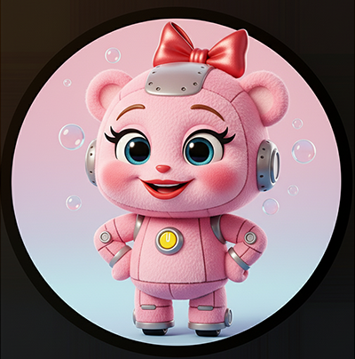

# ✅ Day 14：品質を守る最後の砦！手動テストで総仕上げ

ついに最終日です！ここまでの全ての機能を、ユーザーの視点に立って丁寧にテストし、アプリの品質を確かなものにしましょう。

---

 
 
 

## 🐻ＡＩ・レスト🐻ピンクルボットのお気楽テスト

### 💬 「最近のテストは、まずAIがスラスラ書いてくれちゃうよ。 　 　 チェックも自動でカタカタ動いてくれるからラクちん。 　 　 ブラウザもAIが開いて走るから、私はおやつタイムなの🐻」

 
 
 

------

## 「動作確認」と「テスト」の違いって？

**心の旅** ：「今までは、適当にボタンを押して『うん、動いてるな』くらいで満足してた。でも、それだと『メモ欄に絵文字を入れたらどうなる？』とか『めちゃくちゃ長い文章を入れたらレイアウト崩れない？』みたいな、細かいケースを見逃しちゃう。最初に『正常系』『異常系』『境界値』みたいに観点を決めてリストを作ることで、自分の思い込みだけじゃなくて、色々な角度からアプリを客観的にチェックできるんだな。これが『テスト』と『動作確認』の違いか！」

`TEST.md` でも触れたとおり、ユニットテストの自動化はこの先に待っている「また別の物語」。初めてWebアプリを作っている今は、落ち着いて手動テストができれば十分です。その代わりに、下のチェックリストを1つずつクリアしながら、完成版の挙動を自分の目で確かめましょう。

---

 
 
 

## 🚦ストップ・アンド・ゴー🚦アカネミドリコは黄色ポジション

### 💬 「赤と青だけの世界って、 　 　 きれいだけどちょっと怖いでしょ？ 　 　 だから私、『キメて！』って言う係なの🚦」

 
 
 

------

## 手動テスト チェックリスト

### 基本機能（正常系）
- [ ] **追加** ： 種目と日付を入力して「追加」を押すと、記録が保存され、リストの一番上に表示される
- [ ] **永続化** ： ページをリロードしても、記録が残っている
- [ ] **削除** ： 削除ボタンを押すと、その記録だけが消える
- [ ] **フィルター** ： 日付フィルターで絞り込むと、該当する記録だけ表示される
- [ ] **フィルター解除** ： フィルター解除ボタンで全件表示に戻る

### 入力チェック（異常系）
- [ ] **必須項目（種目）** ： 種目を選ばずに追加しようとすると、ブラウザが警告を出す
- [ ] **必須項目（日付）** ： 日付を入力せずに追加しようとすると、ブラウザが警告を出す
- [ ] **XSS対策** ： メモ欄に特殊文字（``）を入力しても、ただのテキストとして表示される

### 境界値テスト
- [ ] **数値（0）** ： 時間や回数に `0` を入力しても正常に保存・表示される
- [ ] **数値（巨大）** ： 時間や回数に `999999` のような大きな数字を入力してもレイアウトが崩れず表示される
- [ ] **文字列（長文）** ： メモ欄に非常に長い文章（スマートフォンの画面幅を超えるくらい）を入力しても、表示が崩れない（テーブル内で適切に折り返される）

このように観点を書き出しておくと、チェックの抜け漏れが減って安心です。リストを作って試していく取り組みを、「テスト計画」と呼びます。

---

 
 
 

## 🫛グリーン・ピース🫛グリピちゃんのグリーン・ナビ

### 💬 「テストは恋と同じさじ加減よ 　 　 見ないふりなら赤のまま。 　 　 手間は緑 ── 実るまで🫛」

 
 
 

------

## まとめ

この14日間の旅で、あなたはただ動くプログラムを作るだけでなく、その品質をどうやって確かめるか、という開発者として非常に重要な視点を手に入れました。

**アプリの完成、本当におめでとうございます！** 🎉👏

この経験は、あなたの次の冒険への、力強い一歩となるはずです。

---

<h1><a href="D15.md">ゴール</a></h1>
