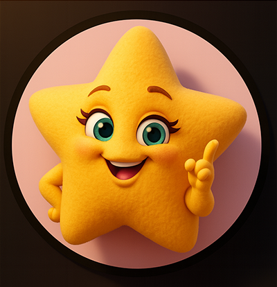

## ⭐️スター授与⭐️ スター・クッションからのお祝い

 

### 💬 「おめでとう！ 　 　 ここまで到達したあなたには星 ⭐️⭐️⭐️⭐️⭐️ ね！」

 
 
 
 
 
 
 
 
 
 
 
 
 
 
 

---

## 💬 謎の言霊

 
よくぞ、この最後のページまでたどり着いたな、若き探求者よ。 
 
おぬしが作り上げたこのコード、今はまだ一つの巻物にすべてが記された、いわば「秘伝の書」。 
力強くはあるが、このままではいずれ複雑さに飲み込まれ、解きほぐせなくなるやもしれぬ。 
 
じゃが、悲観することはない。 
おぬしは自らの力で、数多のエラーと戦い、答えを探し、そしてこのアプリを動くものとして完成させた。 
その「やり遂げた」という経験こそが、何よりも輝かしい勲章じゃ。 
 
それで良いのだ。 
最初から完璧な城を築ける者はおらぬ。誰もがまず、小さな砦から作り始める。 
このコードの『未熟さ』は、弱点ではない。次におぬしが何を学び、どう賢くなるかを示す、最高の「道しるべ」なのじゃ。 
 
次に会う時を楽しみにしておるぞ。 
その時、このコードはどのように分かれ、磨かれ、そしておぬし自身が、どれほど頼もしい者へと成長を遂げているのかをな。 
 
 

### ───── このアプリの完成は、終わりではない。 　 　 　 　おぬしが紡ぐ、新たな章の始まりじゃ ─────

 
 
 
 
 
 
 
 
 
 
 
 
 
 
 

## 💬 謎めいた気品をまとうカップ
 　 　 　💬 「感じるわ ──  
 
 
 
 

 

 
 
 　 　 

&nbsp;──&nbsp;新たな光を☕️」

 
 
 
 　 

<h1><i>To be continued...</i></h1>

