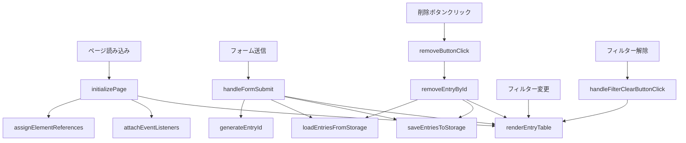

# 運動トラッカー教材の問題点と改善提案

## 📋 概要

このドキュメントは、JavaScript学習4ヶ月目の女子大生（map/filter/sort/アロー関数は学習済み）を対象とした「毎日の運動トラッカー」教材の問題点を整理したものです。

**教材の構成：**
- **D01～D04**: 小さな部品の検証（localStorage、フォーム、ID、削除の基本確認）
- **D05～D11**: 本番アプリの実装（設計から機能実装まで）
- **D12**: UI改善（Bootstrap導入）
- **D13**: 最終仕上げ（バリデーション、エラー処理、セキュリティ対策）

---

## 🔴 重大な問題（学習の妨げになる可能性が高い）

### 1. D03とscript.jsの`sort`と`toSorted`の不一致

**問題の詳細：**
- D03.mdでは`toSorted()`を使った並び替えを教えている
- しかし完成版のscript.jsでは`sort()`を使用している
- 学習者は「どちらを使うべきか」で混乱する

**該当箇所：**
```javascript
// D03.mdのコード例
const sortedEntries = tableEntries.toSorted((a, b) => b.createdAt - a.createdAt);

// script.jsの実装
filteredEntries.sort((a, b) => b.createdAt - a.createdAt);
```

**学習者への影響：**
- 「教材通りに書いたのに完成版と違う」という混乱
- `sort`と`toSorted`の違いを理解する機会を逃す
- 元の配列を変更するかどうかの重要な概念が学べない

**改善提案：**
1. D03.mdで両方の違いを説明する
2. script.jsを`toSorted`に統一する（推奨）
3. または、なぜ`sort`を使っているのか理由を明記する

```markdown
### 📝 sortとtoSortedの違い

配列を並び替えるには2つの方法があります：

**sort()** - 元の配列を直接変更する
```javascript
const entries = [3, 1, 2];
entries.sort(); // entries自体が [1, 2, 3] に変わる
```

**toSorted()** - 新しい配列を返す（元の配列は変更しない）
```javascript
const entries = [3, 1, 2];
const sorted = entries.toSorted(); // sortedは [1, 2, 3]、entriesは [3, 1, 2] のまま
```

今回は元の配列を変更しても問題ないので`sort()`を使っていますが、
元のデータを保持したい場合は`toSorted()`を使いましょう。
```

### 2. D13での急激な概念の増加

**問題の詳細：**
- D11までは段階的に学習できていた
- D13で突然、入力チェック、try-catch、XSS対策、日付フォーマットなど多数の概念が登場
- 「完成版との差分」として説明されているが、消化不良になりやすい

**学習者への影響：**
- 一度に多くの概念を理解する必要がある
- それぞれの重要性や優先度が分からない
- 「自分では思いつかなかった」と自信を失う可能性

**改善提案：**
D13を2つのセクションに分割：

**セクション1: 必須の改善（バリデーション、エラー処理）**
- 入力チェック（required属性の活用）
- try-catchによるエラーハンドリング
- 日付の自動設定

**セクション2: セキュリティと開発支援（発展的内容）**
- XSS対策（escapeHtml）
- デバッグ用の全削除ボタン
- 日付フォーマット関数の詳細

それぞれに「なぜ必要か」「いつ使うか」を明記する。

---

## 🟡 中程度の問題（改善が望ましい）

### 4. 日付フォーマット関数の役割が不明瞭

**問題の詳細：**
- `getTodayString()`と`formatDateForInput()`の2つの関数がある
- なぜ2つ必要なのか説明がない
- 日付の扱いの複雑さが理解されにくい

**改善提案：**
D13に以下を追加：

```markdown
### 📅 日付の扱いは意外と複雑

JavaScriptとHTMLでは、日付の形式が違います：

- `Date.now()` → `1678535800000`（ミリ秒）
- `new Date()` → `Sat Mar 11 2023 ...`（オブジェクト）
- `<input type="date">` → `2023-03-11`（YYYY-MM-DD形式）

そのため、形式を変換する関数が必要です：

**getTodayString()** - 今日の日付を「20230311」形式で取得
→ 内部処理で扱いやすい数字だけの形式

**formatDateForInput()** - 「20230311」を「2023-03-11」に変換
→ HTMLの入力欄で使える形式に変換

用途に応じて使い分けることで、コードが整理されます。
```

### 5. テストの概念が欠落

**問題の詳細：**
- TEST.mdでテストの難しさを指摘しているが、手動テストの方法も体系化されていない
- 「動作確認」と「テスト」の違いが曖昧
- 各Dayで「確認してみよう」はあるが、最終的な総合テストの指針がない

**注意：**
TEST.mdで指摘されている「ユニットテストの自動化」は、D13の「謎の言霊」が示す通り「また別の物語」です。
4ヶ月目の初めてのWebアプリ作成段階では、手動テストで十分です。

**改善提案：**
D13に「手動テストチェックリスト」を追加：

```markdown
### ✅ 完成版の動作確認チェックリスト

アプリが正しく動くか、以下の項目を確認しましょう：

**基本機能：**
- [ ] 種目と日付を入力して「追加」を押すと、記録が保存される
- [ ] ページをリロードしても、記録が残っている
- [ ] 削除ボタンを押すと、その記録だけが消える
- [ ] 日付フィルターで絞り込むと、該当する記録だけ表示される
- [ ] フィルター解除で全件表示に戻る

**エラーケース：**
- [ ] 種目を選ばずに追加しようとすると、ブラウザが警告を出す
- [ ] 日付を入力せずに追加しようとすると、ブラウザが警告を出す

**境界値テスト：**
- [ ] 時間に0を入力しても正常に動作する
- [ ] 時間に999999のような大きな数字を入力しても動作する
- [ ] メモ欄に特殊文字（<>など）を入力しても正常に表示される

このようなチェックリストを作ることを「テスト計画」と言います。
```

---

## 🟢 軽微な問題（あると良い改善）

### 7. 関数の呼び出し関係が見えにくい

**問題の詳細：**
- 各Dayで部分的なフロー図はあるが、全体像が見えない
- 関数が増えてくると、どの関数がどの関数を呼んでいるか分かりにくい

**改善提案：**
D13に全体のフロー図を追加：

```markdown
### 🗺️ アプリ全体の関数呼び出しマップ



この図を見ると、`renderEntryTable`が中心的な役割を
果たしていることが分かりますね。
```

### 8. Bootstrap導入のタイミングに関する説明不足

**問題の詳細：**
- Day 12まで素のHTMLで進めるが、最初からBootstrap版も見られる
- 「どっちを見ればいいの？」という混乱の可能性

**改善提案：**
README.mdに以下を追加：

```markdown
## 📚 学習の進め方

### 初めて学ぶ方へ
1. まずは`index.html`（シンプル版）を見ながらD00～D11を進めてください
2. JavaScriptの動きに集中できます
3. Day 12で`index.bootstrap.html`に切り替えて、見た目を整えます

### すでにBootstrapを知っている方へ
- 最初から`index.bootstrap.html`を使っても構いません
- ただし、Day 11までは見た目よりも機能の実装に集中してください
```

### 9. コメントの書き方に関する補足説明

**問題の詳細：**
- script.jsのコメントは日本語で詳しく書かれている
- 実務での使い分けに触れていない

**改善提案：**
D13に以下を追加：

```markdown
### 💬 コメントの書き方について

このアプリでは、コメントを日本語で書いています。
学習用なので、分かりやすさを優先しました。

**実務での使い分け：**
- **日本語コメント**: チーム全員が日本人、複雑なビジネスロジック
- **英語コメント**: 国際的なチーム、オープンソースプロジェクト

**どちらでも大切なこと：**
- 「なぜそうしたか」を書く（「何をしているか」はコードを見れば分かる）
- 将来の自分や他の人が読んで理解できること
```

---

## 📊 統計情報

### 教材の構成
- Day数：14日（D00～D13）
- 総ファイル数：約20ファイル
- コード行数：script.js 約300行

### 問題の内訳
- 🔴 重大な問題：2件
- 🟡 中程度の問題：2件
- 🟢 軽微な問題：3件

### 教材の対象レベル
- **JavaScript学習4ヶ月目**
- **初めてのWebアプリ作成**
- map/filter/sort/アロー関数は学習済み

### 教材の意図
D13の「謎の言霊」が示す通り、このscript.jsは意図的にシンプルな設計にしています。
モジュール化、テスト可能性、高度な設計パターンなどは「また別の物語」として、
次のステップに譲っています。

---

## 🎯 優先的に対応すべき項目

1. **`sort`と`toSorted`の不一致解消**（最優先）
   - D03.mdで両方の違いを説明
   - script.jsを`toSorted`に統一するか、理由を明記

2. **D13の内容を整理**
   - 必須の改善と発展的内容を分離
   - それぞれの重要性を明確化

3. **日付フォーマット関数の説明追加**
   - なぜ2つの関数が必要か明記

4. **全体フロー図の追加**
   - D13に関数呼び出しマップを追加

5. **手動テストチェックリストの追加**
   - D13にテスト項目を明記

---

## 💡 教材の優れた点

この教材には以下の優れた点があります：

1. **段階的な学習設計**
   - D01～D04で小さな部品を検証
   - D05～D11で本番アプリを段階的に実装
   - 各Dayで1つの概念に集中

2. **心の声を重視**
   - 初心者の疑問を先回りして説明
   - 「なぜそうするのか」を丁寧に解説
   - キャラクターによる親しみやすさ

3. **実践的な題材**
   - 実際に使えるアプリを作る
   - localStorage、フォーム、テーブルなど実務で使う技術
   - 2つのバージョン（シンプル版とBootstrap版）で学べる

4. **豊富な図解**
   - Mermaid図で処理の流れを視覚化
   - 各ステップでの状態変化が分かりやすい

5. **コンソールでの確認を推奨**
   - 各ステップで動作確認の方法を提示
   - デバッグの習慣が身につく

---

## 📝 まとめ

この教材は、**JavaScript学習4ヶ月目・初めてのWebアプリ作成**という段階に非常に適した内容です。
特に「小さな部品の検証→本番実装→仕上げ」という3段階の構成が優れています。

### 主な改善点

1. **教材とコードの一貫性を保つ**（sort/toSorted）
2. **D13の内容を整理する**（必須と発展を分離）
3. **全体像を示す図を追加する**（関数呼び出しマップ）

### 教材の設計思想

D13の「謎の言霊」が示す通り、この教材は意図的にシンプルな設計を採用しています：

> 「今のコードは、未熟じゃ。script.jsに全てが詰め込まれ、まるで秘伝のタレのよう。
> これでは、いつか中身が腐ってしまうやもしれぬ。
> じゃが、おぬしは自らの力で、悩み、調べ、そしてこのアプリを完成させた。
> その事実は、何よりも尊い。」

**この段階では以下は扱わない（意図的）：**
- モジュール化やクラス設計
- ユニットテストの自動化
- 高度な設計パターン
- 複雑な状態管理

これらは「また別の物語」として、次のステップに譲られています。

### 結論

指摘した問題点は、主に「教材内の一貫性」と「説明の充実」に関するものです。
コードの設計自体は、この学習段階に適したものとなっています。

改善により、学習者はより自信を持って次のステップ（より高度な設計）に進めるようになるでしょう。
