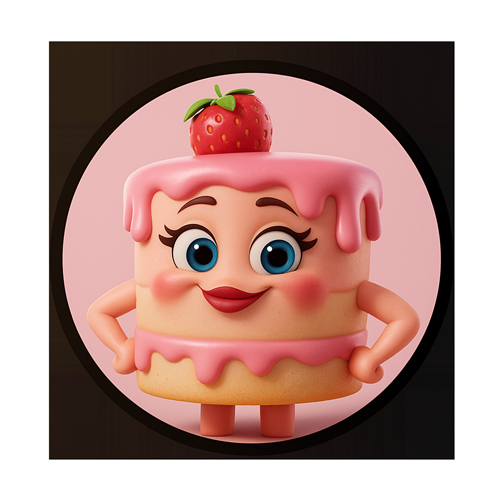
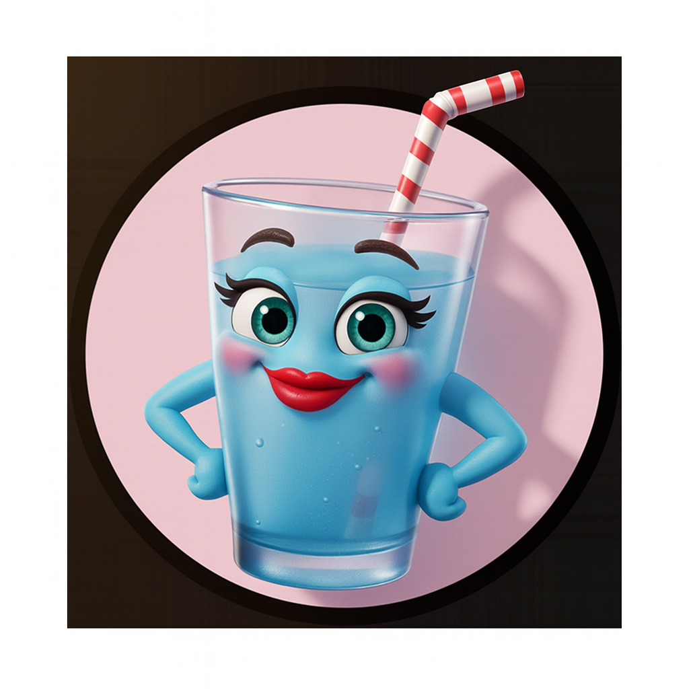

# これは教育教材リポジトリです

（別リポジトリへの投稿データ用です）

## 簡易 index.html

- https://komiyamma.github.io/site_ichika_exercise_tracker/index.html

## Bootstrap 版 index.bootstrap.html

- https://komiyamma.github.io/site_ichika_exercise_tracker/index.bootstrap.html

## この解説で登場させる予定の中核キャラクター

### なわりん

### カレダちゃん

### メモリナ姉さん

### りんりん

### スニッキー

## この解説での誘惑を担当するキャラクター

### ベリノアージュ

### ストロベリーヌ

### ソフトちゃん

### カプケちゃん

### ラムネ姉さん

---

# 毎日の運動トラッカー

こんにちは！ この「毎日の運動トラッカー」は、JavaScriptとlocalStorage（Webブラウザの保存機能）だけで作った、シンプルなアプリです。
`index.html` や `index.bootstrap.html` をブラウザで開くとすぐに使えます。

## このアプリでできること

* **日々の運動を記録**
    * 種目、日付、時間、回数や距離、短いメモを残せます。
* **記録した内容を一覧表示**
    * テーブル形式で見やすく表示します。
* **日付での絞り込み**
    * 「あの日の運動、何したっけ？」と思い出すのに便利です。
* **記録の削除**
    * 間違えて入力しても大丈夫！

## 2つのHTMLファイルについて

このプロジェクトには `index.html` と `index.bootstrap.html` の2つのファイルがあります。

* **`index.html`**
    * こちらはBootstrapを使わず、HTMLと少しのCSSだけで作られています。
    * JavaScriptの動きだけに集中したいときは、こちらを見るとコードがシンプルで分かりやすいです。
* **`index.bootstrap.html`**
    * こちらは[Bootstrap](https://getbootstrap.jp/)という、見た目をキレイに整えるための「ライブラリ」を使っています。
    * 多くのWebサイトで使われているので、どんなものか見てみるのも面白いですよ。

**`script.js`はどちらのHTMLからも共通で使われています。**
見た目が違っても、裏側で動いているJavaScriptは同じ、ということを体験してみてください。
