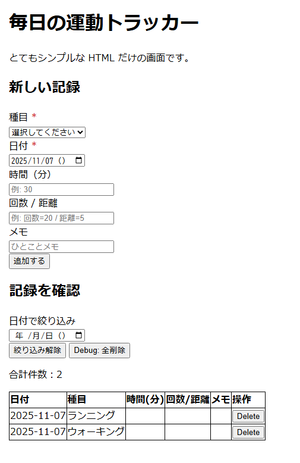

# 💖 毎日の運動トラッカーで学ぶ、はじめてのWebアプリ開発 💖

こんにちは！ このリポジトリは、JavaScriptと`localStorage`だけで作ったシンプルなWebアプリ「毎日の運動トラッカー」を使って、フロントエンド開発の基本を楽しく学ぶための教材です。

プログラミングに初めて挑戦する方や、HTML/CSS/JavaScriptの基本を復習したい初心者向けて、キャラクターたちと一緒に学べるストーリー仕立ての解説（`D00.md`～`D13.md`）を用意しています。

## ✨ 2つのバージョンで体験できる！

このプロジェクトには、機能は同じでも見た目が違う2つのHTMLファイルがあります。

### 1. シンプル版 (`index.html`)

- **URL:** [https://komiyamma.github.io/site_ichika_exercise_tracker/index.html](https://komiyamma.github.io/site_ichika_exercise_tracker/index.html)
- **特徴:** CSSフレームワークを使わず、素のHTMLと少しのCSSだけで作られています。JavaScriptの基本的な動きやDOM操作に集中して学びたいときにピッタリです。

### 2. Bootstrap版 (`index.bootstrap.html`)

- **URL:** [https://komiyamma.github.io/site_ichika_exercise_tracker/index.bootstrap.html](https://komiyamma.github.io/site_ichika_exercise_tracker/index.bootstrap.html)
- **特徴:** 見た目を整えるための人気CSSフレームワーク [Bootstrap](https://getbootstrap.jp/) を使っています。モダンなWebサイトがどのように作られているのか、ライブラリを使うとどれだけ効率的に開発できるのかを体験できます。

**ポイント💡**
どちらのHTMLも、裏側で動いている **`script.js` は全く同じもの** を使っています。
見た目（ビュー）とロジック（機能）を分離するという、Web開発の重要な考え方を体感してみてくださいね。

## 🚀 このアプリでできること

- **日々の運動を記録:** 種目、日付、時間、回数/距離、メモを残せます。
- **記録の一覧表示:** 記録した内容を見やすいテーブル形式で確認できます。
- **日付での絞り込み:** 「あの日の筋トレ、何したっけ？」がすぐにわかります。
- **記録の削除:** 間違えても大丈夫！いつでも記録を削除できます。

---

## 🚀 学習を始めよう！

開発中は、いつでも `index.html` と `script.js` をいつでも確認出来るようにして進めましょう。

この教材が、あなたのWeb開発学習の楽しい第一歩になることを願っています。
さあ、一緒に頑張りましょう！✨

<h1><a href="D00.md">Day0 からスタート</a></h1>

 
 
 
 
 

## 🎨 この教材をナビゲートしてくれるキャラクターたち

学習の旅をサポートしてくれる、個性豊かなキャラクターたちを紹介します！

### 味方キャラクター
| キャラクター | 画像 |
| :--- | :---: |
| **なわりん** |  |
| **カレダ姉さん** |  |
| **メモリナ姉さん** |  |
| **紙ロールちゃん** |  |
| **りんりん** |  |
| **スニッキー** |  |
| **パレティーナ** |  |

### 敵役キャラクター
| キャラクター | 画像 |
| :--- | :---: |
| **ベリノアージュ** |  |
| **ストロベリーヌ** |  |
| **ソフトちゃん** |  |
| **カプケちゃん** |  |
| **ラムネェさん** |  |

---
