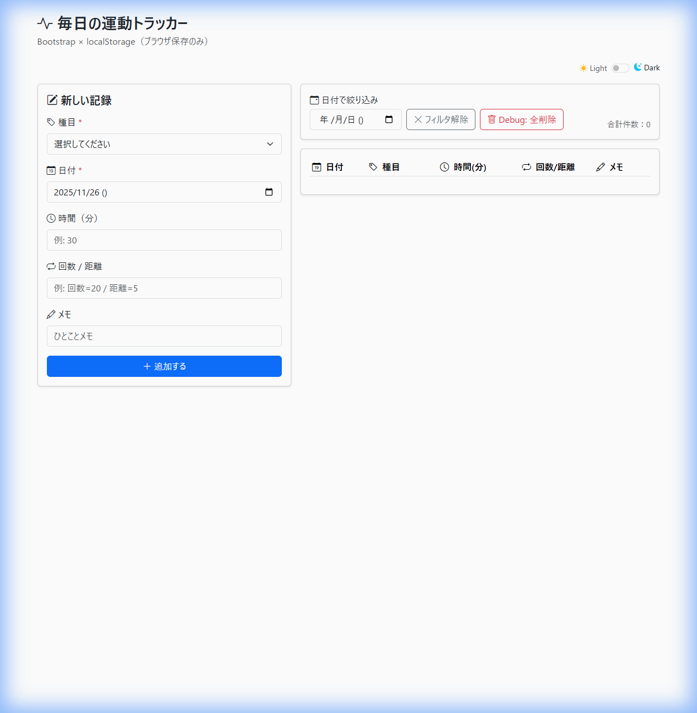
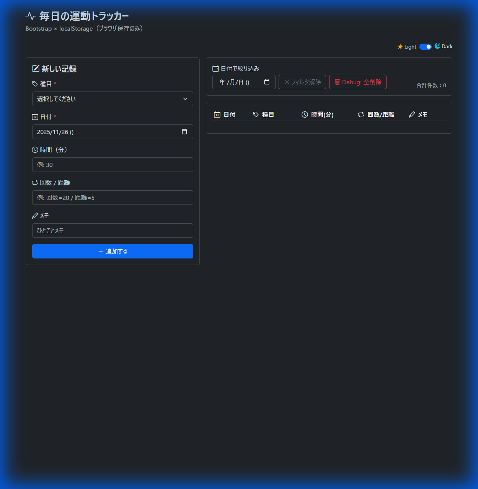
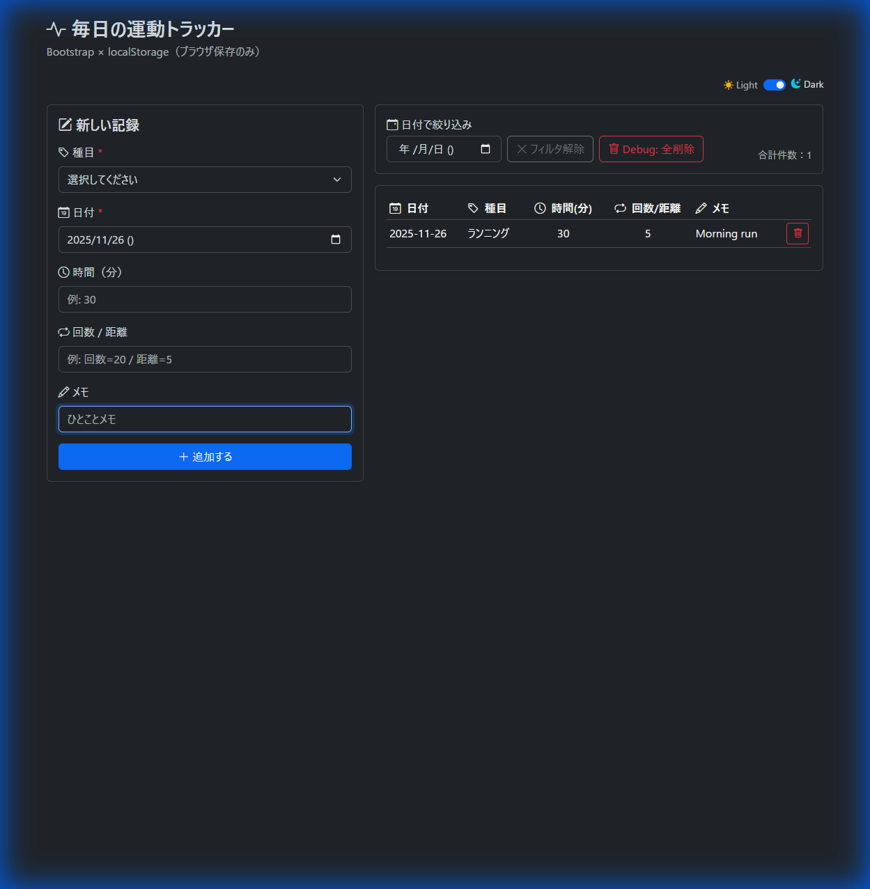
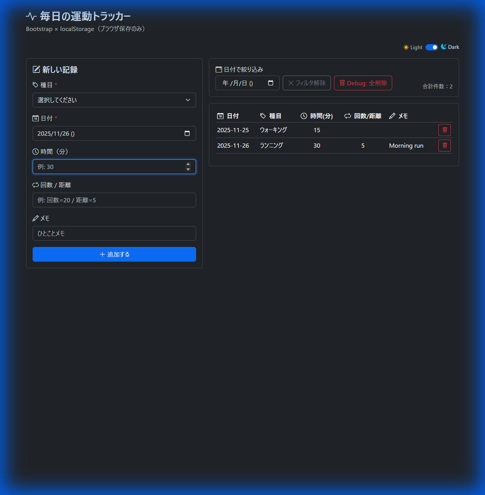
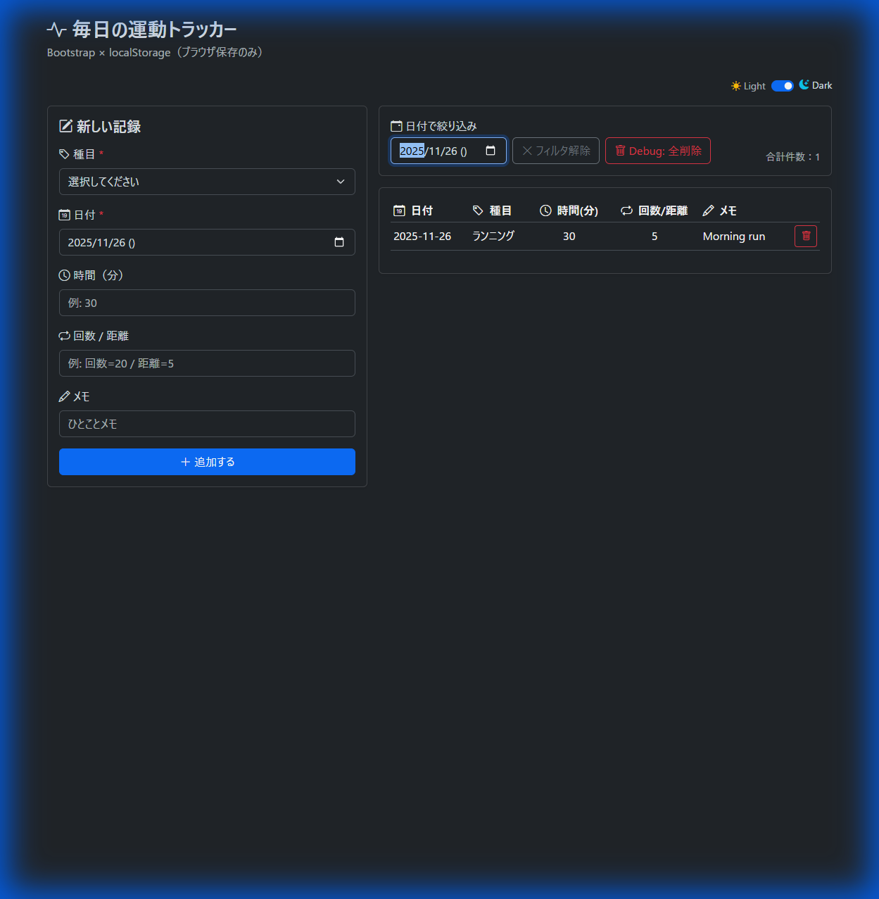
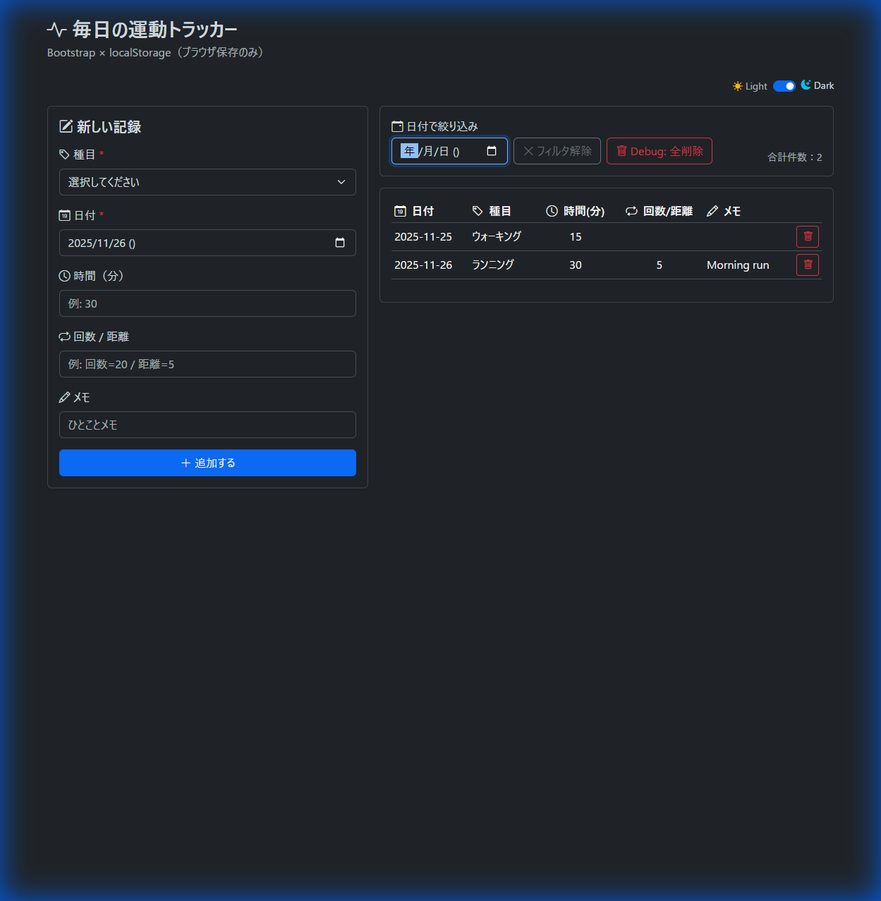
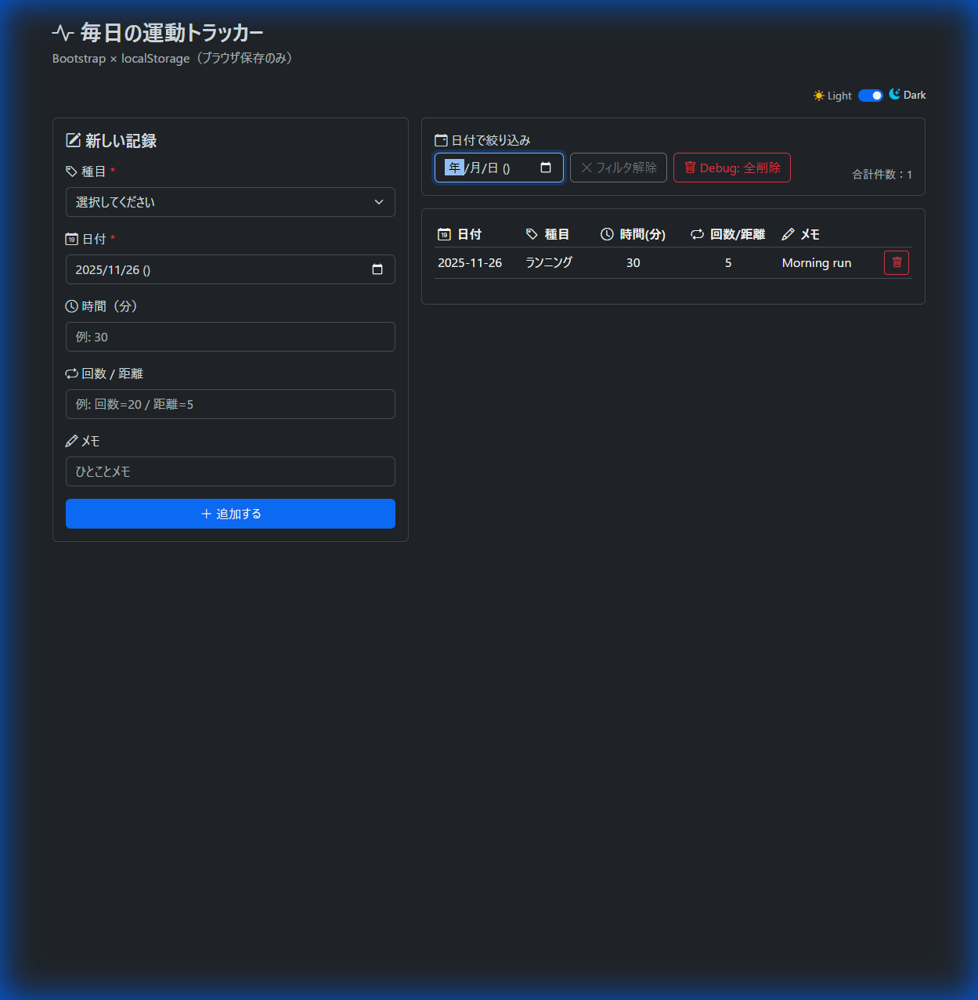
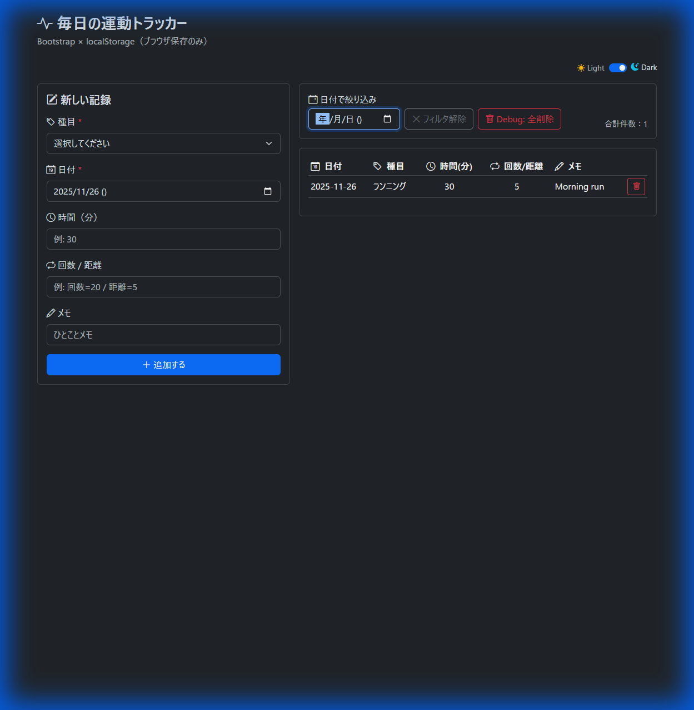

# E2E Test Report

## Overview
This report summarizes the results of the manual E2E testing performed on the "Daily Exercise Tracker" application (`index.bootstrap.theme.html`).

**Date:** 2025-11-26
**Tester:** Antigravity

## Test Environment
- **Browser:** Chrome (via Headless Browser Tool)
- **URL:** http://localhost:8000/index.bootstrap.theme.html

## Test Cases & Results

| ID | Test Case | Expected Result | Actual Result | Status |
| :--- | :--- | :--- | :--- | :--- |
| 1 | Page Load | Page loads without errors. | Page loaded successfully. | ✅ Pass |
| 2 | Theme Toggle | Theme changes between Light and Dark modes. | Theme toggled successfully. | ✅ Pass |
| 3 | Add Entry (Running) | New entry appears in the table. | Entry added and displayed correctly. | ✅ Pass |
| 4 | Add Entry (Walking) | New entry appears in the table. | Entry added and displayed correctly. | ✅ Pass |
| 5 | Date Filter | Table shows only entries for the selected date. | Filter worked correctly. | ✅ Pass |
| 6 | Clear Filter | Table shows all entries. | Filter cleared successfully. | ✅ Pass |
| 7 | Delete Entry | Specific entry is removed from the table. | Entry removed successfully. | ✅ Pass |
| 8 | Debug: Clear All | All entries are removed from the table and storage. | **FAILURE**: The last remaining entry was NOT removed from the table view after confirmation. | ❌ Fail |

## Detailed Findings

### 1. Initial Load & Theme Toggle
The application loaded correctly. The theme toggle switch functioned as expected, switching the interface to dark mode.

### 2. Adding Entries
Two entries were added:
- **Running**: 30 mins, 5 km (Today)
- **Walking**: 15 mins (Yesterday)

Both entries were correctly added to the list.

### 3. Filtering
Filtering by today's date correctly showed only the "Running" entry. Clearing the filter restored the view to show both entries.

### 4. Deletion
Deleting the "Walking" entry using the trash icon button worked as expected. The entry was removed from the list.

### 5. Debug: Clear All (Bug Found)
When clicking the "Debug: 全削除" (Clear All) button:
1. The confirmation dialog appeared.
2. The "Data deleted" alert appeared.
3. **However, the table did NOT clear the last remaining entry ("Running").**
4. A second attempt was made, but the entry still persisted in the view.

This suggests a bug in the `handleDebugClearStorageClick` function or the `renderEntryTable` function when handling the empty state after a clear all operation, or potentially an issue with how the storage is being cleared.

## Recommendations
- **Investigate `handleDebugClearStorageClick`**: Ensure `localStorage.removeItem(WORKOUT_STORAGE_KEY)` is working and that `renderEntryTable()` is called immediately after.
- **Investigate `renderEntryTable`**: Check how it handles an empty list returned from `loadEntriesFromStorage()`. It's possible that if the list is empty, it's not clearing the `innerHTML` of the table body correctly or `loadEntriesFromStorage` is returning a default value that isn't empty.
